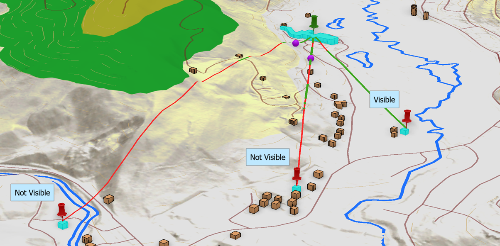

## CreateLineOfSight

<!-- TODO: Write a brief abstract explaining this sample -->
This sample demonstrates how to perform a line of sight analysis between an observer and a target point on a TIN surface.  
  


<a href="https://pro.arcgis.com/en/pro-app/sdk/" target="_blank">View it live</a>

<!-- TODO: Fill this section below with metadata about this sample-->
```
Language:              C#
Subject:               3DAnalyst
Contributor:           ArcGIS Pro SDK Team <arcgisprosdk@esri.com>
Organization:          Esri, https://www.esri.com
Date:                  04/04/2024
ArcGIS Pro:            3.3
Visual Studio:         2022
.NET Target Framework: net8.0-windows
```

## Resources

[Community Sample Resources](https://github.com/Esri/arcgis-pro-sdk-community-samples#resources)

### Samples Data

* Sample data for ArcGIS Pro SDK Community Samples can be downloaded from the [Releases](https://github.com/Esri/arcgis-pro-sdk-community-samples/releases) page.  

## How to use the sample
<!-- TODO: Explain how this sample can be used. To use images in this section, create the image file in your sample project's screenshots folder. Use relative url to link to this image using this syntax:  -->
1. In Visual Studio click the Build menu. Then select Build Solution.
2. Click Start button to open ArcGIS Pro.  
3. ArcGIS Pro will open.   
4. Open CreateLineOfSight.aprx from the Sample Data  
5. Activate the "Line of Sight Demo" map if it is not already active.   
6. Observe the green observer point push pin and the 3 red target point push pins on the map.  
7. Click the Los Demo tab on the ribbon.  
8. Click the "Sight Lines" button. This will run the Line of sight analysis between the observer and target points.  
9. Three sight lines will be drawn from the observer point to the 3 target points. Each sight line will have a green visible section, a red invisible section and an optional purple Obstruction point (if any).  
  
  

<!-- End -->

&nbsp;&nbsp;&nbsp;&nbsp;&nbsp;&nbsp;
&nbsp;&nbsp;&nbsp;&nbsp;&nbsp;&nbsp;&nbsp;&nbsp;&nbsp;&nbsp;&nbsp;&nbsp;
[Home](https://github.com/Esri/arcgis-pro-sdk/wiki) | <a href="https://pro.arcgis.com/en/pro-app/latest/sdk/api-reference" target="_blank">API Reference</a> | [Requirements](https://github.com/Esri/arcgis-pro-sdk/wiki#requirements) | [Download](https://github.com/Esri/arcgis-pro-sdk/wiki#installing-arcgis-pro-sdk-for-net) | <a href="https://github.com/esri/arcgis-pro-sdk-community-samples" target="_blank">Samples</a>
