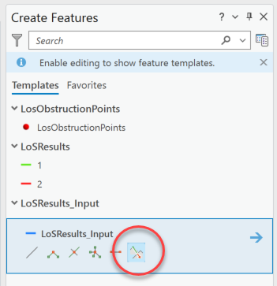
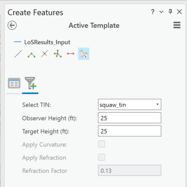
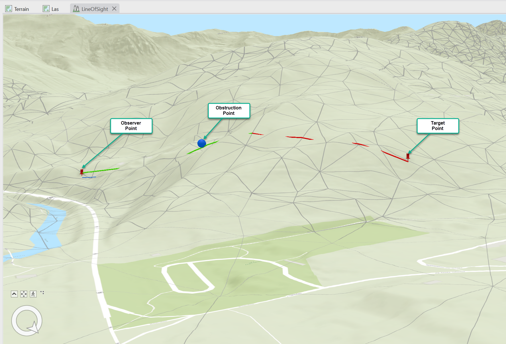

## GetLineOfSight

<!-- TODO: Write a brief abstract explaining this sample -->
This sample illustrates how to calculate the line of sight between an observer point and a target point. The line of sight is calculated based on a TIN dataset.    
  


<a href="https://pro.arcgis.com/en/pro-app/sdk/" target="_blank">View it live</a>

<!-- TODO: Fill this section below with metadata about this sample-->
```
Language:              C#
Subject:               3DAnalyst
Contributor:           ArcGIS Pro SDK Team <arcgisprosdk@esri.com>
Organization:          Esri, https://www.esri.com
Date:                  11/04/2024
ArcGIS Pro:            3.4
Visual Studio:         2022
.NET Target Framework: net8.0-windows
```

## Resources

[Community Sample Resources](https://github.com/Esri/arcgis-pro-sdk-community-samples#resources)

### Samples Data

* Sample data for ArcGIS Pro SDK Community Samples can be downloaded from the [Releases](https://github.com/Esri/arcgis-pro-sdk-community-samples/releases) page.  

## How to use the sample
<!-- TODO: Explain how this sample can be used. To use images in this section, create the image file in your sample project's screenshots folder. Use relative url to link to this image using this syntax:  -->
1. Download the Community Sample data (see under the 'Resources' section for downloading sample data)
2. Make sure that the Sample data is unzipped in c:\data  
3. The project used for this sample is 'C:\Data\3DAnalyst\3DLayersMap.ppkx'  
4. In Visual Studio click the Build menu.Then select Build Solution.  
5. Launch the debugger to open ArcGIS Pro.  
6. ArcGIS Pro will open, select the 3DLayersMap.ppkx project package.  
7. Activate the LineOfSight scene.  
8. This scene has the following layers in the TOC:  
* squaw_tin: TIN Dataset  
* LosResults_Input: Line feature layer input for the Line of Sight calculation.  
* LosResults: Line Feature Layer that will store the Line of sight result in two components - Visible and Invisible(if there is an obstruction point) sections. Visible section is symbolized in red and Invisible section is symbolized in green.  
* LosObstructionPoints: Point feature layer that represents the obstruction points detected in the line of sight.  
9. Select the 'Edit' tab on the ArcGIS Pro ribbon and 'Create' new features  
10. On the 'Create Features' pane select the LosResults_Input feature layer to see the 'Line of Sight' tool  
        
11. Select and activate the tool and see the Options page displaying the various parameters for the Line of Sight Tool.  
        
12. Enter the parameters you require.  
13. Sketch a line on the TIN in the Scene.  
14. See a "Line of Sight" profile created for the sketched line. If there is an obstruction, you will also see this point symbolized in red. In this case, the line of sight will have two components - Visible section is symbolized in red and Invisible section is symbolized in green.  
     
  

<!-- End -->

&nbsp;&nbsp;&nbsp;&nbsp;&nbsp;&nbsp;
&nbsp;&nbsp;&nbsp;&nbsp;&nbsp;&nbsp;&nbsp;&nbsp;&nbsp;&nbsp;&nbsp;&nbsp;
[Home](https://github.com/Esri/arcgis-pro-sdk/wiki) | <a href="https://pro.arcgis.com/en/pro-app/latest/sdk/api-reference" target="_blank">API Reference</a> | [Requirements](https://github.com/Esri/arcgis-pro-sdk/wiki#requirements) | [Download](https://github.com/Esri/arcgis-pro-sdk/wiki#installing-arcgis-pro-sdk-for-net) | <a href="https://github.com/esri/arcgis-pro-sdk-community-samples" target="_blank">Samples</a>
