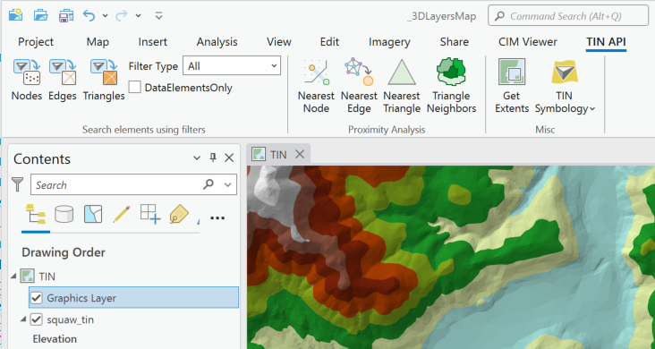
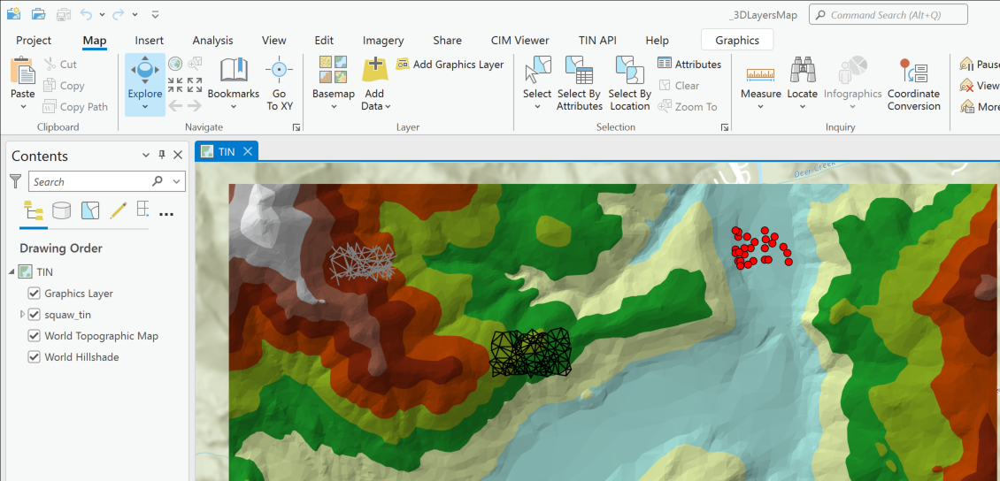
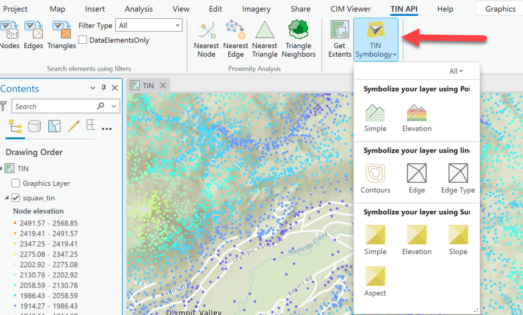

## TINApiSamples

<!-- TODO: Write a brief abstract explaining this sample -->
This sample illustrates TIN Api methods available to iterate and work with TIN Nodes, edges and Triangles.  
  


<a href="https://pro.arcgis.com/en/pro-app/sdk/" target="_blank">View it live</a>

<!-- TODO: Fill this section below with metadata about this sample-->
```
Language:              C#
Subject:               3DAnalyst
Contributor:           ArcGIS Pro SDK Team <arcgisprosdk@esri.com>
Organization:          Esri, https://www.esri.com
Date:                  05/06/2025
ArcGIS Pro:            3.5
Visual Studio:         2022
.NET Target Framework: net8.0-windows
```

## Resources

[Community Sample Resources](https://github.com/Esri/arcgis-pro-sdk-community-samples#resources)

### Samples Data

* Sample data for ArcGIS Pro SDK Community Samples can be downloaded from the [Releases](https://github.com/Esri/arcgis-pro-sdk-community-samples/releases) page.  

## How to use the sample
<!-- TODO: Explain how this sample can be used. To use images in this section, create the image file in your sample project's screenshots folder. Use relative url to link to this image using this syntax:  -->
1. Download the Community Sample data (see under the 'Resources' section for downloading sample data)
2. Make sure that the Sample data is unzipped in c:\data  
3. The project used for this sample is 'C:\Data\3DAnalyst\3DLayersMap.ppkx'  
4. In Visual Studio click the Build menu.Then select Build Solution.  
5. Launch the debugger to open ArcGIS Pro.  
6. ArcGIS Pro will open, select the 3DLayersMap.ppkx project package. Note: Alternatively, you can open any map with a TIN layer and a graphics layer. Using this sample, you will be adding points, lines and polygon graphic elements to explore the TIN layer's nodes, edges and triangles.  
7. If using 3DLayersMap.ppkx, activate the TIN map. This map has a graphics layer.   
8. Click the TIN API tab. Explore the tools and buttons available on this tab.  
  
9. The "Search elements using filters" group has three tools: Nodes, Edges, and Triangles. There is also a combo box that allows you to set the FilterType setting (All, InsideDataArea, InsideTin) and a check box to set the "DataElementsOnly" property of the Search filter.  Active the tool and sketch a small rectangle on the TIN. Nodes, Edges and Triangles in the sketch rectangle will be found. Graphic elements to represent these elements will be drawn on the map.  
  
10. The "Proximity Analysis" group has 4 tools: Nearest Node, Nearest Edge, Nearest Triangle, Triangle Neighbors. Activate any of these tools and sketch a point on the TIN. Nodes, Edges and Triangles closest to the sketched point will be detected.  Graphic elements to represent these elements will be drawn on the map.  
11. The "Get Extents" button calculates the TIN dataset's "Extent", "DataArea Extent", "Full Extent" and the "Super Node Extent". Polygon graphics to represent these extents are drawn on the map.  
12. The "TIN Symbology" gallery allows you to symbolize the TIN using points, lines or surface renderers.  
  
  

<!-- End -->

&nbsp;&nbsp;&nbsp;&nbsp;&nbsp;&nbsp;
&nbsp;&nbsp;&nbsp;&nbsp;&nbsp;&nbsp;&nbsp;&nbsp;&nbsp;&nbsp;&nbsp;&nbsp;
[Home](https://github.com/Esri/arcgis-pro-sdk/wiki) | <a href="https://pro.arcgis.com/en/pro-app/latest/sdk/api-reference" target="_blank">API Reference</a> | [Requirements](https://github.com/Esri/arcgis-pro-sdk/wiki#requirements) | [Download](https://github.com/Esri/arcgis-pro-sdk/wiki#installing-arcgis-pro-sdk-for-net) | <a href="https://github.com/esri/arcgis-pro-sdk-community-samples" target="_blank">Samples</a>
