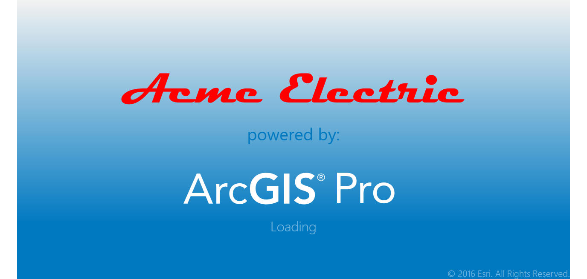
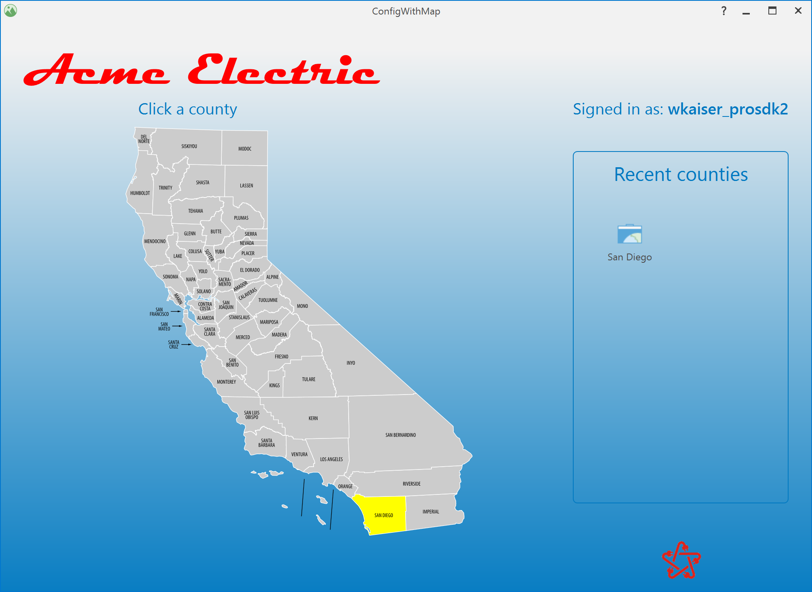
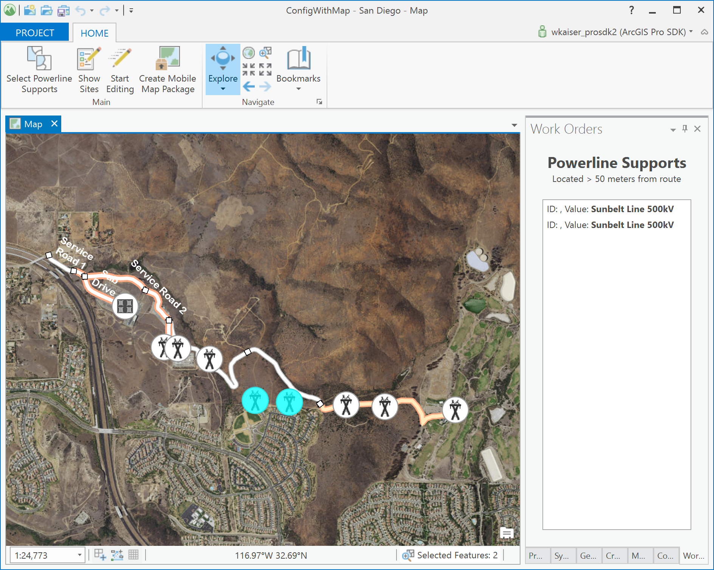

## ConfigWithMap

<!-- TODO: Write a brief abstract explaining this sample -->
"Managed Configurations" allow branding of ArcGIS Pro meaning you can customize the splash and startup screens, application icon, and modify the runtime ArcGIS Pro User Interface to best fit your user’s business needs.  This sample illustrates a configuration solution that includes those features.    
  


<a href="https://pro.arcgis.com/en/pro-app/sdk/" target="_blank">View it live</a>

<!-- TODO: Fill this section below with metadata about this sample-->
```
Language:              C#
Subject:               Configuation
Contributor:           ArcGIS Pro SDK Team <arcgisprosdk@esri.com>
Organization:          Esri, https://www.esri.com
Date:                  10/01/2023
ArcGIS Pro:            3.2
Visual Studio:         2022
.NET Target Framework: net6.0-windows
```

## Resources

[Community Sample Resources](https://github.com/Esri/arcgis-pro-sdk-community-samples#resources)

### Samples Data

* Sample data for ArcGIS Pro SDK Community Samples can be downloaded from the [Releases](https://github.com/Esri/arcgis-pro-sdk-community-samples/releases) page.  

## How to use the sample
<!-- TODO: Explain how this sample can be used. To use images in this section, create the image file in your sample project's screenshots folder. Use relative url to link to this image using this syntax:  -->
1. Download the Community Sample data (see under the 'Resources' section for downloading sample data).  The sample data contains a folder called 'C:\Data\Configurations\Projects' with sample data required for this solution.  Make sure that the Sample data is unzipped in c:\data and "C:\Data\Configurations\Projects" is available.
2. In Visual Studio click the Build menu. Then select Build Solution.  
3. Click Start button to debug ArcGIS Pro.  
4. ArcGIS Pro displays the custom splash screen.  
  
5. Pro will then display the startup screen showing a map, click on the county of San Diego area on the map.  
  
6. Pro will then open the San Diego project specifically tuned for this sample workflow.  
7. Click on the 'Select Power Line Support' button to start a geoprocessing task that find all power line support structure further than 50 meters from the service road.  
8. Click the 'Show Sites' button to show the geo processing task results.  
9. Click the 'Edit' button to display the 'Edit' tab which contains existing ArcGIS Pro edit functionality.    
  
  

<!-- End -->

&nbsp;&nbsp;&nbsp;&nbsp;&nbsp;&nbsp;
&nbsp;&nbsp;&nbsp;&nbsp;&nbsp;&nbsp;&nbsp;&nbsp;&nbsp;&nbsp;&nbsp;&nbsp;
[Home](https://github.com/Esri/arcgis-pro-sdk/wiki) | <a href="https://pro.arcgis.com/en/pro-app/latest/sdk/api-reference" target="_blank">API Reference</a> | [Requirements](https://github.com/Esri/arcgis-pro-sdk/wiki#requirements) | [Download](https://github.com/Esri/arcgis-pro-sdk/wiki#installing-arcgis-pro-sdk-for-net) | <a href="https://github.com/esri/arcgis-pro-sdk-community-samples" target="_blank">Samples</a>
