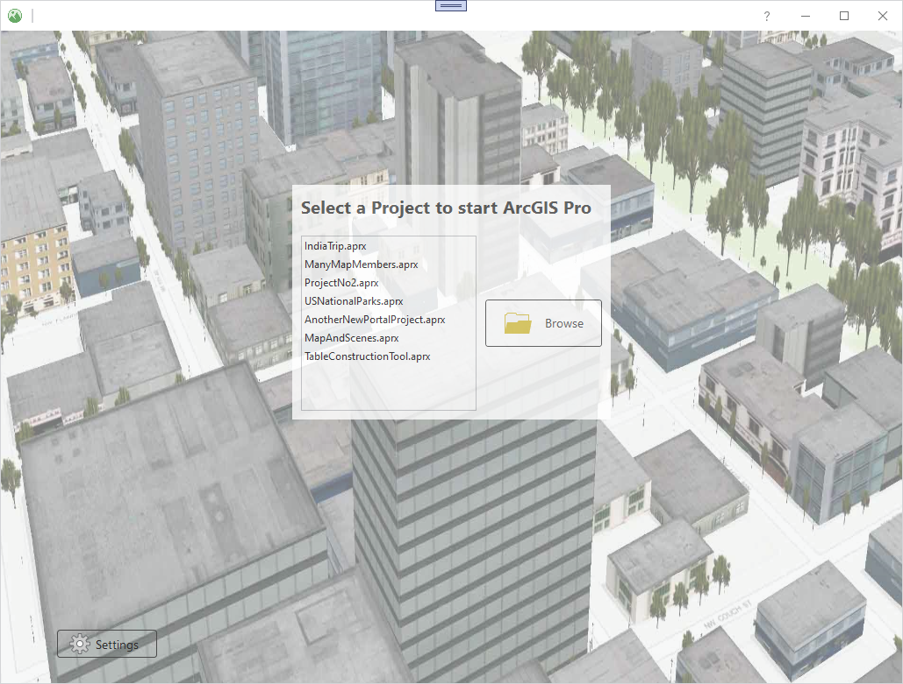
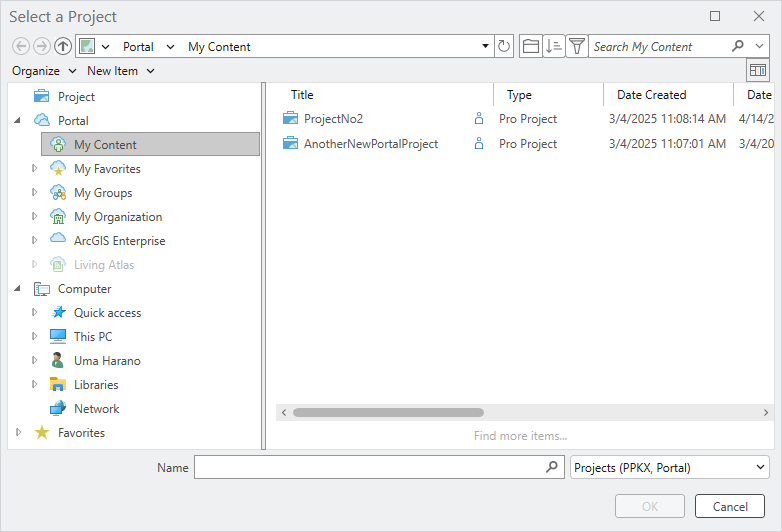

## GetRecentPortalProjects

<!-- TODO: Write a brief abstract explaining this sample -->
This sample illustrates how to retrieve recently opened projects. This includes projects that are opened from the local machine and from a portal. The sample also shows how to open a project from the recent projects list.  
  


<a href="https://pro.arcgis.com/en/pro-app/sdk/" target="_blank">View it live</a>

<!-- TODO: Fill this section below with metadata about this sample-->
```
Language:              C#
Subject:               Framework
Contributor:           ArcGIS Pro SDK Team <arcgisprosdk@esri.com>
Organization:          Esri, https://www.esri.com
Date:                  05/06/2025
ArcGIS Pro:            3.5
Visual Studio:         2022
.NET Target Framework: net8.0-windows
```

## Resources

[Community Sample Resources](https://github.com/Esri/arcgis-pro-sdk-community-samples#resources)

### Samples Data

* Sample data for ArcGIS Pro SDK Community Samples can be downloaded from the [Releases](https://github.com/Esri/arcgis-pro-sdk-community-samples/releases) page.  

## How to use the sample
<!-- TODO: Explain how this sample can be used. To use images in this section, create the image file in your sample project's screenshots folder. Use relative url to link to this image using this syntax:  -->
1. In Visual Studio click the Build menu. Then select Build Solution.
2. Launch the debugger to run this configuration.  
3. The configuration's custom start up page will display.  
4. This page will list the most recent projects that have been opened in ArcGIS Pro. The list will include projects that are opened from the local machine and from a portal.  
      
5. Select any project to open it. Note: If you pick a portal project to open, the active portal must match the portal that the project was opened from.   
6. Use the Browse button on the start up page to browse to other projects. The open item dialog displayed has a composite filter that will show local projects and projects on your current portal.  
     
  

<!-- End -->

&nbsp;&nbsp;&nbsp;&nbsp;&nbsp;&nbsp;
&nbsp;&nbsp;&nbsp;&nbsp;&nbsp;&nbsp;&nbsp;&nbsp;&nbsp;&nbsp;&nbsp;&nbsp;
[Home](https://github.com/Esri/arcgis-pro-sdk/wiki) | <a href="https://pro.arcgis.com/en/pro-app/latest/sdk/api-reference" target="_blank">API Reference</a> | [Requirements](https://github.com/Esri/arcgis-pro-sdk/wiki#requirements) | [Download](https://github.com/Esri/arcgis-pro-sdk/wiki#installing-arcgis-pro-sdk-for-net) | <a href="https://github.com/esri/arcgis-pro-sdk-community-samples" target="_blank">Samples</a>
