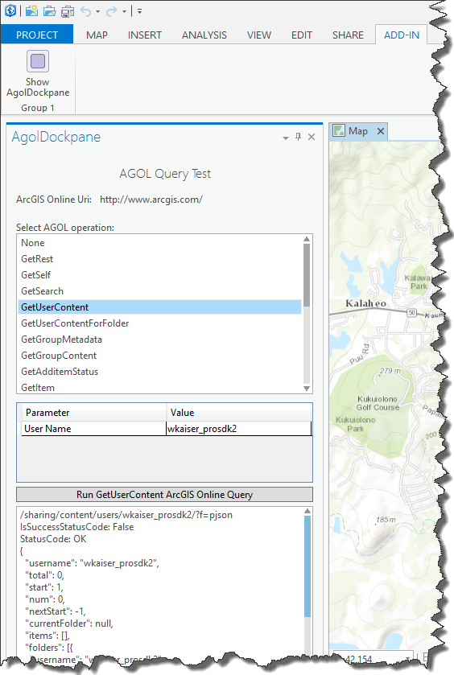

##ArcGISOnlineConnect

<!-- TODO: Write a brief abstract explaining this sample -->
ArcGISOnlineConnect exercises a collection of programmatic interactions with ArcGIS Online using EsriHttpClient  
  


<a href="http://pro.arcgis.com/en/pro-app/sdk/" target="_blank">View it live</a>

<!-- TODO: Fill this section below with metadata about this sample-->
```
Language:      C#
Subject:       Framework
Contributor:   ArcGIS Pro SDK Team <arcgisprosdk@esri.com>
Organization:  Esri, http://www.esri.com
Date:          9/21/2015
ArcGIS Pro:    1.1
Visual Studio: 2013, 2015
```

##Resources

* [API Reference online](http://pro.arcgis.com/en/pro-app/sdk/api-reference)
* <a href="http://pro.arcgis.com/en/pro-app/sdk/" target="_blank">ArcGIS Pro SDK for .NET (pro.arcgis.com)</a>
* [arcgis-pro-sdk-community-samples](http://github.com/Esri/arcgis-pro-sdk-community-samples)
* [FAQ](http://github.com/Esri/arcgis-pro-sdk/wiki/FAQ)
* [ArcGIS Pro SDK icons](https://github.com/Esri/arcgis-pro-sdk/releases/tag/1.1.0.3308)
* [ProConcepts: ArcGIS Pro Add in Samples](https://github.com/Esri/arcgis-pro-sdk-community-samples/wiki/ProConcepts-ArcGIS-Pro-Add-in-Samples)
* [Sample data for ArcGIS Pro SDK Community Samples](https://github.com/Esri/arcgis-pro-sdk-community-samples/releases)

##How to use the sample
<!-- TODO: Explain how this sample can be used. To use images in this section, create the image file in your sample project's screenshots folder. Use relative url to link to this image using this syntax:  -->
1. In Visual Studio click the Build menu. Then select Build Solution.  
2. Click Start button to open ArcGIS Pro.  
3. ArcGIS Pro will open.   
4. Open any project file. Click on the Add-in tab on the ribbon and then on the Show "AgolDockpane" button.  
    
5. On top the AgolDockpane (pane) you find the ArcGIS Online Uri used for the interaction with ArcGIS Online (your portal).  
6. Select from the 'AGOL operation' listbox by starting with 'GetRest' (go through the list top to bottom doing the following steps):  
7. Verify the Parameter(s) required for the query you just selected (note: default values are filled in by using return values from previous query results so sequence is important)  
8. Click on the "Run ... ArcGIS Online Query" button to execute the query.  
9. View the results in text box on the bottom of the AgolDockpane.    
10. Please not that ArcGIS Online queries return json and various content returned in json is deserialized into the respective c# class.  
11. Also note that permissions and content are required for various queries (i.e. content or folder queries)  
  


[](Esri Tags: ArcGIS-Pro-SDK)
[](Esri Language: C-Sharp)​


<p align = center>
<b> ArcGIS Pro 1.1 SDK for Microsoft .NET Framework</b>
</p>
&nbsp;&nbsp;&nbsp;&nbsp;&nbsp;&nbsp;&nbsp;&nbsp;&nbsp;&nbsp;&nbsp;&nbsp;&nbsp;&nbsp;&nbsp;&nbsp;&nbsp;&nbsp;&nbsp;&nbsp;[Home](https://github.com/Esri/arcgis-pro-sdk/wiki) | <a href="http://pro.arcgis.com/en/pro-app/sdk" target="_blank">ArcGIS Pro SDK</a> | <a href="http://pro.arcgis.com/en/pro-app/sdk/api-reference" target="_blank">API Reference</a> | [Requirements](#requirements) | [Download](#download) |  <a href="http://github.com/esri/arcgis-pro-sdk-community-samples" target="_blank">Samples</a>
