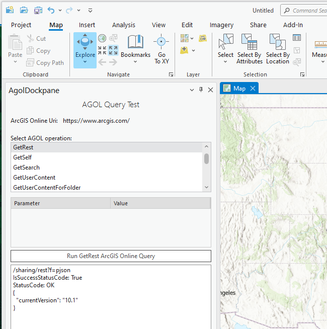
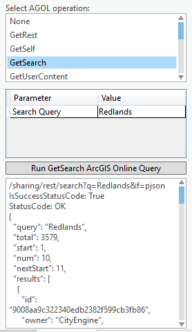
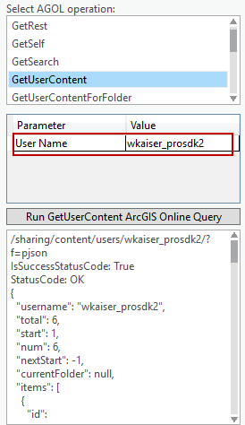
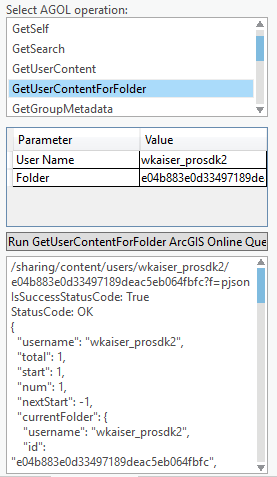
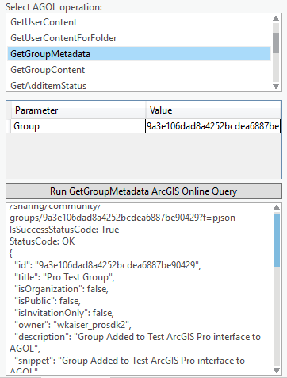
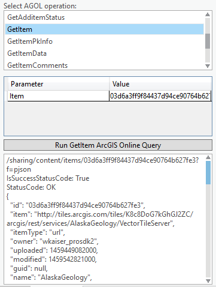
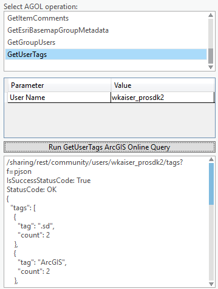

## ArcGISOnlineConnect

<!-- TODO: Write a brief abstract explaining this sample -->
ArcGISOnlineConnect exercises a collection of programmatic interactions with ArcGIS Online using EsriHttpClient  
  


<a href="http://pro.arcgis.com/en/pro-app/sdk/" target="_blank">View it live</a>

<!-- TODO: Fill this section below with metadata about this sample-->
```
Language:              C#
Subject:               Framework
Contributor:           ArcGIS Pro SDK Team <arcgisprosdk@esri.com>
Organization:          Esri, http://www.esri.com
Date:                  4/20/2017
ArcGIS Pro:            2.0
Visual Studio:         2015, 2017
.NET Target Framework: 4.6.1
```

## Resources

* [API Reference online](http://pro.arcgis.com/en/pro-app/sdk/api-reference)
* <a href="http://pro.arcgis.com/en/pro-app/sdk/" target="_blank">ArcGIS Pro SDK for .NET (pro.arcgis.com)</a>
* [arcgis-pro-sdk-community-samples](http://github.com/Esri/arcgis-pro-sdk-community-samples)
* [ArcGISPro Registry Keys](http://github.com/Esri/arcgis-pro-sdk/wiki/ArcGIS-Pro-Registry-Keys)
* [FAQ](http://github.com/Esri/arcgis-pro-sdk/wiki/FAQ)
* [ArcGIS Pro SDK icons](https://github.com/Esri/arcgis-pro-sdk/releases/tag/1.4.0.7198)
* [ProConcepts: ArcGIS Pro Add in Samples](https://github.com/Esri/arcgis-pro-sdk-community-samples/wiki/ProConcepts-ArcGIS-Pro-Add-in-Samples)


### Samples Data

* Sample data for ArcGIS Pro SDK Community Samples can be downloaded from the [repo releases](https://github.com/Esri/arcgis-pro-sdk-community-samples/releases) page.  

## How to use the sample
<!-- TODO: Explain how this sample can be used. To use images in this section, create the image file in your sample project's screenshots folder. Use relative url to link to this image using this syntax:  -->
1. This sample is using the ArcGIS REST API which is published here http://resources.arcgis.com/en/help/arcgis-rest-api    
1. In Visual Studio click the Build menu. Then select Build Solution.  
1. Click Start button to open ArcGIS Pro.  
1. ArcGIS Pro will open.   
1. Open any project file. Click on the Add-in tab on the ribbon and then on the Show "AgolDockpane" button.  
    
  
1. On top the AgolDockpane (pane) you find the ArcGIS Online Uri used for the interaction with ArcGIS Online (your portal).  
1. Select from the 'AGOL operation' listbox by starting with 'GetRest' (go through the list top to bottom doing the following steps):  
1. Verify the Parameter(s) required for the query you just selected (note: default values are filled in by using return values from previous query results so sequence is important)  
1. Click on the "Run ... ArcGIS Online Query" button to execute the query.  
1. View the results in text box on the bottom of the AgolDockpane.    
1. Please note that ArcGIS Online queries return json and various content returned in json is deserialized into the respective c# class.  
1. Also note that permissions and content are required for various queries (i.e. content or folder queries)  
1. The 'GetSearch' query requires a search string which by default is set to 'Redlands'.    
    
  
1. The 'GetUserContent' query requires a user name, however, if you performed the 'GetSelf' query before the parameter is filled in automatically for you.    
    
  
1. The 'GetUserContentForFolder' query requires a user name and a folder id, however, if you performed the 'GetSelf' and 'GetUserContent' query before, those parameters are filled in automatically for you from previous query results.  Also you need to have a folder under you 'My content' tab in ArcGIS Online.    
     
  
1. The 'GetGroupMetadata, and GetGroupContent' queries require a group id, however, if you performed the 'GetSelf' query before, those parameters are filled in automatically for you from previous query results.    
    
  
1. The 'GetAdditemStatus, GetItem, GetItemPkInfo, GetItemData, and GetItemComments' queries require an item id, however, if you performed the 'GetUserContent' query before, those parameters are filled in automatically for you from previous query results.     
     
  
1. The 'GetGroupUsers, and GetUserTags' queries require a group id, however, if you performed the 'GetSelf' query before, those parameters are filled in automatically for you from previous query results.    
   
  


<!-- End -->

&nbsp;&nbsp;&nbsp;&nbsp;&nbsp;&nbsp;
&nbsp;&nbsp;&nbsp;&nbsp;&nbsp;&nbsp;&nbsp;&nbsp;&nbsp;&nbsp;&nbsp;&nbsp;
[Home](https://github.com/Esri/arcgis-pro-sdk/wiki) | <a href="http://pro.arcgis.com/en/pro-app/sdk/api-reference" target="_blank">API Reference</a> | [Requirements](https://github.com/Esri/arcgis-pro-sdk/wiki#requirements) | [Download](https://github.com/Esri/arcgis-pro-sdk/wiki#installing-arcgis-pro-sdk-for-net) | <a href="http://github.com/esri/arcgis-pro-sdk-community-samples" target="_blank">Samples</a>
