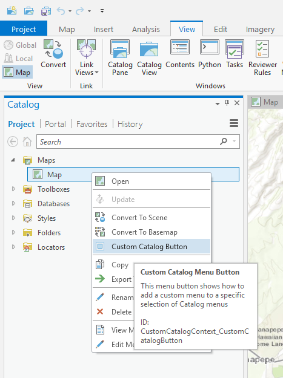

## CustomCatalogContext

<!-- TODO: Write a brief abstract explaining this sample -->
Shows how to modify a sampling of different context menus for the ArcGIS Pro Catalog (dockpane) context menu  
  


<a href="https://pro.arcgis.com/en/pro-app/sdk/" target="_blank">View it live</a>

<!-- TODO: Fill this section below with metadata about this sample-->
```
Language:              C#
Subject:               Content
Contributor:           ArcGIS Pro SDK Team <arcgisprosdk@esri.com>
Organization:          Esri, https://www.esri.com
Date:                  06/10/2022
ArcGIS Pro:            3.0
Visual Studio:         2022
.NET Target Framework: net6.0-windows
```

## Resources

[Community Sample Resources](https://github.com/Esri/arcgis-pro-sdk-community-samples#resources)

### Samples Data

* Sample data for ArcGIS Pro SDK Community Samples can be downloaded from the [Releases](https://github.com/Esri/arcgis-pro-sdk-community-samples/releases) page.  

## How to use the sample
<!-- TODO: Explain how this sample can be used. To use images in this section, create the image file in your sample project's screenshots folder. Use relative url to link to this image using this syntax:  -->
1. In Visual Studio click the Build menu. Then select Build Solution.  
1. Click Start button to open ArcGIS Pro.  
1. ArcGIS Pro will open.   
1. Open any project file. Click on the Catalog Dockpane tab selector or if the Catalog Dockpane is not displayed, use the View tab on the Pro ribbon and select the 'Catalog Pane'.  
    
  
1. Right click on either the 'Maps' or 'Styles' nodes to use the 'Custom Catalog Button' menu option.  
1. In the OnClick code behind the context of the clicked on IProjectWindow(s) is retrieved from the FrameworkApplication.ActiveWindow property.  
1. The IProjectWindow's SelectedItems property to access each of the selected items which in turn can be cast to the respective project item depending on what "type" of item it is (i.e. map, style, gdb, etc)  
  


<!-- End -->

&nbsp;&nbsp;&nbsp;&nbsp;&nbsp;&nbsp;
&nbsp;&nbsp;&nbsp;&nbsp;&nbsp;&nbsp;&nbsp;&nbsp;&nbsp;&nbsp;&nbsp;&nbsp;
[Home](https://github.com/Esri/arcgis-pro-sdk/wiki) | <a href="https://pro.arcgis.com/en/pro-app/latest/sdk/api-reference" target="_blank">API Reference</a> | [Requirements](https://github.com/Esri/arcgis-pro-sdk/wiki#requirements) | [Download](https://github.com/Esri/arcgis-pro-sdk/wiki#installing-arcgis-pro-sdk-for-net) | <a href="https://github.com/esri/arcgis-pro-sdk-community-samples" target="_blank">Samples</a>
