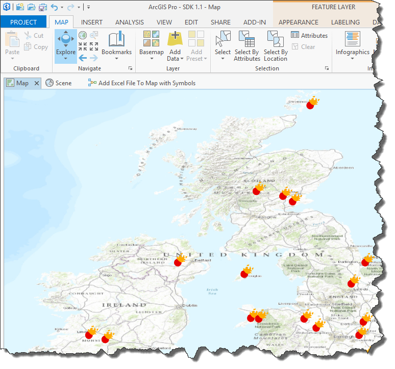
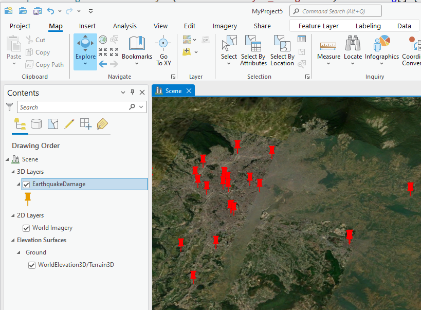

##ExcelDropHandler

<!-- TODO: Write a brief abstract explaining this sample -->
ArcGIS Pro Addin allows to Drag and drop *.xlsx file on ArcGIS Pro and execute the necessary Geoprocessing Tools automatically.   
  


<a href="http://pro.arcgis.com/en/pro-app/sdk/" target="_blank">View it live</a>

<!-- TODO: Fill this section below with metadata about this sample-->
```
Language:      C#
Subject:       Content
Contributor:   ArcGIS Pro SDK Team <arcgisprosdk@esri.com>
Organization:  Esri, http://www.esri.com
Date:          16-Jul-15
ArcGIS Pro:    1.1
Visual Studio: 2013
```

##Resources

* [API Reference online](http://pro.arcgis.com/en/pro-app/sdk/api-reference)
* <a href="http://pro.arcgis.com/en/pro-app/sdk/" target="_blank">ArcGIS Pro SDK for .NET (pro.arcgis.com)</a>
* [arcgis-pro-sdk-community-samples](http://github.com/Esri/arcgis-pro-sdk-community-samples)
* [FAQ](http://github.com/Esri/arcgis-pro-sdk/wiki/FAQ)
* [ArcGIS Pro SDK icons](https://github.com/Esri/arcgis-pro-sdk/releases/tag/1.1.0.3308)
* [ProConcepts: ArcGIS Pro Add in Samples](https://github.com/Esri/arcgis-pro-sdk-community-samples/wiki/ProConcepts-ArcGIS-Pro-Add-in-Samples)

##How to use the sample
<!-- TODO: Explain how this sample can be used. To use images in this section, create the image file in your sample project's screenshots folder. Use relative url to link to this image using this syntax:  -->
   
1. Download the Community Sample data (see under the 'Resources' section for downloading sample data)  
1. Make sure that the Sample data is unzipped in c:\data   
1. Before you run the sample verify that the project C:\data\SDK\SDK 1.1.aprx is present since this is required to run the sample.          
1. In Visual Studio click the Build menu. Then select Build Solution.  
1. Click Start button to open ArcGIS Pro.  
1. ArcGIS Pro will open.   
1. Open the project 'SDK 1.1.aprx' which can now be found in the C:\Data\SDK folder.    
1. ArcGIS Pro will display a map view.    
1. Look at two eventhandler methods  
1. OnDragOver – The Pro framework calls this method when an Excel file is dragged onto the Map holding down the left mouse button.   
1. OnDrop – The Pro framework calls this method when the user releases the left mouse button and the Excel file is dropped on Pro.   
1. Take a closer look at the OnDrop logic where the code for the execution of the Geoprocessing Tool can be found.    
1. Drag and Drop Meteorites_UK.xls onto Pro.    
1. View the results of the Meteorite strikes layer loaded into Pro with symbology applied    
  
1. Switch to the 3D scene view    
1. Drag and Drop EarthquakeDamage.xls on to ArcGIS Pro    
1. View those results.    
  
  


[](Esri Tags: ArcGIS-Pro-SDK)
[](Esri Language: C-Sharp)​


<p align = center>
<b> ArcGIS Pro 1.1 SDK for Microsoft .NET Framework</b>
</p>
&nbsp;&nbsp;&nbsp;&nbsp;&nbsp;&nbsp;&nbsp;&nbsp;&nbsp;&nbsp;&nbsp;&nbsp;&nbsp;&nbsp;&nbsp;&nbsp;&nbsp;&nbsp;&nbsp;&nbsp;[Home](https://github.com/Esri/arcgis-pro-sdk/wiki) | <a href="http://pro.arcgis.com/en/pro-app/sdk" target="_blank">ArcGIS Pro SDK</a> | <a href="http://pro.arcgis.com/en/pro-app/sdk/api-reference" target="_blank">API Reference</a> | [Requirements](#requirements) | [Download](#download) |  <a href="http://github.com/esri/arcgis-pro-sdk-community-samples" target="_blank">Samples</a>
