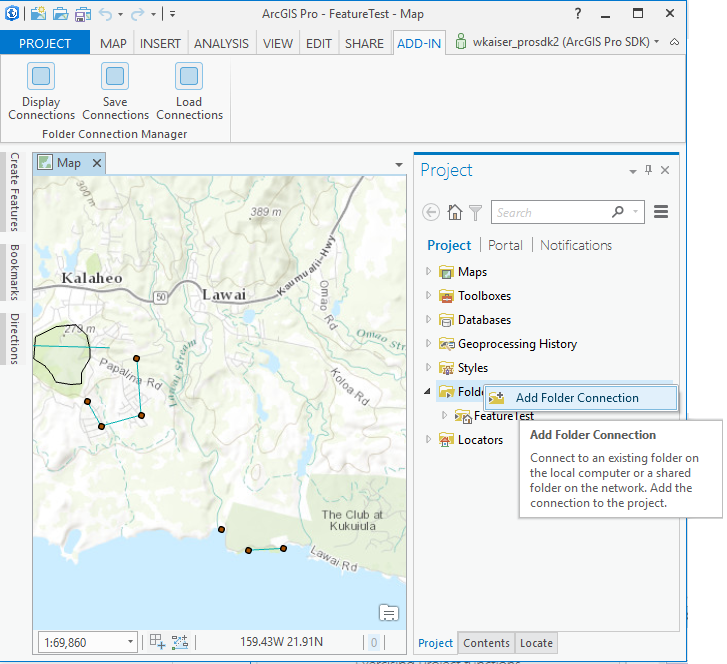
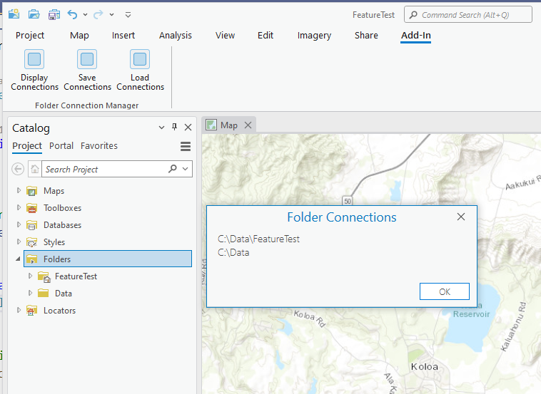
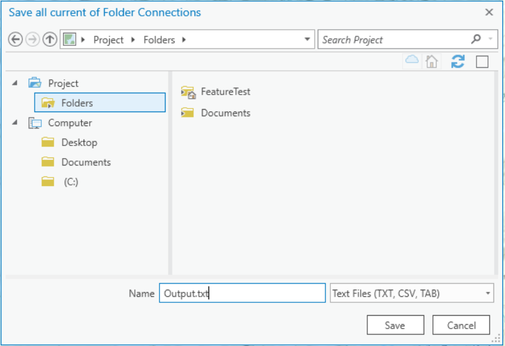

## FolderConnectionManager

<!-- TODO: Write a brief abstract explaining this sample -->
Allows saving and loading folder connections to a Project showing how to manage folder connections in ArcGIS Pro from within an Add-in.  
  


<a href="http://pro.arcgis.com/en/pro-app/sdk/" target="_blank">View it live</a>

<!-- TODO: Fill this section below with metadata about this sample-->
```
Language:              C#
Subject:               Content
Contributor:           ArcGIS Pro SDK Team <arcgisprosdk@esri.com>
Organization:          Esri, http://www.esri.com
Date:                  4/20/2017
ArcGIS Pro:            2.0
Visual Studio:         2015, 2017
.NET Target Framework: 4.6.1
```

## Resources

* [API Reference online](http://pro.arcgis.com/en/pro-app/sdk/api-reference)
* <a href="http://pro.arcgis.com/en/pro-app/sdk/" target="_blank">ArcGIS Pro SDK for .NET (pro.arcgis.com)</a>
* [arcgis-pro-sdk-community-samples](http://github.com/Esri/arcgis-pro-sdk-community-samples)
* [ArcGISPro Registry Keys](http://github.com/Esri/arcgis-pro-sdk/wiki/ArcGIS-Pro-Registry-Keys)
* [FAQ](http://github.com/Esri/arcgis-pro-sdk/wiki/FAQ)
* [ArcGIS Pro SDK icons](https://github.com/Esri/arcgis-pro-sdk/releases/tag/1.4.0.7198)
* [ProConcepts: ArcGIS Pro Add in Samples](https://github.com/Esri/arcgis-pro-sdk-community-samples/wiki/ProConcepts-ArcGIS-Pro-Add-in-Samples)


### Samples Data

* Sample data for ArcGIS Pro SDK Community Samples can be downloaded from the [repo releases](https://github.com/Esri/arcgis-pro-sdk-community-samples/releases) page.  

## How to use the sample
<!-- TODO: Explain how this sample can be used. To use images in this section, create the image file in your sample project's screenshots folder. Use relative url to link to this image using this syntax:  -->
   
  
1. Open this solution in Visual Studio.  
1. Click the build menu and select Build Solution.  
1. Click the Start button to open ArCGIS Pro.  
1. Open any project either a new or existing Project.  
1. Click on the Add-in tab and see that the "Folder Connection Manager" group appears on the "add-in" tab.  
1. Create a new Folder Connection in the Project window as shown below.    
    
  
1. On the Add-in tab click the "Display Connections" button in the "Folder Connection Manager" Add-In group to see the list of all current folder connection path strings.  
    
  
1. On the Add-in tab click the "Save Connections" button in the "Folder Connection Manager" Add-In group.The browser pop up appears in which create a txt file on the home folder under projects to save the folderpath.  
  
  
1. Remove the Folder Connections you just added by right-clicking on folder name in the Project window and selecting "Remove".  
  
  
1. Load your saved Folder Connection by clicking the "Load Connection" button in the "Folder Connection Manager" Add-In group. Select the text file you saved in the previous step.  
1. Verify that your Folder Connections have been programmatically added back under 'Folders'.  
  


<!-- End -->

&nbsp;&nbsp;&nbsp;&nbsp;&nbsp;&nbsp;
&nbsp;&nbsp;&nbsp;&nbsp;&nbsp;&nbsp;&nbsp;&nbsp;&nbsp;&nbsp;&nbsp;&nbsp;
[Home](https://github.com/Esri/arcgis-pro-sdk/wiki) | <a href="http://pro.arcgis.com/en/pro-app/sdk/api-reference" target="_blank">API Reference</a> | [Requirements](https://github.com/Esri/arcgis-pro-sdk/wiki#requirements) | [Download](https://github.com/Esri/arcgis-pro-sdk/wiki#installing-arcgis-pro-sdk-for-net) | <a href="http://github.com/esri/arcgis-pro-sdk-community-samples" target="_blank">Samples</a>
