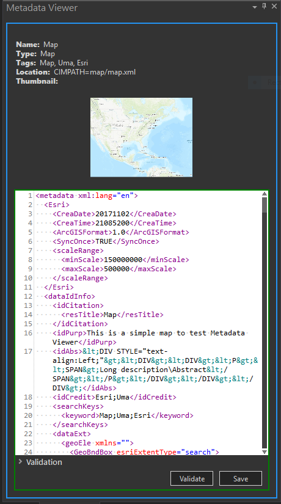

## MetadataViewer

<!-- TODO: Write a brief abstract explaining this sample -->
This sample demonstrates how to view the Metadata of a Project item using the Pro API.  
Note: Metadata of certain items such as system styles cannot be viewed.  
  


<a href="https://pro.arcgis.com/en/pro-app/sdk/" target="_blank">View it live</a>

<!-- TODO: Fill this section below with metadata about this sample-->
```
Language:              C#
Subject:               Content
Contributor:           ArcGIS Pro SDK Team <arcgisprosdk@esri.com>
Organization:          Esri, https://www.esri.com
Date:                  05/06/2025
ArcGIS Pro:            3.5
Visual Studio:         2022
.NET Target Framework: net8.0-windows
```

## Resources

[Community Sample Resources](https://github.com/Esri/arcgis-pro-sdk-community-samples#resources)

### Samples Data

* Sample data for ArcGIS Pro SDK Community Samples can be downloaded from the [Releases](https://github.com/Esri/arcgis-pro-sdk-community-samples/releases) page.  

## How to use the sample
<!-- TODO: Explain how this sample can be used. To use images in this section, create the image file in your sample project's screenshots folder. Use relative url to link to this image using this syntax:  -->
1. In Visual Studio click the Build menu. Then select Build Solution.
2. This solution is using the **AvalonEdit Nuget**.  If needed, you can install the Nuget from the "Nuget Package Manager Console" by using this script: "Install-Package AvalonEdit -Version 5.0.4".  
3. Click Start button to open ArcGIS Pro.  
4. ArcGIS Pro will open.   
5. Open any project file that contains project items such as Maps, toolboxs, databases with metadata.   
6. In the Catalog pane, select any item that has metadata.  
7. Select the Add-in tab and click the Show the Metadata viewer button.  The Metadata Viewer dockpane will be displayed.  
8. The dockpane will display the metadata of the project item selected.  
9. The metadata can also be edited in the viewer.    
10. Check if your edits are valid by clicking the Validate button.  Validation errors (if any) will be displayed.  
11. Click the Save button in the Metadata Viewer dockpane to save your edits.    
  
  

<!-- End -->

&nbsp;&nbsp;&nbsp;&nbsp;&nbsp;&nbsp;
&nbsp;&nbsp;&nbsp;&nbsp;&nbsp;&nbsp;&nbsp;&nbsp;&nbsp;&nbsp;&nbsp;&nbsp;
[Home](https://github.com/Esri/arcgis-pro-sdk/wiki) | <a href="https://pro.arcgis.com/en/pro-app/latest/sdk/api-reference" target="_blank">API Reference</a> | [Requirements](https://github.com/Esri/arcgis-pro-sdk/wiki#requirements) | [Download](https://github.com/Esri/arcgis-pro-sdk/wiki#installing-arcgis-pro-sdk-for-net) | <a href="https://github.com/esri/arcgis-pro-sdk-community-samples" target="_blank">Samples</a>
