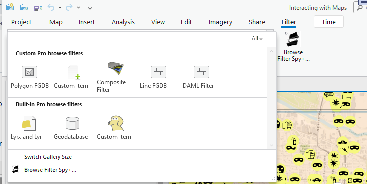
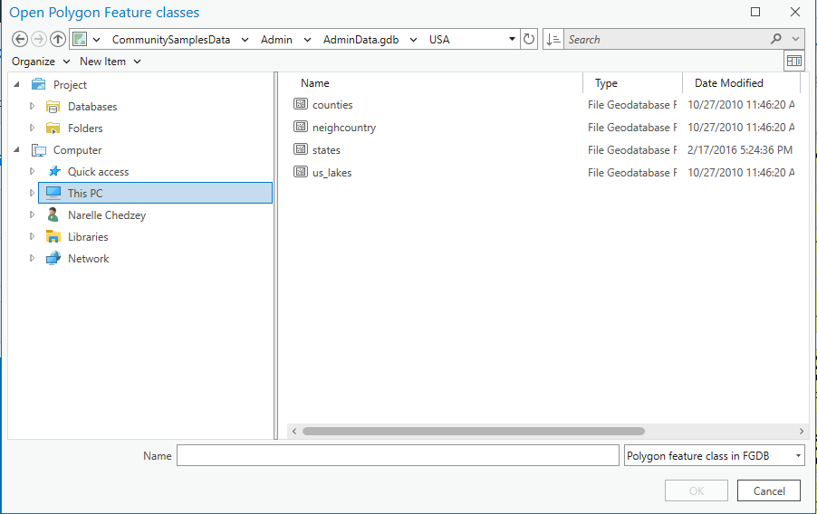
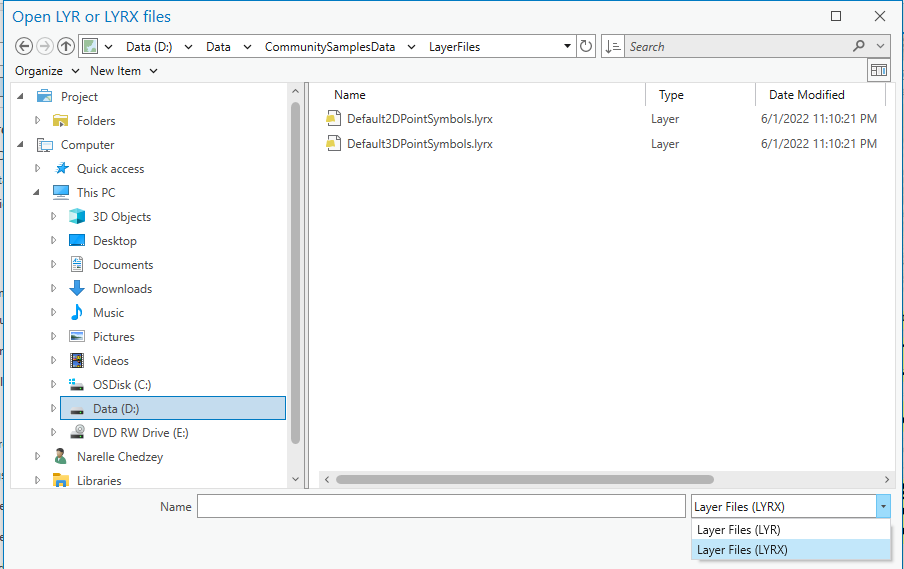
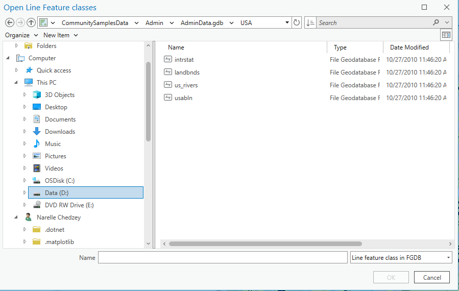
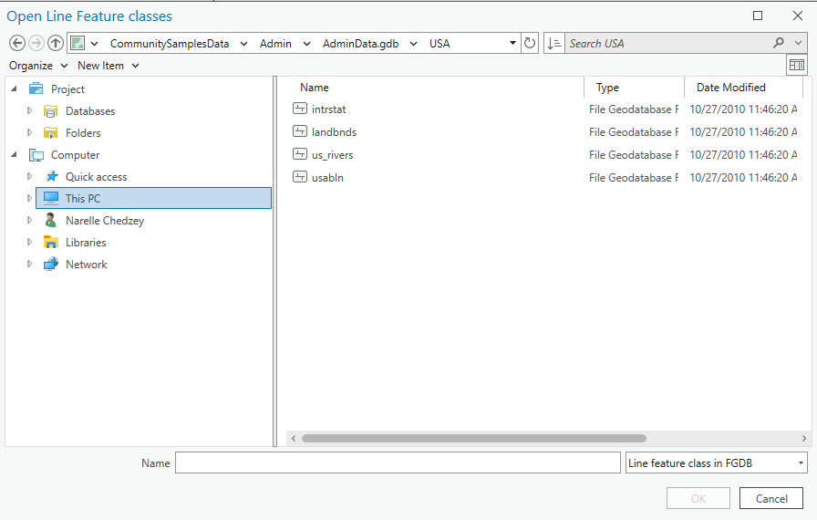
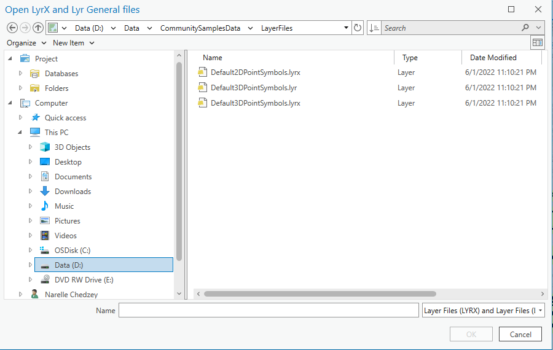
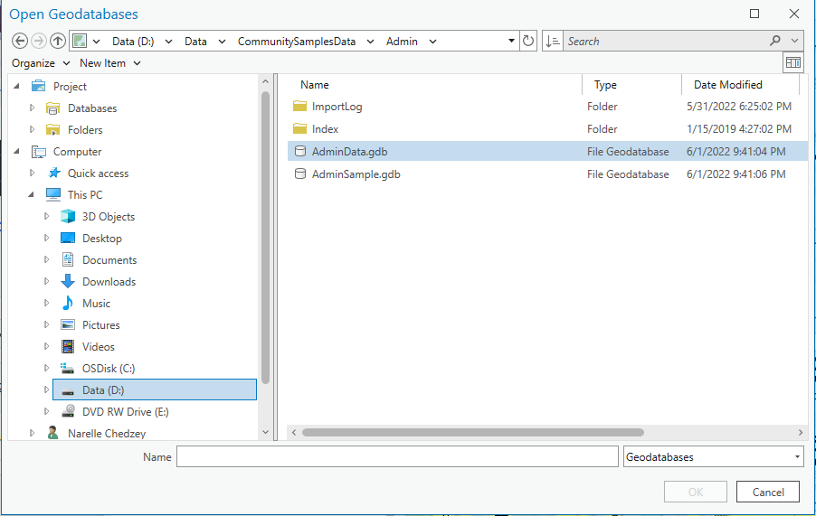
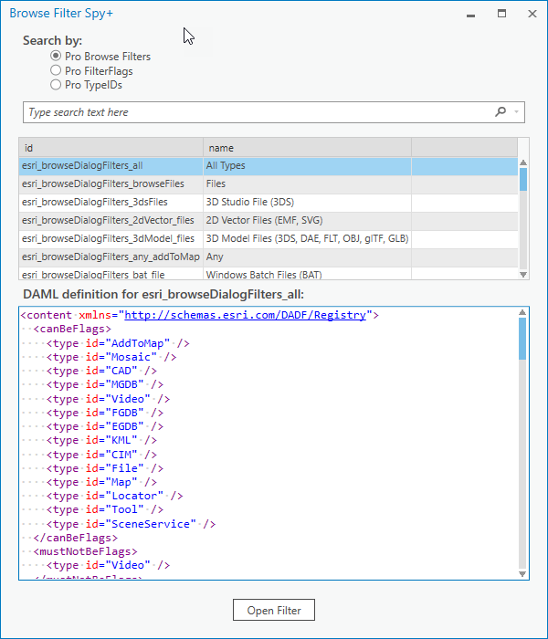

## OpenItemDialogBrowseFilter

<!-- TODO: Write a brief abstract explaining this sample -->
This sample demonstrates working with browse dialog filters.    
  


<a href="http://pro.arcgis.com/en/pro-app/sdk/" target="_blank">View it live</a>

<!-- TODO: Fill this section below with metadata about this sample-->
```
Language:              C#
Subject:               Content
Contributor:           ArcGIS Pro SDK Team <arcgisprosdk@esri.com>
Organization:          Esri, http://www.esri.com
Date:                  7/01/2020
ArcGIS Pro:            2.6
Visual Studio:         2019
.NET Target Framework: 4.8
```

## Resources

* [API Reference online](https://pro.arcgis.com/en/pro-app/sdk/api-reference)
* <a href="https://pro.arcgis.com/en/pro-app/sdk/" target="_blank">ArcGIS Pro SDK for .NET (pro.arcgis.com)</a>
* [arcgis-pro-sdk-community-samples](https://github.com/Esri/arcgis-pro-sdk-community-samples)
* [ArcGIS Pro DAML ID Reference](https://github.com/Esri/arcgis-pro-sdk/wiki/ArcGIS-Pro-DAML-ID-Reference)
* [FAQ](https://github.com/Esri/arcgis-pro-sdk/wiki/FAQ)
* [ArcGIS Pro SDK icons](https://github.com/Esri/arcgis-pro-sdk/releases/tag/2.4.0.19948)


### Samples Data

* Sample data for ArcGIS Pro SDK Community Samples can be downloaded from the [repo releases](https://github.com/Esri/arcgis-pro-sdk-community-samples/releases) page.  

## How to use the sample
<!-- TODO: Explain how this sample can be used. To use images in this section, create the image file in your sample project's screenshots folder. Use relative url to link to this image using this syntax:  -->
Using the sample:  
  
1. In Visual Studio click the Build menu. Then select Build Solution.  
1. Click Start button to open ArcGIS Pro.  
1. ArcGIS Pro will open.   
1. Open any project.  
1. Click the Dialog filters tab on the Pro ribbon.  
1. Notice the in-line gallery that displays a collection of Dialog filters.  
1. Click the gallery expander to view the entire gallery. The filters in this sample are grouped into two categories: Custom Pro browse filters and Built-in browse filters.  
  
  
1. Clicking on each filter will display Pro's OpenItemDialog set to that specific filter.  
1. The table below offers a brief explanation of these filters showcased in this sample.    
  
|Browse dialog image with filter| Filter type| Description|  
|------------- |:-------------:| -----:|  
|    | Custom Pro BrowseProjectFilter<br />**Polygon FGDB**: Show Polygon File GDB|  
|    | Custom Pro BrowseProjectFilter<br />**Custom Item**: Show files with the "customItem" file extension. Sample file located in the [community sample data](https://github.com/Esri/arcgis-pro-sdk-community-samples#samples-data). After you extract the contents of the zip file, the file can be found in the folder C:\Data\BrowseDialogFilters|  
|    | Custom Pro Browse BrowseProjectFilter<br />**Composite Filter**: Show Composite Filter File GDB|  
|    | Custom Pro BrowseProjectFilter<br />**Line FGDB**: Show Line File GDB|  
|    | Custom Pro BrowseProjectFilter<br />**DAML Filter**: Line File GDB filter created from DAML definition files |  
|  | Built-in Pro BrowseProjectFilter<br />**Lyr and Lyrx**:Show Lyrx and lyr files     |  
|  | Built-in Pro BrowseProjectFilter<br />**Geodatabase**: Show all Geodatabases|  
|  | Built-in Pro BrowseProjectFilter<br />**Custom Item**: Browse custom item in Pro's Add to map dialog|      
  
1. Click the "Browse Filter Spy+" button choice at the bottom of the in-line gallery or on the Pro ribbon.    
1. The Browse Filter Spy+ dialog allows you to choose between 3 options - Pro Browse Filters, Pro FilterFlags and ProTypeIDs.  
    * **Pro Browse Filters**: Using this choice you can see all the Browse Filters defined in DAML. This includes Pro's built in filters and those defined in Add-ins (config.daml).   
    You can select any of the browse filters and see its DAML Definition below. The Open Filter button will display Pro's OpenItemDialog set to that specific filter.   
    * **Pro FilterFlags**: Using this choice you can see the enum values for BrowseProjectFilter.FilterFlag. Additionally, when you select any filterFlag,      you can see the typeIDs that participate in that filter flag.  
    * **ProTypeIDs**: This choice allows you to see all the TypeIDs defined in Pro. This includes the typeIDs for custom items created by Add-ins.   
    Additionally, when you select a TypeID in the data grid, you can see the DAML definition of the type ID. This will allow you to see the filterFlags used by that typeID.  
  
  


<!-- End -->

&nbsp;&nbsp;&nbsp;&nbsp;&nbsp;&nbsp;
&nbsp;&nbsp;&nbsp;&nbsp;&nbsp;&nbsp;&nbsp;&nbsp;&nbsp;&nbsp;&nbsp;&nbsp;
[Home](https://github.com/Esri/arcgis-pro-sdk/wiki) | <a href="https://pro.arcgis.com/en/pro-app/sdk/api-reference" target="_blank">API Reference</a> | [Requirements](https://github.com/Esri/arcgis-pro-sdk/wiki#requirements) | [Download](https://github.com/Esri/arcgis-pro-sdk/wiki#installing-arcgis-pro-sdk-for-net) | <a href="https://github.com/esri/arcgis-pro-sdk-community-samples" target="_blank">Samples</a>
