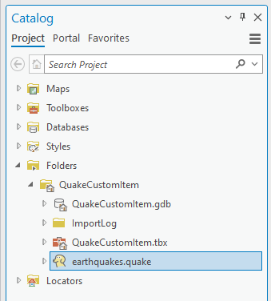
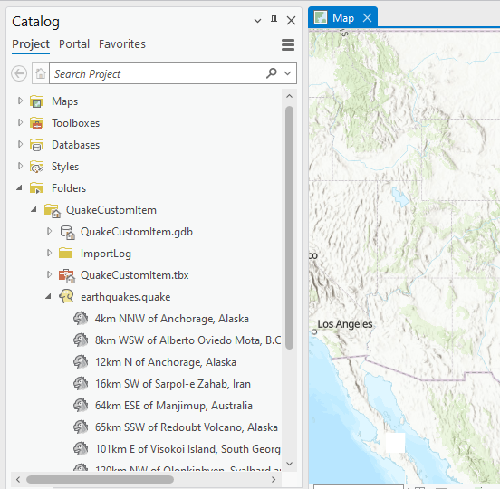
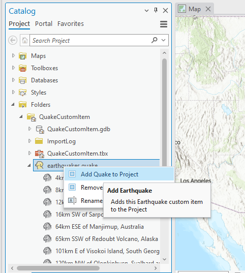
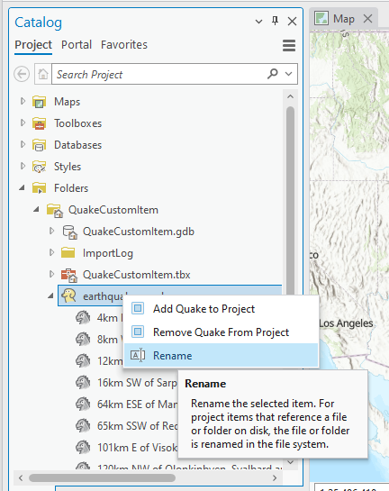

## QuakeItem

<!-- TODO: Write a brief abstract explaining this sample -->
This sample covers how to 'customize' Pro's access to content by using custom items and project custom items.  Specifically we are reading a 'custom' formatted XML file containing earthquake data.  
  


<a href="https://pro.arcgis.com/en/pro-app/sdk/" target="_blank">View it live</a>

<!-- TODO: Fill this section below with metadata about this sample-->
```
Language:              C#
Subject:               Framework
Contributor:           ArcGIS Pro SDK Team <arcgisprosdk@esri.com>
Organization:          Esri, https://www.esri.com
Date:                  02/22/2023
ArcGIS Pro:            3.1
Visual Studio:         2022
.NET Target Framework: net6.0-windows
```

## Resources

[Community Sample Resources](https://github.com/Esri/arcgis-pro-sdk-community-samples#resources)

### Samples Data

* Sample data for ArcGIS Pro SDK Community Samples can be downloaded from the [Releases](https://github.com/Esri/arcgis-pro-sdk-community-samples/releases) page.  

## How to use the sample
<!-- TODO: Explain how this sample can be used. To use images in this section, create the image file in your sample project's screenshots folder. Use relative url to link to this image using this syntax:  -->
1. Download the Community Sample data (see under the 'Resources' section for downloading sample data)  
1. Make sure that the Sample data is unzipped in c:\data   
1. The data used in this sample is located in this folder 'C:\Data\CustomItem\QuakeCustomItem'  
1. In Visual Studio click the Build menu. Then select Build Solution.  
1. Click Start button to open ArcGIS Pro.  
1. In ArcGIS Pro open C:\Data\CustomItem\QuakeCustomItem\QuakeCustomItem.aprx  
1. Open ArcGIS Pro's Catalog dockpane  
1. Under Folders browse to QuakeCustomItem and open the folder.    
1. Notice that earthquake.quake has a custom icon.  This is the result of a -custom item- implementation for all .quake file extensions.  
    
  
1. Open config.daml in the solution and find the update to the -esri_customItems- category, specifically the -acme_quake_handler- component.  This component allows to specify a -fileExtension- -quake- and also a -className- -ProjectCustomItemEarthQuake.Items.QuakeProjectItem- for the codebehind implementation.  
1. Open the Items\QuakeProjectItem.cs source in the solution.  Notice that this class derives from -CustomProjectItemBase- which provides the most of the functionality required for project custom items.  Notice some overrides to modify the out-of-box behavior like for example the -bex the dog- icon.  
1. Back in ArcGIS Pro's Catalog pane open -earthquake.quake-.  Notice the list of earthquake events that a -children- of the -earthquake.quake- file.  
     
  
1. Open the Items\QuakeProjectItem.cs source in the solution.  Notice that this class overrides the -Fetch- function which uses the -AddRangeToChildren- function to add children to the -earthquake.quake- parent.  
     
  
1. Navigate back to the *Bex the dog* icon, right click on this item to bring up the context menu and then click on *Add To Project* to add the *Item* to the current project.  
  
  
  
1. Rename *earthquakes.quake* by using the rename Context Menu button or by simply clicking on the *Custom Project Item* name to enable editing of the name  
  
  
  
1. Click the "Open Quake Event" button. Browse to the 'C:\Data\CustomItem\QuakeCustomItem' folder. You will be able to see the .quake item.  Double click the .quake item to browse into it to see the quake events  
  
  


<!-- End -->

&nbsp;&nbsp;&nbsp;&nbsp;&nbsp;&nbsp;
&nbsp;&nbsp;&nbsp;&nbsp;&nbsp;&nbsp;&nbsp;&nbsp;&nbsp;&nbsp;&nbsp;&nbsp;
[Home](https://github.com/Esri/arcgis-pro-sdk/wiki) | <a href="https://pro.arcgis.com/en/pro-app/latest/sdk/api-reference" target="_blank">API Reference</a> | [Requirements](https://github.com/Esri/arcgis-pro-sdk/wiki#requirements) | [Download](https://github.com/Esri/arcgis-pro-sdk/wiki#installing-arcgis-pro-sdk-for-net) | <a href="https://github.com/esri/arcgis-pro-sdk-community-samples" target="_blank">Samples</a>
