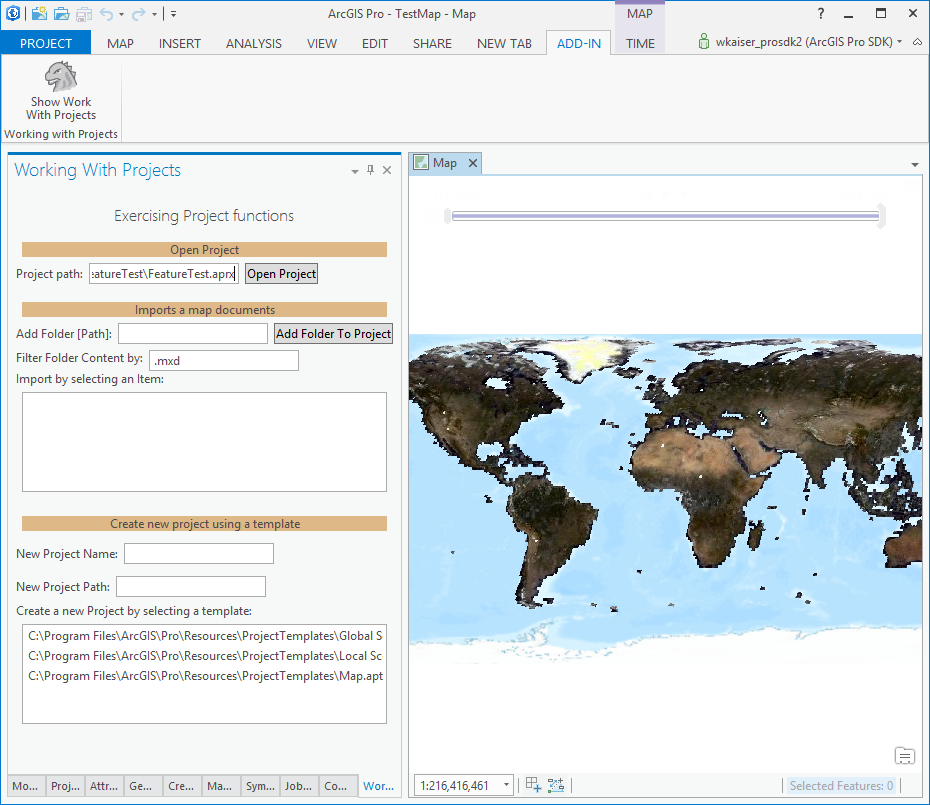

## WorkwithProjects

<!-- TODO: Write a brief abstract explaining this sample -->
This sample illustrates working with ArcGIS Projects.  The sample provides the following functionality  
  
1. Open an existing project.  
2. Opens an existing project, imports a map document (via a folder connection), and saves the project to a different location  
3. Creates a new project using the supplied name from a project template.  
  


<a href="https://pro.arcgis.com/en/pro-app/sdk/" target="_blank">View it live</a>

<!-- TODO: Fill this section below with metadata about this sample-->
```
Language:              C#
Subject:               Content
Contributor:           ArcGIS Pro SDK Team <arcgisprosdk@esri.com>
Organization:          Esri, https://www.esri.com
Date:                  04/04/2024
ArcGIS Pro:            3.3
Visual Studio:         2022
.NET Target Framework: net8.0-windows
```

## Resources

[Community Sample Resources](https://github.com/Esri/arcgis-pro-sdk-community-samples#resources)

### Samples Data

* Sample data for ArcGIS Pro SDK Community Samples can be downloaded from the [Releases](https://github.com/Esri/arcgis-pro-sdk-community-samples/releases) page.  

## How to use the sample
<!-- TODO: Explain how this sample can be used. To use images in this section, create the image file in your sample project's screenshots folder. Use relative url to link to this image using this syntax:  -->
1. Open this solution in Visual Studio.
2. Click the build menu and select Build Solution.  
3. Click the Start button to open ArCGIS Pro.  ArcGIS Pro will open.  
4. Open any project - it can be an existing project containing data or a new empty project.  
5. Click on the Add-in tab and see that a 'Work with Projects' buttons are added to a Tasks group.  
6. The 'Work with Projects' button opens the 'Work with Projects' pane.   
7. To open a new project enter a valid project path and click "open Project"  
8. To import an existing mxd document into an existing project, add a folder that contains mxd files under 'Add Folder [Path]:' then select an item from the list of MXDs  
9. To create a new project enter a new Project Name, and an existing folder path, then select a template to create a new project  
  
  

<!-- End -->

&nbsp;&nbsp;&nbsp;&nbsp;&nbsp;&nbsp;
&nbsp;&nbsp;&nbsp;&nbsp;&nbsp;&nbsp;&nbsp;&nbsp;&nbsp;&nbsp;&nbsp;&nbsp;
[Home](https://github.com/Esri/arcgis-pro-sdk/wiki) | <a href="https://pro.arcgis.com/en/pro-app/latest/sdk/api-reference" target="_blank">API Reference</a> | [Requirements](https://github.com/Esri/arcgis-pro-sdk/wiki#requirements) | [Download](https://github.com/Esri/arcgis-pro-sdk/wiki#installing-arcgis-pro-sdk-for-net) | <a href="https://github.com/esri/arcgis-pro-sdk-community-samples" target="_blank">Samples</a>
