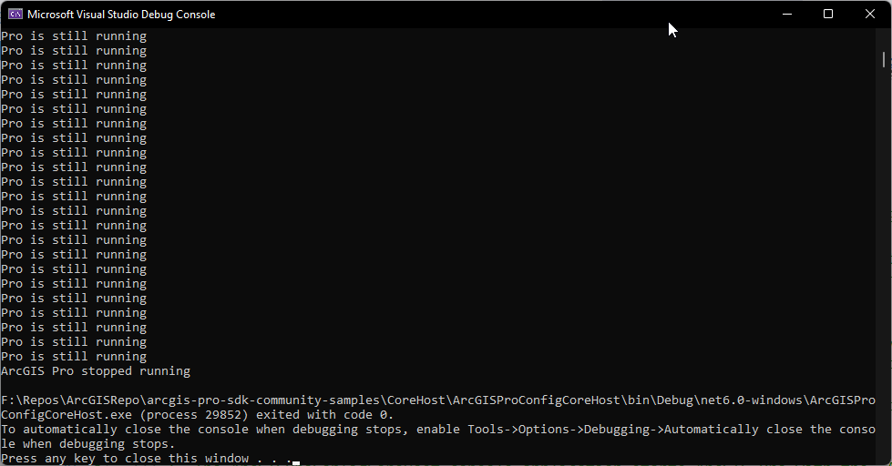

## ArcGISProConfig

<!-- TODO: Write a brief abstract explaining this sample -->
This sample shows how to remote start and remote control ArcGIS Pro from an ArcGIS Corehost application.  
This sample is comprised of two samples:  
- Corehost **server application** that starts and controls the ArcGIS Pro client: ArcGISProConfigCoreHost  
- ArcGIS Pro **client application** that is started and controlled: ArcGISProConfig  
  


<a href="https://pro.arcgis.com/en/pro-app/sdk/" target="_blank">View it live</a>

<!-- TODO: Fill this section below with metadata about this sample-->
```
Language:              C#
Subject:               CoreHost
Contributor:           ArcGIS Pro SDK Team <arcgisprosdk@esri.com>
Organization:          Esri, https://www.esri.com
Date:                  02/22/2023
ArcGIS Pro:            3.1
Visual Studio:         2022
.NET Target Framework: net6.0-windows
```

## Resources

[Community Sample Resources](https://github.com/Esri/arcgis-pro-sdk-community-samples#resources)

### Samples Data

* Sample data for ArcGIS Pro SDK Community Samples can be downloaded from the [Releases](https://github.com/Esri/arcgis-pro-sdk-community-samples/releases) page.  

## How to use the sample
<!-- TODO: Explain how this sample can be used. To use images in this section, create the image file in your sample project's screenshots folder. Use relative url to link to this image using this syntax:  -->
1. Download the Community Sample data (see under the "Resources" section for downloading sample data).  Make sure that the Sample data is unzipped in c:\data and "C:\Data\FeatureTest\FeatureTest.aprx" is available.  
1. Open both solutions in Visual Studio: ArcGISProConfigCoreHost and ArcGISProConfig  
1. Rebuild both solutions.  
1. Make sure this project is available: "C:\Data\FeatureTest\FeatureTest.aprx" or change the path in the Corehost application.  
1. Run the client application: ArcGISProConfigCoreHost  
1. Note that the AppDomain is modified on startup to resolve the Assembly Paths for ArcGIS.Core.dll and ArcGIS.CoreHost.dll by using the ArcGIS Pro installation location.  
1. The ArcGISProConfigCoreHost console application starts ArcGIS Pro with the "ArcGISProConfig" Managed Configuration  
  
  
1. Once ArcGISProConfig has started and is ready, ArcGISProConfigCoreHost sends the project path: "C:\Data\FeatureTest\FeatureTest.aprx" to be opened  
1. ArcGISProConfig opens the project  
  
  
1. Once the output stops press any key to close the application.    
1. Close the "ArcGISProConfig" client session (ArcGIS Pro) using the User Interface.  Note that closing can be automated as well.  
1. The "ArcGISProConfigCoreHost" Corehost application terminates after ArcGIS Pro has been closed.  
  
  


<!-- End -->

&nbsp;&nbsp;&nbsp;&nbsp;&nbsp;&nbsp;
&nbsp;&nbsp;&nbsp;&nbsp;&nbsp;&nbsp;&nbsp;&nbsp;&nbsp;&nbsp;&nbsp;&nbsp;
[Home](https://github.com/Esri/arcgis-pro-sdk/wiki) | <a href="https://pro.arcgis.com/en/pro-app/latest/sdk/api-reference" target="_blank">API Reference</a> | [Requirements](https://github.com/Esri/arcgis-pro-sdk/wiki#requirements) | [Download](https://github.com/Esri/arcgis-pro-sdk/wiki#installing-arcgis-pro-sdk-for-net) | <a href="https://github.com/esri/arcgis-pro-sdk-community-samples" target="_blank">Samples</a>
