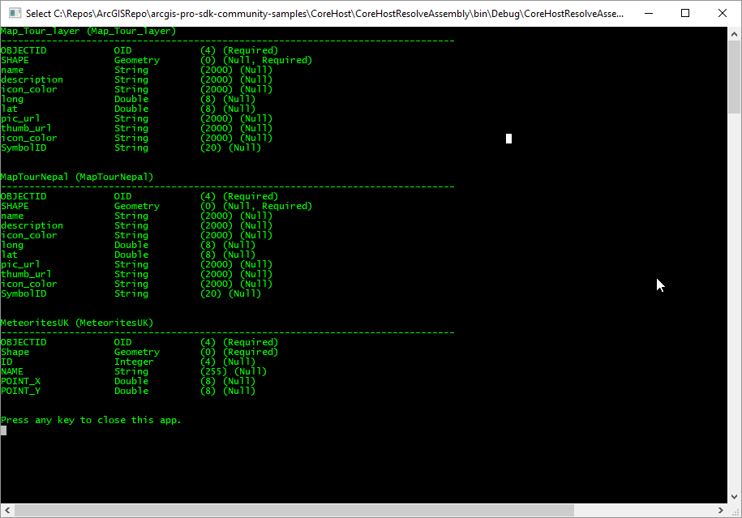

## CoreHostResolveAssembly

<!-- TODO: Write a brief abstract explaining this sample -->
This sample illustrates how to deploy a standalone CoreHost application that resolves the ArcGIS Pro location in order to load the dependent assemblies such as ArcGIS.Core.dll and ArcGIS.CoreHost.dll from the ArcGIS Pro install location.  
Except for the dynamic assembly loading logic this sample is identical to the "CoreHostSample".   
The references to ArcGIS.Core.dll and ArcGIS.CoreHost.dll in Visual Studio have the "Copy Local" property set to "false".   
  


<a href="https://pro.arcgis.com/en/pro-app/sdk/" target="_blank">View it live</a>

<!-- TODO: Fill this section below with metadata about this sample-->
```
Language:              C#
Subject:               Console
Contributor:           ArcGIS Pro SDK Team <arcgisprosdk@esri.com>
Organization:          Esri, https://www.esri.com
Date:                  06/10/2022
ArcGIS Pro:            3.0
Visual Studio:         2022
.NET Target Framework: 4.6.1
```

## Resources

[Community Sample Resources](https://github.com/Esri/arcgis-pro-sdk-community-samples#resources)

### Samples Data

* Sample data for ArcGIS Pro SDK Community Samples can be downloaded from the [Releases](https://github.com/Esri/arcgis-pro-sdk-community-samples/releases) page.  

## How to use the sample
<!-- TODO: Explain how this sample can be used. To use images in this section, create the image file in your sample project's screenshots folder. Use relative url to link to this image using this syntax:  -->
1. Download the Community Sample data (see under the "Resources" section for downloading sample data).  Make sure that the Sample data is unzipped in c:\data and "C:\Data\SDK\SDK.gdb" is available.  
1. Open this solution in Visual Studio   
1. Click the build menu and select Build Solution.  
1. Specify a valid path to a file geodatabase as your debug command line parameter   
1. Click the Start button to run the console app.  
1. Note that the AppDomain is modified on startup to resolve the Assembly Paths for ArcGIS.Core.dll and ArcGIS.CoreHost.dll by using the ArcGIS Pro installation location.  
1. View the table definition in your file geodatabase  
  
  
1. Once the output stops press any key to close the application.    
  


<!-- End -->

&nbsp;&nbsp;&nbsp;&nbsp;&nbsp;&nbsp;
&nbsp;&nbsp;&nbsp;&nbsp;&nbsp;&nbsp;&nbsp;&nbsp;&nbsp;&nbsp;&nbsp;&nbsp;
[Home](https://github.com/Esri/arcgis-pro-sdk/wiki) | <a href="https://pro.arcgis.com/en/pro-app/latest/sdk/api-reference" target="_blank">API Reference</a> | [Requirements](https://github.com/Esri/arcgis-pro-sdk/wiki#requirements) | [Download](https://github.com/Esri/arcgis-pro-sdk/wiki#installing-arcgis-pro-sdk-for-net) | <a href="https://github.com/esri/arcgis-pro-sdk-community-samples" target="_blank">Samples</a>
