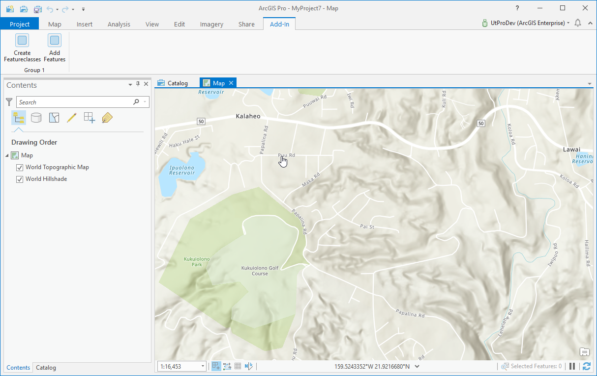

## AddFeatureTest

<!-- TODO: Write a brief abstract explaining this sample -->
This sample shows how to create new featureclasses with attributes and also how to add new features to those newly created featureclasses.  
  


<a href="http://pro.arcgis.com/en/pro-app/sdk/" target="_blank">View it live</a>

<!-- TODO: Fill this section below with metadata about this sample-->
```
Language:              C#
Subject:               Framework
Contributor:           ArcGIS Pro SDK Team <arcgisprosdk@esri.com>
Organization:          Esri, http://www.esri.com
Date:                  7/01/2020
ArcGIS Pro:            2.6
Visual Studio:         2017, 2019
.NET Target Framework: 4.8
```

## Resources

* [API Reference online](https://pro.arcgis.com/en/pro-app/sdk/api-reference)
* <a href="https://pro.arcgis.com/en/pro-app/sdk/" target="_blank">ArcGIS Pro SDK for .NET (pro.arcgis.com)</a>
* [arcgis-pro-sdk-community-samples](https://github.com/Esri/arcgis-pro-sdk-community-samples)
* [ArcGIS Pro DAML ID Reference](https://github.com/Esri/arcgis-pro-sdk/wiki/ArcGIS-Pro-DAML-ID-Reference)
* [FAQ](https://github.com/Esri/arcgis-pro-sdk/wiki/FAQ)
* [ArcGIS Pro SDK icons](https://github.com/Esri/arcgis-pro-sdk/releases/tag/2.4.0.19948)


### Samples Data

* Sample data for ArcGIS Pro SDK Community Samples can be downloaded from the [repo releases](https://github.com/Esri/arcgis-pro-sdk-community-samples/releases) page.  

## How to use the sample
<!-- TODO: Explain how this sample can be used. To use images in this section, create the image file in your sample project's screenshots folder. Use relative url to link to this image using this syntax:  -->
1. In Visual studio rebuild the solution.  
1. Debug the add-in by clicking the "Start" button.  
1. ArcGIS Pro opens, select a new Map project  
1. Zoom the new map into your local neighborhood, because the newly created features will be in close proximity.  
  
  
1. Click the "Create Featureclasses" button to create a point and a polygon feature class.  Both are added to your map as well.   
  
  
1. Click the "Add Features" button to add 5 feature to each newly create feature class.   
  
  


<!-- End -->

&nbsp;&nbsp;&nbsp;&nbsp;&nbsp;&nbsp;
&nbsp;&nbsp;&nbsp;&nbsp;&nbsp;&nbsp;&nbsp;&nbsp;&nbsp;&nbsp;&nbsp;&nbsp;
[Home](https://github.com/Esri/arcgis-pro-sdk/wiki) | <a href="https://pro.arcgis.com/en/pro-app/sdk/api-reference" target="_blank">API Reference</a> | [Requirements](https://github.com/Esri/arcgis-pro-sdk/wiki#requirements) | [Download](https://github.com/Esri/arcgis-pro-sdk/wiki#installing-arcgis-pro-sdk-for-net) | <a href="https://github.com/esri/arcgis-pro-sdk-community-samples" target="_blank">Samples</a>
