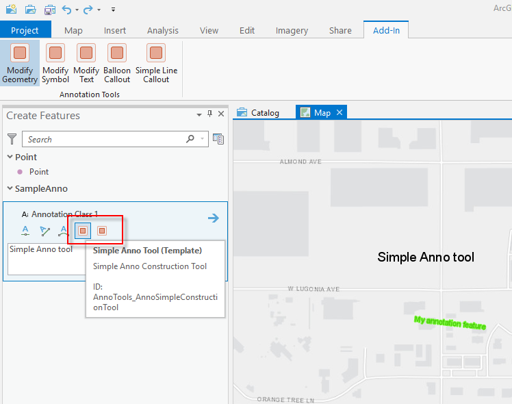
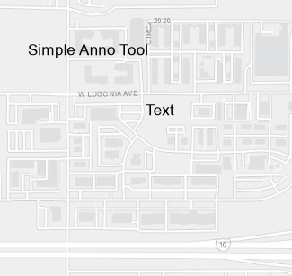
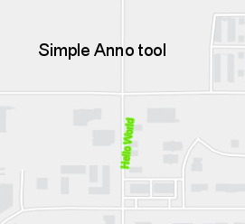
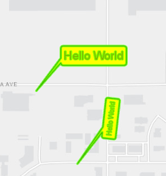
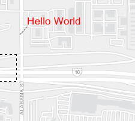
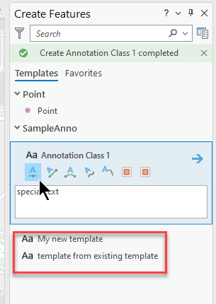

## AnnoTools

<!-- TODO: Write a brief abstract explaining this sample -->
This sample illustrates construction tools and modify tools for annotation feature classes.  The modify tools show how to modify the text, geometry and symbol of  annotation features.  There are also some tools illustrating how to add callouts and leader lines to annotation features.   
Annotation has the following special considerations  
  
1.  Annotation feature classes store polygon geometry.  This polygon is the bounding box of the text of an annotation feature. The  bounding box is calculated from the text string, font, font size, angle orientation and other text formatting attributes of the feature.   
It is automatically updated by the application each time the annotation attributes are modified. You should never need to access or  modify an annotation feature's polygon shape.  
2. The text attributes of an annotation feature are represented as a CIMTextGraphic. The CIMTextGraphic  contains the text string, text formatting attributes (such as alignment, angle, font, color, etc), and other information (such as callouts  and leader lines). It also has a shape which represents the baseline geometry that the annotation text string sits upon. For annotation  features this CIMTextGraphic shape can be a point, polyline (typically a two point line or Bezier curve), multipoint or geometryBag. It is  this shape that you will typically interact with when developing annotation tools. For example when creating annotation features, the geometry passed to the EditOperation.Create method is the CIMTextGraphic geometry.  
3.  In ArcGIS Pro, the only fields guaranteed to exist in an annotation schema are AnnotationClassID, SymbolID, Element, FeatureID,   
ZOrder and Status along with the system ObjectID and Shape fields. All other fields which store text formatting attributes (such as   
TextString, FontName, VerticalAlignment, HorizontalAlignment etc) are not guaranteed to exist in the physical schema. This is different  from the annotation schema in ArcGIS 10x where all fields existed and were unable to be deleted. In ArcGIS Pro, these text formatting  fields are able to be deleted by the user if they exist; they are no longer designated as protected or system fields. If you are writing  or porting tools that create or modify annotation features, it is essential to take this important concept into account.  
4. Construction tools - Set the categoryRefID in the daml file to be "esri_editing_construction_annotation".  Also note that the geometry being passed to the EditOperation.Create method is the CIMTextGraphic geometry.  
5. Editing tools - Use the GetAnnotationProperties and SetAnnotationPropertes methods on the Inspector object to modify the text formatting attributes.  (see AnnoModifySymbol.cs).  Any custom attributes in your schema can continue to be referenced via the inspector[fieldName] methodology.    
  


<a href="https://pro.arcgis.com/en/pro-app/sdk/" target="_blank">View it live</a>

<!-- TODO: Fill this section below with metadata about this sample-->
```
Language:              C#
Subject:               Editing
Contributor:           ArcGIS Pro SDK Team <arcgisprosdk@esri.com>
Organization:          Esri, https://www.esri.com
Date:                  04/04/2024
ArcGIS Pro:            3.3
Visual Studio:         2022
.NET Target Framework: net8.0-windows
```

## Resources

[Community Sample Resources](https://github.com/Esri/arcgis-pro-sdk-community-samples#resources)

### Samples Data

* Sample data for ArcGIS Pro SDK Community Samples can be downloaded from the [Releases](https://github.com/Esri/arcgis-pro-sdk-community-samples/releases) page.  

## How to use the sample
<!-- TODO: Explain how this sample can be used. To use images in this section, create the image file in your sample project's screenshots folder. Use relative url to link to this image using this syntax:  -->
1. Download the Community Sample data (see under the 'Resources' section for downloading sample data)
2. Make sure that the Sample data is unzipped in c:\data   
3. The project used for this sample is 'C:\Data\SampleAnno\SampleAnno.aprx'  
4. In Visual studio click the Build menu. Then select Build Solution.  
5. Start the Debugger to open ArcGIS Pro.  
6. ArcGIS Pro will open, select the SampleAnno.aprx project  
7. Activate an annotation template and see the two additional construction tools - Simple Anno Tool (Template) and Advanced Anno Tool.  
  
8. Select the Simple Anno Tool and digitize a point.  An annotation feature will be created.   
  
9. Select the Advanced Anno Tool and digitize a line.  An annotation feature will be created.   
  
10. Click the 'Modify Anno Geometry' tool on the Add-In tab and drag a rectangle around the annotation features created by the advanced tool. The geometry of these features will be rotated 90 degrees.  
11. Click the 'Modify Anno Symbol' tool on the Add-In tab and drag a rectangle around some annotation features. The text and symbol color of these features will change to 'Hello World' in red.  
  
12. Click the 'Balloon Callout' tool on the Add-In tab and drag a rectangle around some annotation features. The text will change to a 'Balloon Callout'.  
  
13. Click the 'Simple Line Callout' tool on the Add-In tab and drag a rectangle around some annotation features. The text will change to a 'Line Callout'.  
  
14. Click the 'New Anno Template' button on the Add-In tab. Notice the new template created in the Create Feature pane.  
15. Click the 'New Anno Template from Existing Tempate' button on the Add-In tab. Notice the new template created in the Create Feature pane.  
  
  

<!-- End -->

&nbsp;&nbsp;&nbsp;&nbsp;&nbsp;&nbsp;
&nbsp;&nbsp;&nbsp;&nbsp;&nbsp;&nbsp;&nbsp;&nbsp;&nbsp;&nbsp;&nbsp;&nbsp;
[Home](https://github.com/Esri/arcgis-pro-sdk/wiki) | <a href="https://pro.arcgis.com/en/pro-app/latest/sdk/api-reference" target="_blank">API Reference</a> | [Requirements](https://github.com/Esri/arcgis-pro-sdk/wiki#requirements) | [Download](https://github.com/Esri/arcgis-pro-sdk/wiki#installing-arcgis-pro-sdk-for-net) | <a href="https://github.com/esri/arcgis-pro-sdk-community-samples" target="_blank">Samples</a>
