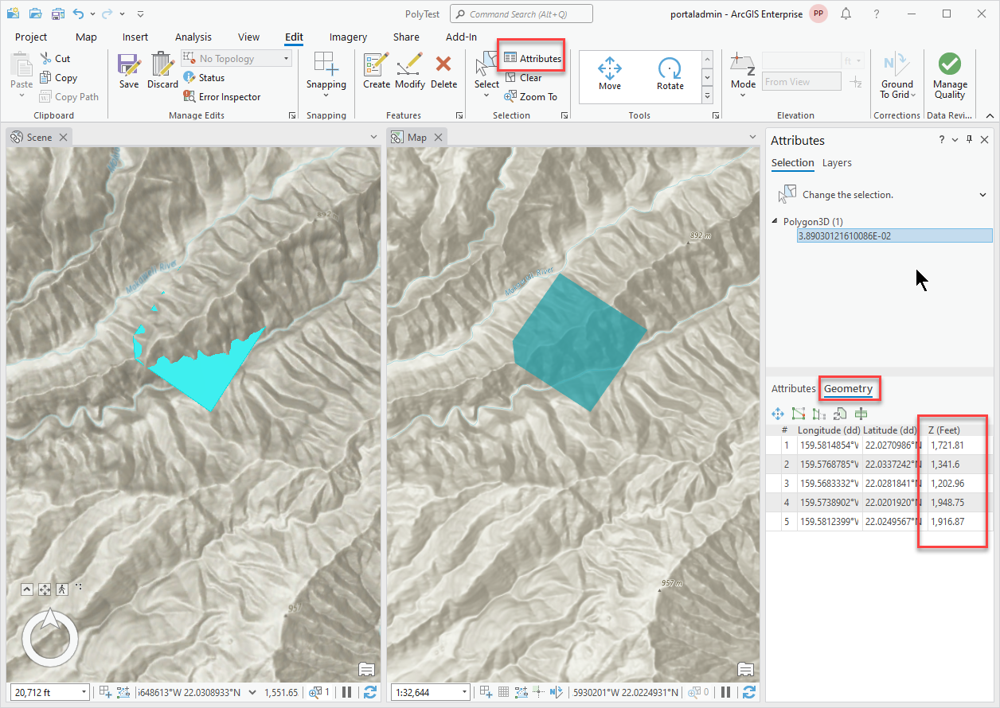

## BeforeSketchCompleted

<!-- TODO: Write a brief abstract explaining this sample -->
This sample demonstrates the use of the BeforeSketchCompleted event to modify the sketch geometry before the sketch is completed.  
The example sets the Z values of the sketch to the specified elevation surface regardless of the current Z environment and any existing Z values the sketch may have.  
  


<a href="https://pro.arcgis.com/en/pro-app/sdk/" target="_blank">View it live</a>

<!-- TODO: Fill this section below with metadata about this sample-->
```
Language:              C#
Subject:               Editing Sketch Events
Contributor:           ArcGIS Pro SDK Team <arcgisprosdk@esri.com>
Organization:          Esri, https://www.esri.com
Date:                  04/04/2024
ArcGIS Pro:            3.3
Visual Studio:         2022
.NET Target Framework: net8.0-windows
```

## Resources

[Community Sample Resources](https://github.com/Esri/arcgis-pro-sdk-community-samples#resources)

### Samples Data

* Sample data for ArcGIS Pro SDK Community Samples can be downloaded from the [Releases](https://github.com/Esri/arcgis-pro-sdk-community-samples/releases) page.  

## How to use the sample
<!-- TODO: Explain how this sample can be used. To use images in this section, create the image file in your sample project's screenshots folder. Use relative url to link to this image using this syntax:  -->
1. Download the Community Sample data (see under the 'Resources' section for downloading sample data).  The sample data contains a folder called 'C:\Data\Configurations\Projects' with sample data required for this solution.  Make sure that the Sample data (specifically CommunitySampleData-3D-mm-dd-yyyy.zip) is unzipped into c:\data and c:\data\PolyTest is available.
2. In Visual Studio click the Build menu. Then select Build Solution.  
3. Start the debugger to open ArcGIS Pro.  
4. ArcGIS Pro will open.   
5. Open the Pro project file: PolyTest.aprx in the C:\Data\PolyTest\ folder or another map containing Z aware editable data and an elevation surface called 'Ground' Alternatively create a new map with Z aware editable data (e.g. map notes) and add an elevation source.  
6. Open the add-in tab and click on the BeforeSketchCompleted button in the Sketch Events group  
7. On the edit tab, click on the Create button in the Features group to display the create features pane.  
8. Create a feature using a construction tool (the default polygon or line tool where applicable).  
9. Select and examine the Z values on the newly created feature via the attributes pane and switch to the geometry tab. The Z values should reflect the surface Z values.  
  
  

<!-- End -->

&nbsp;&nbsp;&nbsp;&nbsp;&nbsp;&nbsp;
&nbsp;&nbsp;&nbsp;&nbsp;&nbsp;&nbsp;&nbsp;&nbsp;&nbsp;&nbsp;&nbsp;&nbsp;
[Home](https://github.com/Esri/arcgis-pro-sdk/wiki) | <a href="https://pro.arcgis.com/en/pro-app/latest/sdk/api-reference" target="_blank">API Reference</a> | [Requirements](https://github.com/Esri/arcgis-pro-sdk/wiki#requirements) | [Download](https://github.com/Esri/arcgis-pro-sdk/wiki#installing-arcgis-pro-sdk-for-net) | <a href="https://github.com/esri/arcgis-pro-sdk-community-samples" target="_blank">Samples</a>
