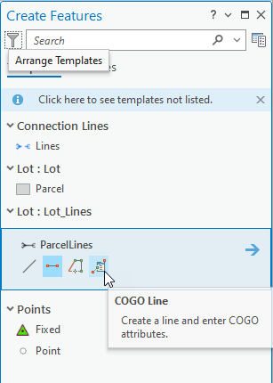
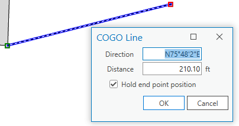
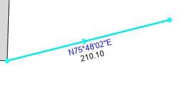

## COGOLineFeatures

<!-- TODO: Write a brief abstract explaining this sample -->
This custom feature template construction tool is used to click two locations on the map and presents measured COGO attribute values, then allows those attributes to be edited without altering the end point location of the created line. This can be used as an enhanced Direction Distance constraint tool or as an enhanced measure tool that holds fixed the locations snapped on the map, while also maintaining the entered values.  
  


<a href="https://pro.arcgis.com/en/pro-app/sdk/" target="_blank">View it live</a>

<!-- TODO: Fill this section below with metadata about this sample-->
```
Language:              C#
Subject:               Editing, Geometry
Contributor:           ArcGIS Pro SDK Team <arcgisprosdk@esri.com>
Organization:          Esri, https://www.esri.com
Date:                  05/06/2025
ArcGIS Pro:            3.5
Visual Studio:         2022
.NET Target Framework: net8.0-windows
```

## Resources

[Community Sample Resources](https://github.com/Esri/arcgis-pro-sdk-community-samples#resources)

### Samples Data

* Sample data for ArcGIS Pro SDK Community Samples can be downloaded from the [Releases](https://github.com/Esri/arcgis-pro-sdk-community-samples/releases) page.  

## How to use the sample
<!-- TODO: Explain how this sample can be used. To use images in this section, create the image file in your sample project's screenshots folder. Use relative url to link to this image using this syntax:  -->
1. Build or debug the sample through Visual Studio.
2. In Pro, add a line layer or a COGO enabled line layer to the map.  
3. Click the Edit tab and click Create Features button in the Feature group.  
4. Click the line feature template in the Create Features pane, and click the COGO Line tool.    
  
5. Snap to or click in the map for the first point of the COGO line, then snap to or click in the map for the second point.  
6. The COGO line dialog shows the measured Direction and Distance values.  
    
7. Change the values as needed to match the source document; these are usually small changes to the numbers.  
8. The first Direction entry box has the focus, you can press the Enter key to move the focus to the Distance field, and press Enter again to create the line.  
9. The check box "Hold end point position" is turned on by default. Uncheck the box to have the end point location updated based on changed values.  
10. You can type a negative distance to reverse the direction of the line.  
11. To create the line you can click the OK button, or you can press Enter when in the Distance entry field. The dialog will automatically close.  
  
  

<!-- End -->

&nbsp;&nbsp;&nbsp;&nbsp;&nbsp;&nbsp;
&nbsp;&nbsp;&nbsp;&nbsp;&nbsp;&nbsp;&nbsp;&nbsp;&nbsp;&nbsp;&nbsp;&nbsp;
[Home](https://github.com/Esri/arcgis-pro-sdk/wiki) | <a href="https://pro.arcgis.com/en/pro-app/latest/sdk/api-reference" target="_blank">API Reference</a> | [Requirements](https://github.com/Esri/arcgis-pro-sdk/wiki#requirements) | [Download](https://github.com/Esri/arcgis-pro-sdk/wiki#installing-arcgis-pro-sdk-for-net) | <a href="https://github.com/esri/arcgis-pro-sdk-community-samples" target="_blank">Samples</a>
