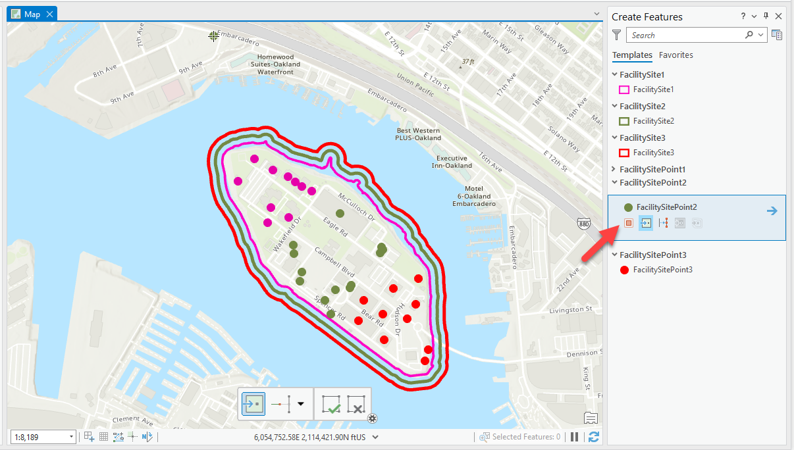
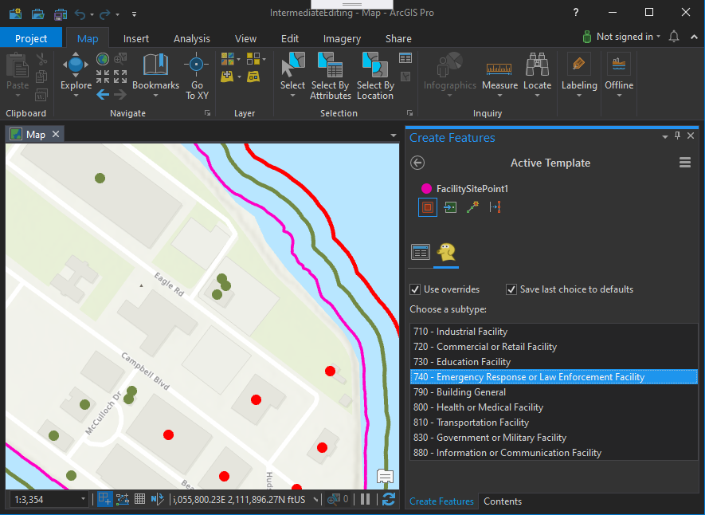

## ConstructToolWithOptions

<!-- TODO: Write a brief abstract explaining this sample -->
This sample illustrates how to build a point construction tool with the option to select the feature subtype when the point is created.    
  


<a href="https://pro.arcgis.com/en/pro-app/sdk/" target="_blank">View it live</a>

<!-- TODO: Fill this section below with metadata about this sample-->
```
Language:              C#
Subject:               Editing
Contributor:           ArcGIS Pro SDK Team <arcgisprosdk@esri.com>
Organization:          Esri, https://www.esri.com
Date:                  11/04/2024
ArcGIS Pro:            3.4
Visual Studio:         2022
.NET Target Framework: net8.0-windows
```

## Resources

[Community Sample Resources](https://github.com/Esri/arcgis-pro-sdk-community-samples#resources)

### Samples Data

* Sample data for ArcGIS Pro SDK Community Samples can be downloaded from the [Releases](https://github.com/Esri/arcgis-pro-sdk-community-samples/releases) page.  

## How to use the sample
<!-- TODO: Explain how this sample can be used. To use images in this section, create the image file in your sample project's screenshots folder. Use relative url to link to this image using this syntax:  -->
1. Download the Community Sample data (see under the 'Resources' section for downloading sample data)
2. Make sure that the Sample data is unzipped in c:\data  
3. The project used for this sample is 'C:\Data\ConstructToolSample\ConstructToolSample.ppkx'  
4. In Visual Studio click the Build menu.Then select Build Solution.  
5. Launch the debugger to open ArcGIS Pro.  
6. ArcGIS Pro will open, select the ConstructToolSample.ppkx project  
7. Select the 'Edit' tab on the ArcGIS Pro ribbon and click the 'Create' button    
8. On the 'Create Features' pane select any of the point features (FacilitySitePoint... feature classes) to see the 'Construct Facilities with Subtypes Tool' tool  
        
9. Select the tool and see the Options page displaying the subtype selection  
        
10. Select a subtype to generate a new point feature using that subtype.  
  

<!-- End -->

&nbsp;&nbsp;&nbsp;&nbsp;&nbsp;&nbsp;
&nbsp;&nbsp;&nbsp;&nbsp;&nbsp;&nbsp;&nbsp;&nbsp;&nbsp;&nbsp;&nbsp;&nbsp;
[Home](https://github.com/Esri/arcgis-pro-sdk/wiki) | <a href="https://pro.arcgis.com/en/pro-app/latest/sdk/api-reference" target="_blank">API Reference</a> | [Requirements](https://github.com/Esri/arcgis-pro-sdk/wiki#requirements) | [Download](https://github.com/Esri/arcgis-pro-sdk/wiki#installing-arcgis-pro-sdk-for-net) | <a href="https://github.com/esri/arcgis-pro-sdk-community-samples" target="_blank">Samples</a>
