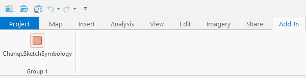
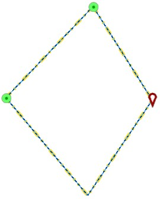
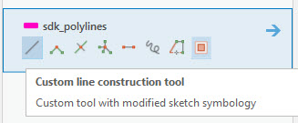
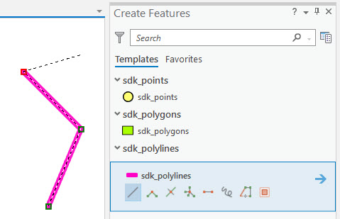

## Customtool Sketch Symbology

<!-- TODO: Write a brief abstract explaining this sample -->
This sample provides a custom line construction tool and a MapTool.  
The custom line construction tool for polyline templates when activated, modifies the sketch symbology just for that particular tool. By the term "Sketch Symbology" here, we are referring to the symbology of the sketch segment, and vertices. The sketch vertices have 4 different symbologies for unselected vertex, selected vertex, current vertex unselected, and current vertex selected.  
  
  
  
This sample shows you how you can edit those symbologies. So when you activate the custom tool, the modified sketch symbology is used and when you deactivate it, it goes back to the symbology set in the application settings.  
  
The ChangeSketchSymbology MapTool can be found in the AddIn tab on the main application ribbon.  
  
Once you activate it, it changes the sketch symbology we talked about earlier and also modifies a property called "SketchSymbol" of the MapTool, and then allows you to sketch a polygon.  
The sketch is then cleared upon completion. This will help you understand the difference between the SketchSymbol property and the sketch segment and sketch vertices.  
The SketchSymbol is used to customize the fixed part of the sketch, i.e. the part of the sketch that shows you what the feature will look like if you finish the sketch right then without doing any further edits.  
In this example, the SketchSegment is changed to be a yellow line with a dash dot dot style.  
The sketch segment is dashed dark blue and light blue line.  
The current unselected vertex is a red pin, and the other unselected vertices are made a circular dark and light green point.  
  
  


<a href="https://pro.arcgis.com/en/pro-app/sdk/" target="_blank">View it live</a>

<!-- TODO: Fill this section below with metadata about this sample-->
```
Language:              C#
Subject:               Editing
Contributor:           ArcGIS Pro SDK Team <arcgisprosdk@esri.com>
Organization:          Esri, https://www.esri.com
Date:                  02/22/2023
ArcGIS Pro:            3.1
Visual Studio:         2022
.NET Target Framework: net6.0-windows
```

## Resources

[Community Sample Resources](https://github.com/Esri/arcgis-pro-sdk-community-samples#resources)

### Samples Data

* Sample data for ArcGIS Pro SDK Community Samples can be downloaded from the [Releases](https://github.com/Esri/arcgis-pro-sdk-community-samples/releases) page.  

## How to use the sample
<!-- TODO: Explain how this sample can be used. To use images in this section, create the image file in your sample project's screenshots folder. Use relative url to link to this image using this syntax:  -->
For sample data, download CommunitySampleData-12-15-2020.zip from https://github.com/Esri/arcgis-pro-sdk-community-samples/releases and unzip it. We will be using the project in "Working with Core Geometry and Data" folder as an example for this AddIn.  
  
1. In Visual Studio click the Build menu. Then select Build Solution.  
1. Click Start button to open ArcGIS Pro.  
1. ArcGIS Pro will open.   
1. Open the Workshop.aprx file from Core Geometry and Data folder you just downloaded.  We can use any project that contains editable polyline data. We are just using Workshop.aprx as an example here.  
1. Open the Create features pane and select a polyline template (in this example that will be the sdk_polylines template).  
1. You will see a custom tool named "Custom line construction tool" at the end of the tools listed below the activated template.  
  
  
1. First let us observe the current sketch symbology by sketching with the default tool of that line template.  
  
  
1. Now activate the custom tool and start sketching and observe how the sketch symbology has changed.  
  
  
1. In this sample, the segment's primary color is changed to orange and the size is changed to 4.  
1. The unselected vertex symbology is also modified to have a yellow color, total size 5, and purple outline of width 3.  
1. When you finish or cancel the sketch (so as to deactivate the custom tool) and then activate any one of the other tools, you'll notice that the sketch symbology has been restored to the application settings.  
  


<!-- End -->

&nbsp;&nbsp;&nbsp;&nbsp;&nbsp;&nbsp;
&nbsp;&nbsp;&nbsp;&nbsp;&nbsp;&nbsp;&nbsp;&nbsp;&nbsp;&nbsp;&nbsp;&nbsp;
[Home](https://github.com/Esri/arcgis-pro-sdk/wiki) | <a href="https://pro.arcgis.com/en/pro-app/latest/sdk/api-reference" target="_blank">API Reference</a> | [Requirements](https://github.com/Esri/arcgis-pro-sdk/wiki#requirements) | [Download](https://github.com/Esri/arcgis-pro-sdk/wiki#installing-arcgis-pro-sdk-for-net) | <a href="https://github.com/esri/arcgis-pro-sdk-community-samples" target="_blank">Samples</a>
