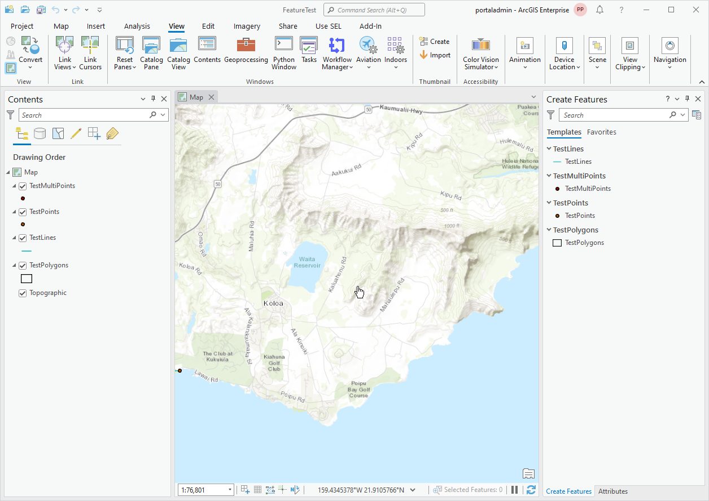
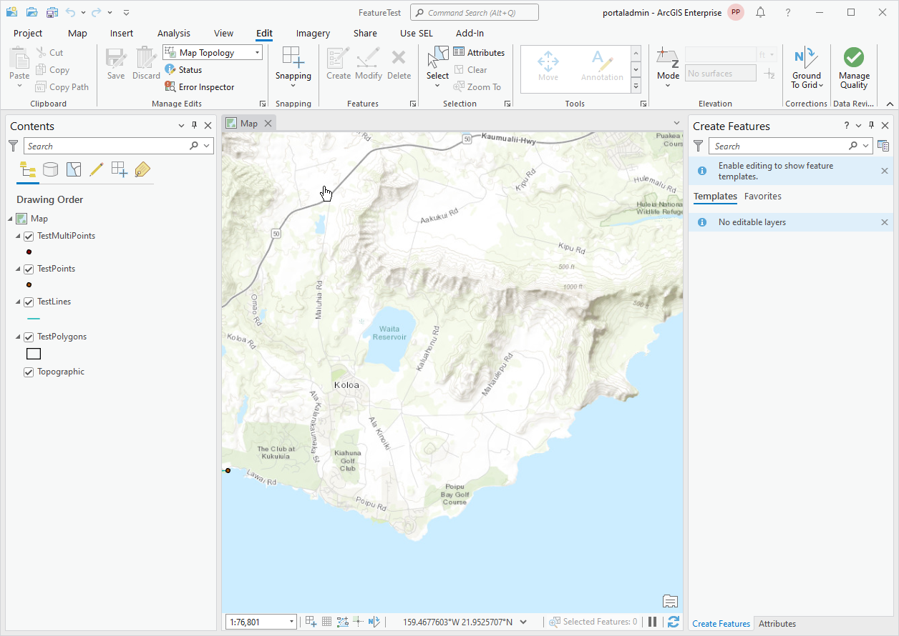
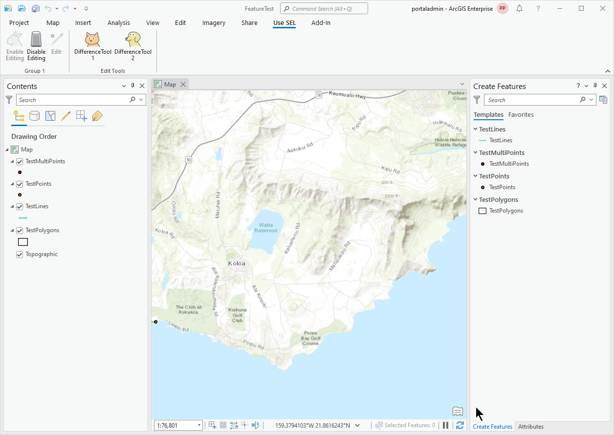
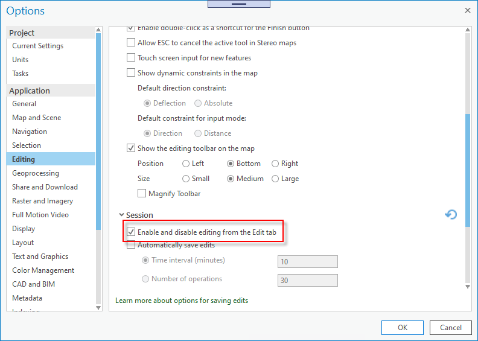
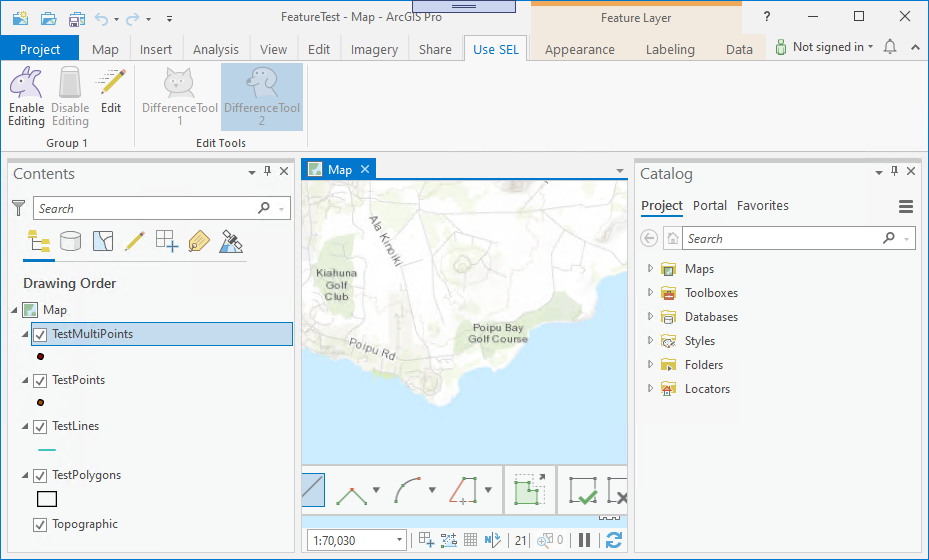

## DemoUseSelection

<!-- TODO: Write a brief abstract explaining this sample -->
This sample shows two things.<br />  
The first is the use of ActivateSelectAsync in conjunction with UseSelection in a couple of example editing tools.  
The two tools both do the same thing - a Difference operation against any selected polygons intersected by the sketch.<p />  
DifferenceTool 1 shows use of UseSelection = <b>true</b>  and leverages built-in behavior of the SHIFT key to toggle the tool into selection mode.<br />  
DifferenceTool 2 also uses UseSelection = <b>true</b> and a custom key - "W" to toggle into select mode. It also shows how to handle the SHIFT key to prevent the default behavior from intefering with the tool's use of "W".<br />  
Developers can experiment by setting UseSelection to <b>false</b> to observe how that changes the behavior of the tools.<p />  
The second thing demonstrated by the sample is the use of <b>Project.Current.IsEditingEnabled</b> in-conjunction with <b>Project.Current.SetIsEditingEnabledAsync(true | false)</b> to detect if a project has editing enabled and to toggle editing on|off. This is new at <b>2.6</b>  


<a href="http://pro.arcgis.com/en/pro-app/sdk/" target="_blank">View it live</a>

<!-- TODO: Fill this section below with metadata about this sample-->
```
Language:              C#
Subject:               Editing
Contributor:           ArcGIS Pro SDK Team <arcgisprosdk@esri.com>
Organization:          Esri, http://www.esri.com
Date:                  5/12/2021
ArcGIS Pro:            2.8
Visual Studio:         2019
.NET Target Framework: 4.8
```

## Resources

[Community Sample Resources](https://github.com/Esri/arcgis-pro-sdk-community-samples#resources)

### Samples Data

* Sample data for ArcGIS Pro SDK Community Samples can be downloaded from the [Releases](https://github.com/Esri/arcgis-pro-sdk-community-samples/releases) page.  

## How to use the sample
<!-- TODO: Explain how this sample can be used. To use images in this section, create the image file in your sample project's screenshots folder. Use relative url to link to this image using this syntax:  -->
1. In Visual Studio click the Build menu. Then select Build Solution.    
1. Click Start button to open ArcGIS Pro.  
1. ArcGIS Pro will open.   
1. Open any project which features you can edit, for example: 'C:\Data\FeatureTest\FeatureTest.aprx'   
1. Click the Edit tab.  Notice that edit functions like create/modify are enabled.  
  
  
1. Click the SEL tab.  Then click 'Disable Editing' to disable editing.  
  
  
1. Click the Edit tab.  Notice that edit functions like create/modify are now disabled.   
  
  
1. Click the SEL tab.  Then click 'Enable Editing' to re-able editing.  Notice that the 'Difference' custom tools are now re-abled as well.   
  
  
1. To utilize the "Edit" button you have to set the "Disable/Enable Editing" option in ArcGIS Pro options as shown here.  
  
  
1. Click 'Edit' to enable editing.  Notice that the 'Enable/Disable Editing' buttons honor the 'Edit' button status and vice versa.  
  
  


<!-- End -->

&nbsp;&nbsp;&nbsp;&nbsp;&nbsp;&nbsp;
&nbsp;&nbsp;&nbsp;&nbsp;&nbsp;&nbsp;&nbsp;&nbsp;&nbsp;&nbsp;&nbsp;&nbsp;
[Home](https://github.com/Esri/arcgis-pro-sdk/wiki) | <a href="https://pro.arcgis.com/en/pro-app/latest/sdk/api-reference" target="_blank">API Reference</a> | [Requirements](https://github.com/Esri/arcgis-pro-sdk/wiki#requirements) | [Download](https://github.com/Esri/arcgis-pro-sdk/wiki#installing-arcgis-pro-sdk-for-net) | <a href="https://github.com/esri/arcgis-pro-sdk-community-samples" target="_blank">Samples</a>
