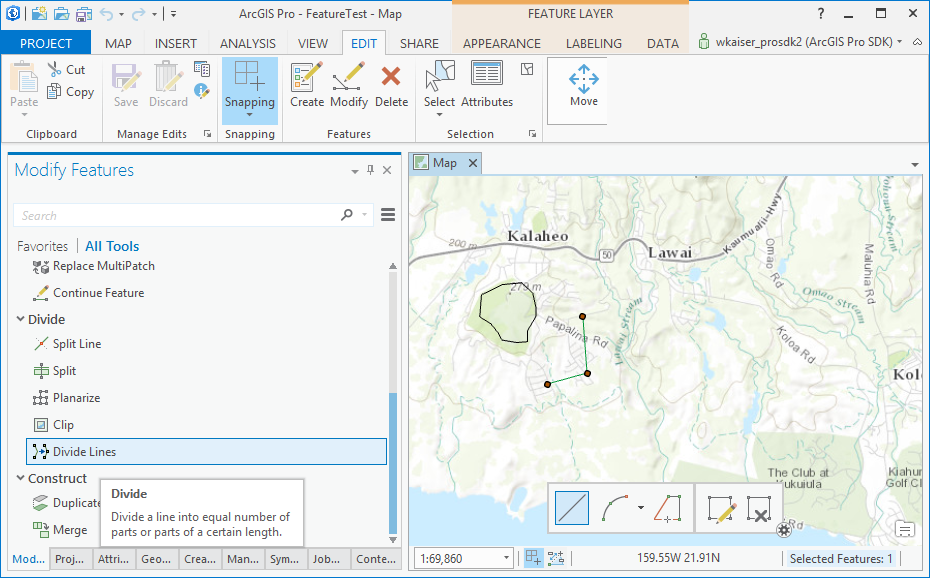

## DivideLines

<!-- TODO: Write a brief abstract explaining this sample -->
This sample provides a tool that divides a line into an equal number of parts or a number of parts of a given length.  


<a href="http://pro.arcgis.com/en/pro-app/sdk/" target="_blank">View it live</a>

<!-- TODO: Fill this section below with metadata about this sample-->
```
Language:              C#
Subject:               Editing
Contributor:           ArcGIS Pro SDK Team <arcgisprosdk@esri.com>
Organization:          Esri, http://www.esri.com
Date:                  4/20/2017
ArcGIS Pro:            2.0
Visual Studio:         2015, 2017
.NET Target Framework: 4.6.1
```

## Resources

* [API Reference online](http://pro.arcgis.com/en/pro-app/sdk/api-reference)
* <a href="http://pro.arcgis.com/en/pro-app/sdk/" target="_blank">ArcGIS Pro SDK for .NET (pro.arcgis.com)</a>
* [arcgis-pro-sdk-community-samples](http://github.com/Esri/arcgis-pro-sdk-community-samples)
* [ArcGISPro Registry Keys](http://github.com/Esri/arcgis-pro-sdk/wiki/ArcGIS-Pro-Registry-Keys)
* [FAQ](http://github.com/Esri/arcgis-pro-sdk/wiki/FAQ)
* [ArcGIS Pro SDK icons](https://github.com/Esri/arcgis-pro-sdk/releases/tag/1.4.0.7198)
* [ProConcepts: ArcGIS Pro Add in Samples](https://github.com/Esri/arcgis-pro-sdk-community-samples/wiki/ProConcepts-ArcGIS-Pro-Add-in-Samples)


### Samples Data

* Sample data for ArcGIS Pro SDK Community Samples can be downloaded from the [repo releases](https://github.com/Esri/arcgis-pro-sdk-community-samples/releases) page.  

## How to use the sample
<!-- TODO: Explain how this sample can be used. To use images in this section, create the image file in your sample project's screenshots folder. Use relative url to link to this image using this syntax:  -->
This sample creates a map tool that is similar to other editing tools in the Modify Features pane, in that it opens a control within the pane with a dialog for user input. It follows the MVVM pattern used by the editing tools.
To use this sample:
  
1. Debug through Visual Studio or compile and run ArcGIS Pro.  
1. In Pro, add or create a map with lines.  
1. Select a single line in the map.  
1. Click the Divide Lines tool in the Divide group within the Modify Features pane.  
1. In the pane for Divide Lines, select the option and enter a value. Click on Divide.  

The selected line should be divided and the selection cleared. The tool remains active to enable selection of other lines to repeat the process.
  
  
  


<!-- End -->

&nbsp;&nbsp;&nbsp;&nbsp;&nbsp;&nbsp;
&nbsp;&nbsp;&nbsp;&nbsp;&nbsp;&nbsp;&nbsp;&nbsp;&nbsp;&nbsp;&nbsp;&nbsp;
[Home](https://github.com/Esri/arcgis-pro-sdk/wiki) | <a href="http://pro.arcgis.com/en/pro-app/sdk/api-reference" target="_blank">API Reference</a> | [Requirements](https://github.com/Esri/arcgis-pro-sdk/wiki#requirements) | [Download](https://github.com/Esri/arcgis-pro-sdk/wiki#installing-arcgis-pro-sdk-for-net) | <a href="http://github.com/esri/arcgis-pro-sdk-community-samples" target="_blank">Samples</a>
