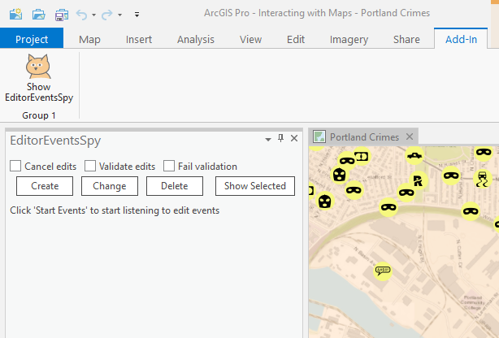
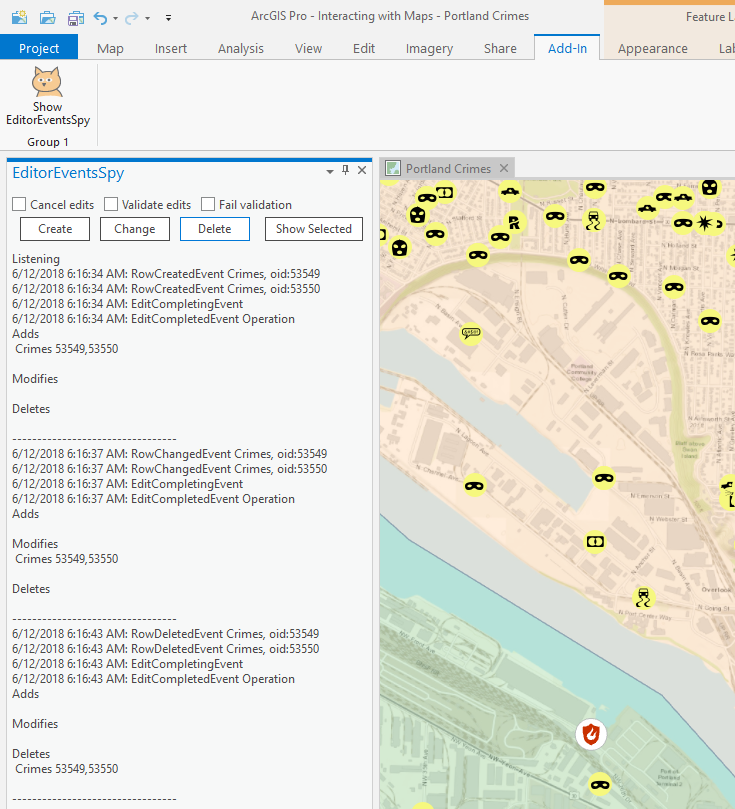
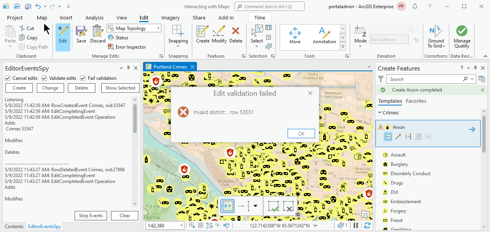

## EditEvents

<!-- TODO: Write a brief abstract explaining this sample -->
The EditEventsSpy dockpane listens to the editing Row, Completing, and Completed events  
  


<a href="http://pro.arcgis.com/en/pro-app/sdk/" target="_blank">View it live</a>

<!-- TODO: Fill this section below with metadata about this sample-->
```
Language:              C#
Subject:               Editing
Contributor:           ArcGIS Pro SDK Team <arcgisprosdk@esri.com>
Organization:          Esri, http://www.esri.com
Date:                  7/01/2020
ArcGIS Pro:            2.6
Visual Studio:         2017, 2019
.NET Target Framework: 4.8
```

## Resources

* [API Reference online](https://pro.arcgis.com/en/pro-app/sdk/api-reference)
* <a href="https://pro.arcgis.com/en/pro-app/sdk/" target="_blank">ArcGIS Pro SDK for .NET (pro.arcgis.com)</a>
* [arcgis-pro-sdk-community-samples](https://github.com/Esri/arcgis-pro-sdk-community-samples)
* [ArcGIS Pro DAML ID Reference](https://github.com/Esri/arcgis-pro-sdk/wiki/ArcGIS-Pro-DAML-ID-Reference)
* [FAQ](https://github.com/Esri/arcgis-pro-sdk/wiki/FAQ)
* [ArcGIS Pro SDK icons](https://github.com/Esri/arcgis-pro-sdk/releases/tag/2.4.0.19948)


### Samples Data

* Sample data for ArcGIS Pro SDK Community Samples can be downloaded from the [repo releases](https://github.com/Esri/arcgis-pro-sdk-community-samples/releases) page.  

## How to use the sample
<!-- TODO: Explain how this sample can be used. To use images in this section, create the image file in your sample project's screenshots folder. Use relative url to link to this image using this syntax:  -->
1. Download the Community Sample data (see under the 'Resources' section for downloading sample data).  The sample data contains required data for this sample add-in.  Make sure that the Sample data is unzipped in c:\data and "C:\Data\Interacting with Maps" is available.  
1. In Visual Studio click the Build menu. Then select Build Solution.  
1. Click Start button to open ArcGIS Pro.  
1. ArcGIS Pro will open.  
1. Open the "C:\Data\Interacting with Maps\Interacting with Maps.aprx" project which contains the required data needed for this sample.  
1. Make sure "Portland Crimes" is the active map and the "Contents" dockpane is open.  
1. Select "Crimes" on the Contents table of content.  
1. From the "Add-in" tab select "Show EditorEventsSpy".  
  
  
1. Click Start Events to start listening for the edit events. Click the Create, Change, or Delete buttons to execute edits that trigger the events.   
1. They will be reported to you on the EditEventsSpy dockpane 'as they happen'.<br />  
  
  
1. Check the Cancel edits, Validate edits, and Fail validation checkboxes (in any combination) to apply that action in the respective row event handler. Note that canceling the edit or canceling the edit because of failed validation terminates the entire edit operation and no further events fire for that operation.<br />  
1. By default, the Create will create two features so you can see the two row events.  
  
  
1. The created features will be selected so clicking Change or Delete will apply the respective edit to the newly created features. Feel free to select others.<br />  
1. You can also try commenting out the cancel logic in the row event handler and, instead, canceling the edit in the EditCompletingEvent.  
  


<!-- End -->

&nbsp;&nbsp;&nbsp;&nbsp;&nbsp;&nbsp;
&nbsp;&nbsp;&nbsp;&nbsp;&nbsp;&nbsp;&nbsp;&nbsp;&nbsp;&nbsp;&nbsp;&nbsp;
[Home](https://github.com/Esri/arcgis-pro-sdk/wiki) | <a href="https://pro.arcgis.com/en/pro-app/sdk/api-reference" target="_blank">API Reference</a> | [Requirements](https://github.com/Esri/arcgis-pro-sdk/wiki#requirements) | [Download](https://github.com/Esri/arcgis-pro-sdk/wiki#installing-arcgis-pro-sdk-for-net) | <a href="https://github.com/esri/arcgis-pro-sdk-community-samples" target="_blank">Samples</a>
