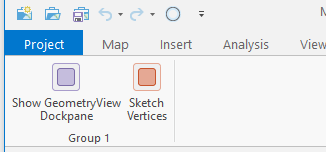
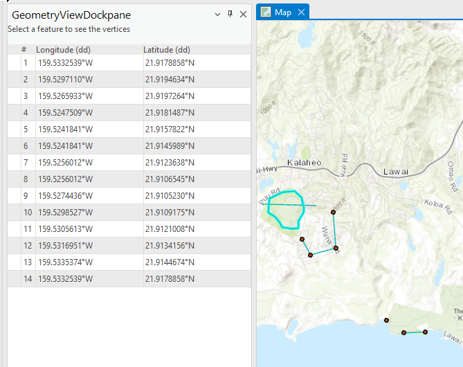
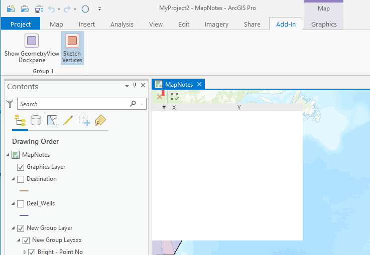
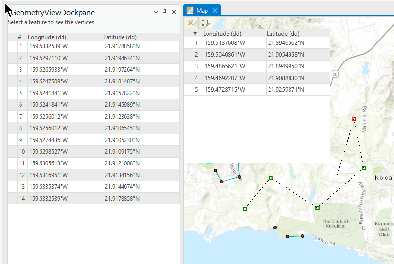

## GeometryControl

<!-- TODO: Write a brief abstract explaining this sample -->
This sample demonstrates the UI GeometryControl.  You can use this control to view sketch vertices or geometry vertices.   
  


<a href="https://pro.arcgis.com/en/pro-app/sdk/" target="_blank">View it live</a>

<!-- TODO: Fill this section below with metadata about this sample-->
```
Language:              C#
Subject:               Editing
Contributor:           ArcGIS Pro SDK Team <arcgisprosdk@esri.com>
Organization:          Esri, https://www.esri.com
Date:                  02/22/2023
ArcGIS Pro:            3.1
Visual Studio:         2022
.NET Target Framework: net6.0-windows
```

## Resources

[Community Sample Resources](https://github.com/Esri/arcgis-pro-sdk-community-samples#resources)

### Samples Data

* Sample data for ArcGIS Pro SDK Community Samples can be downloaded from the [Releases](https://github.com/Esri/arcgis-pro-sdk-community-samples/releases) page.  

## How to use the sample
<!-- TODO: Explain how this sample can be used. To use images in this section, create the image file in your sample project's screenshots folder. Use relative url to link to this image using this syntax:  -->
1. In Visual Studio, build the solution.  
1. Launch the debugger to open ArcGIS Pro.  
1. Open any project containing data.  
1. Activate the Add-in tab.  
  
  
1. Click the 'Show GeometryView Dockpane' button.  A new dockpane should be displayed.   
1. Use the Select tool on the Map tab to select a feature. The vertices of the feature's geometry should be displayed in the dockpane.   
  
  
1. Click the 'Sketch Vertices' tool button. An empty control will be overlayed on the map.  
  
  
1. Start sketching with the tool.  The vertices of the sketch should be displayed.  
  
  


<!-- End -->

&nbsp;&nbsp;&nbsp;&nbsp;&nbsp;&nbsp;
&nbsp;&nbsp;&nbsp;&nbsp;&nbsp;&nbsp;&nbsp;&nbsp;&nbsp;&nbsp;&nbsp;&nbsp;
[Home](https://github.com/Esri/arcgis-pro-sdk/wiki) | <a href="https://pro.arcgis.com/en/pro-app/latest/sdk/api-reference" target="_blank">API Reference</a> | [Requirements](https://github.com/Esri/arcgis-pro-sdk/wiki#requirements) | [Download](https://github.com/Esri/arcgis-pro-sdk/wiki#installing-arcgis-pro-sdk-for-net) | <a href="https://github.com/esri/arcgis-pro-sdk-community-samples" target="_blank">Samples</a>
