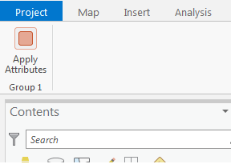
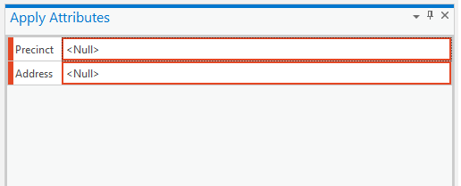
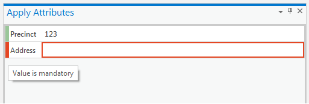
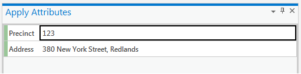
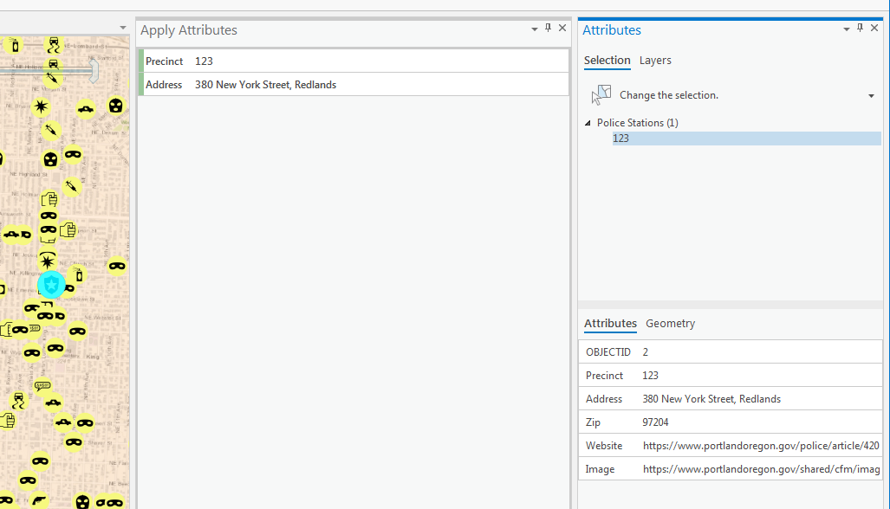

## Inspector_AddAttributeAsync

<!-- TODO: Write a brief abstract explaining this sample -->
This sample demonstrates how to use the Inspector.AddAttributeAsync method. The sample contains a single map tool which displays a grid requesting attribute values from the user. After entering values into the grid, the user sketches a rectangle to identify features.  The attributes will be applied to the features that are  identified by the tool.  
  
In this example we are using Inspector.AddAttributeAsync to only add a few fields from a single specific layer.  It is possible to add fields from multiple layers to  display in the grid.   
  


<a href="http://pro.arcgis.com/en/pro-app/sdk/" target="_blank">View it live</a>

<!-- TODO: Fill this section below with metadata about this sample-->
```
Language:              C#
Subject:               Editing
Contributor:           ArcGIS Pro SDK Team <arcgisprosdk@esri.com>
Organization:          Esri, http://www.esri.com
Date:                  7/01/2020
ArcGIS Pro:            2.6
Visual Studio:         2019
.NET Target Framework: 4.8
```

## Resources

* [API Reference online](https://pro.arcgis.com/en/pro-app/sdk/api-reference)
* <a href="https://pro.arcgis.com/en/pro-app/sdk/" target="_blank">ArcGIS Pro SDK for .NET (pro.arcgis.com)</a>
* [arcgis-pro-sdk-community-samples](https://github.com/Esri/arcgis-pro-sdk-community-samples)
* [ArcGIS Pro DAML ID Reference](https://github.com/Esri/arcgis-pro-sdk/wiki/ArcGIS-Pro-DAML-ID-Reference)
* [FAQ](https://github.com/Esri/arcgis-pro-sdk/wiki/FAQ)
* [ArcGIS Pro SDK icons](https://github.com/Esri/arcgis-pro-sdk/releases/tag/2.4.0.19948)


### Samples Data

* Sample data for ArcGIS Pro SDK Community Samples can be downloaded from the [repo releases](https://github.com/Esri/arcgis-pro-sdk-community-samples/releases) page.  

## How to use the sample
<!-- TODO: Explain how this sample can be used. To use images in this section, create the image file in your sample project's screenshots folder. Use relative url to link to this image using this syntax:  -->
1. Download the Community Sample data (see under the 'Resources' section for downloading sample data)  
1. Make sure that the Sample data is unzipped in C:\Data  
1. Before you run the sample verify that the project "C:\Data\Interacting with Maps\Interacting with Maps.aprx" is present since this is required to run the sample.  
1. In Visual Studio click the Build menu. Then select Build Solution.  
1. Click Start button to open ArcGIS Pro.  
1. ArcGIS Pro will open.  
1. Open the "C:\Data\Interacting with Maps\Interacting with Maps" project.  
1. Click on the ADD-IN TAB.  
  
  
1. Click on the "Apply Attrributes" button.  
1. A dockpane will be displayed showing the fields requiring user input. In this example we have chosen 2 fields from the Police Stations layer.   
Each field is shown as invalid (outlined in a red box) indicating that validation of the values has occurred.  
  
  
1. Enter a value into the first field.  The value is validated. A valid value is outlined with a green box.  The user can hover over the side bar of any invalid value to see any message you wish to display.  
  
  
1. Enter a value into the second field.  The value is validated.    
  
  
1. Now draw a rectangle on the map around one of more Police Station features.   
1. The values entered will be applied to the identified features.   
  
  


<!-- End -->

&nbsp;&nbsp;&nbsp;&nbsp;&nbsp;&nbsp;
&nbsp;&nbsp;&nbsp;&nbsp;&nbsp;&nbsp;&nbsp;&nbsp;&nbsp;&nbsp;&nbsp;&nbsp;
[Home](https://github.com/Esri/arcgis-pro-sdk/wiki) | <a href="https://pro.arcgis.com/en/pro-app/sdk/api-reference" target="_blank">API Reference</a> | [Requirements](https://github.com/Esri/arcgis-pro-sdk/wiki#requirements) | [Download](https://github.com/Esri/arcgis-pro-sdk/wiki#installing-arcgis-pro-sdk-for-net) | <a href="https://github.com/esri/arcgis-pro-sdk-community-samples" target="_blank">Samples</a>
