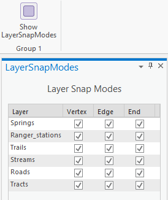

## LayerSnapModes

<!-- TODO: Write a brief abstract explaining this sample -->
This sample illustrates the use of layer snap modes, which provides the ability to set the snap mode (vertex, edge, end etc) on a per layer basis.  
The layer snap modes are presented in a datagrid hosted by a simple dockpane.  
  


<a href="https://pro.arcgis.com/en/pro-app/sdk/" target="_blank">View it live</a>

<!-- TODO: Fill this section below with metadata about this sample-->
```
Language:              C#
Subject:               Editing
Contributor:           ArcGIS Pro SDK Team <arcgisprosdk@esri.com>
Organization:          Esri, https://www.esri.com
Date:                  06/10/2022
ArcGIS Pro:            3.0
Visual Studio:         2022
.NET Target Framework: net6.0-windows
```

## Resources

[Community Sample Resources](https://github.com/Esri/arcgis-pro-sdk-community-samples#resources)

### Samples Data

* Sample data for ArcGIS Pro SDK Community Samples can be downloaded from the [Releases](https://github.com/Esri/arcgis-pro-sdk-community-samples/releases) page.  

## How to use the sample
<!-- TODO: Explain how this sample can be used. To use images in this section, create the image file in your sample project's screenshots folder. Use relative url to link to this image using this syntax:  -->
1. In Visual Studio, build the solution.  
1. Launch the debugger to open ArcGIS Pro.  
1. In Pro, open a map with feature layers or create a new map and add some.  
1. Turn on the application snap modes Vertex, Edge and End from the snapping dropdown on the editing tab.  
1. On the add-in tab, click Show LayerSnapModes to display the LayerSnapModes dockpane.  
  
  
1. Toggle some of the layer snap modes and examine the effect when snapping to the layer with a tool such as the measure tool.  
  


<!-- End -->

&nbsp;&nbsp;&nbsp;&nbsp;&nbsp;&nbsp;
&nbsp;&nbsp;&nbsp;&nbsp;&nbsp;&nbsp;&nbsp;&nbsp;&nbsp;&nbsp;&nbsp;&nbsp;
[Home](https://github.com/Esri/arcgis-pro-sdk/wiki) | <a href="https://pro.arcgis.com/en/pro-app/latest/sdk/api-reference" target="_blank">API Reference</a> | [Requirements](https://github.com/Esri/arcgis-pro-sdk/wiki#requirements) | [Download](https://github.com/Esri/arcgis-pro-sdk/wiki#installing-arcgis-pro-sdk-for-net) | <a href="https://github.com/esri/arcgis-pro-sdk-community-samples" target="_blank">Samples</a>
