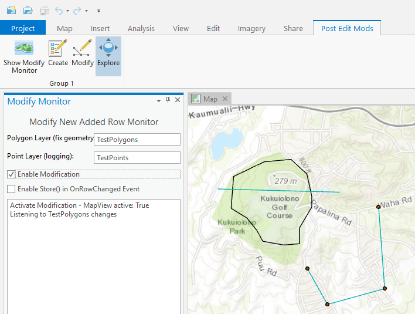
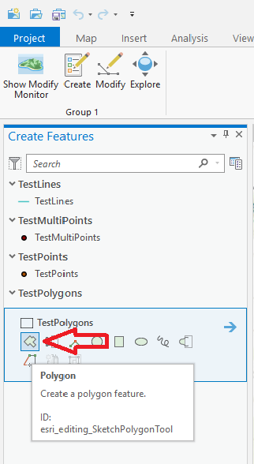
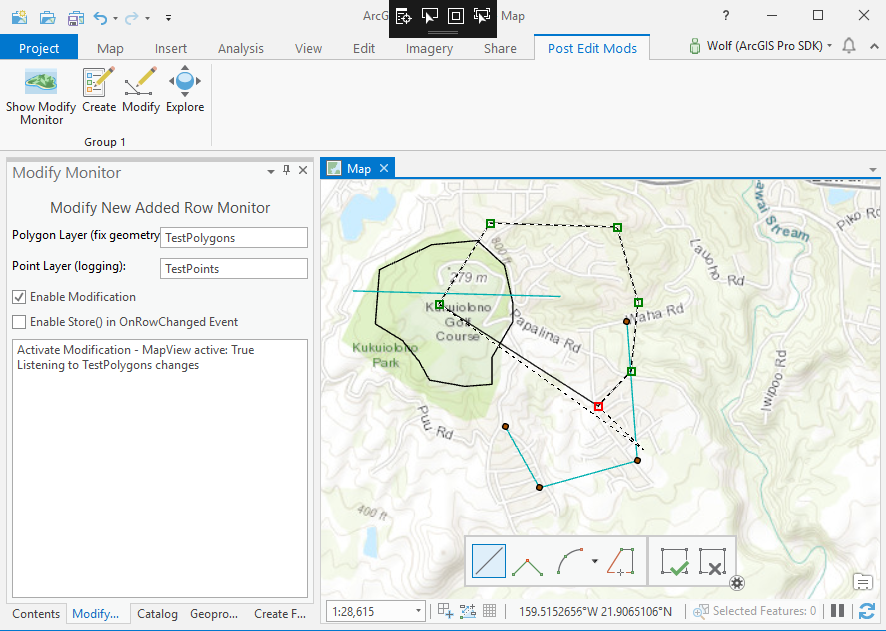
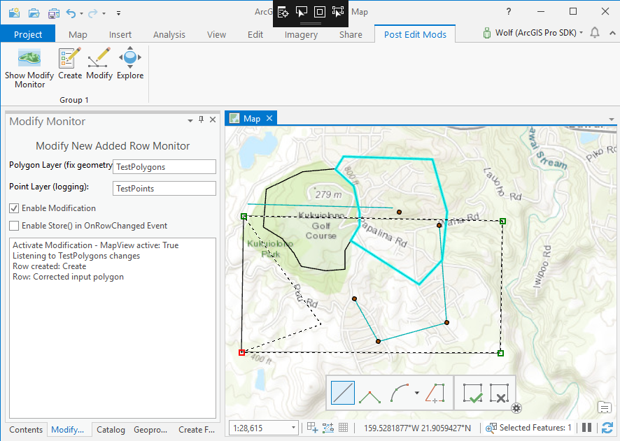
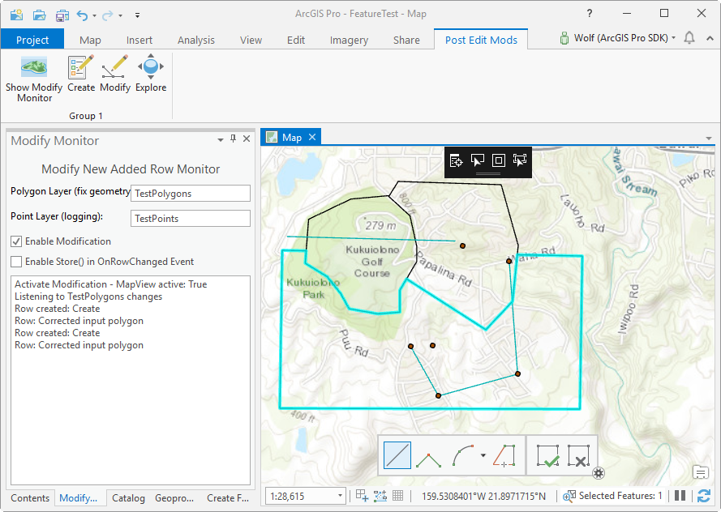
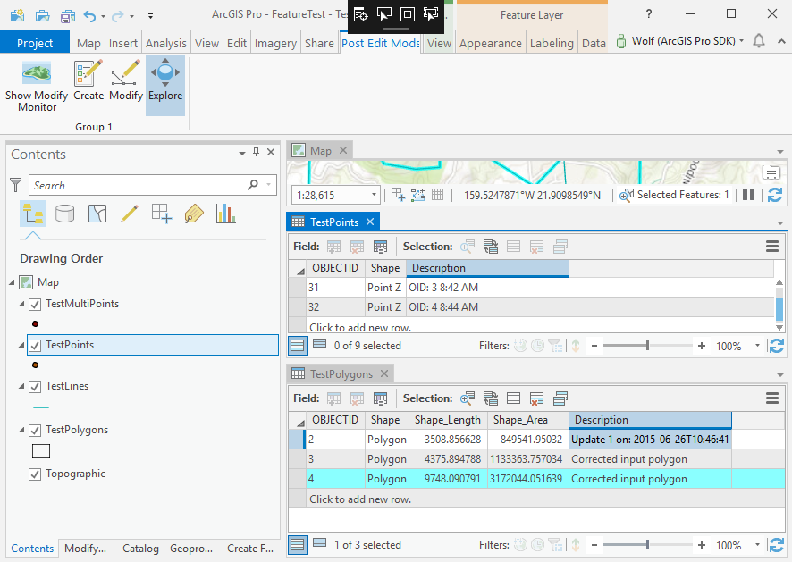

## ModifyNewlyAddedFeatures

<!-- TODO: Write a brief abstract explaining this sample -->
This sample shows how to:  
* Update shape and attribute columns for a newly created or modified polygon feature  
* Create a logging/tracking entry for each change in a second feature class  
The workflow implemented in this sample examines every newly created or modified polygon and assure that it doesn't overlap any existing polygons in the same feature layer.  If the new polygon geometry overlaps any existing polygons, the geometry is corrected so that it doesn't overlap and a 'Description' attribute column is updated to show the action taken on the geometry.  
Furthermore to demonstrate a sample of change tracking or logging, the center point of the polygon is taken and in addition with a 'Description' attribute stored in a separate point feature class.  
The corresponding ProConcept document can be found here: [ProConcepts Editing / Row Events](https://github.com/esri/arcgis-pro-sdk/wiki/ProConcepts-Editing#row-events)  
  


<a href="http://pro.arcgis.com/en/pro-app/sdk/" target="_blank">View it live</a>

<!-- TODO: Fill this section below with metadata about this sample-->
```
Language:              C#
Subject:               Editing
Contributor:           ArcGIS Pro SDK Team <arcgisprosdk@esri.com>
Organization:          Esri, http://www.esri.com
Date:                  6/27/2019
ArcGIS Pro:            2.4
Visual Studio:         2017, 2019
.NET Target Framework: 4.6.1
```

## Resources

* [API Reference online](https://pro.arcgis.com/en/pro-app/sdk/api-reference)
* <a href="https://pro.arcgis.com/en/pro-app/sdk/" target="_blank">ArcGIS Pro SDK for .NET (pro.arcgis.com)</a>
* [arcgis-pro-sdk-community-samples](https://github.com/Esri/arcgis-pro-sdk-community-samples)
* [ArcGIS Pro DAML ID Reference](https://github.com/Esri/arcgis-pro-sdk/wiki/ArcGIS-Pro-DAML-ID-Reference)
* [FAQ](https://github.com/Esri/arcgis-pro-sdk/wiki/FAQ)
* [ArcGIS Pro SDK icons](https://github.com/Esri/arcgis-pro-sdk/releases/tag/2.4.0.19948)


### Samples Data

* Sample data for ArcGIS Pro SDK Community Samples can be downloaded from the [repo releases](https://github.com/Esri/arcgis-pro-sdk-community-samples/releases) page.  

## How to use the sample
<!-- TODO: Explain how this sample can be used. To use images in this section, create the image file in your sample project's screenshots folder. Use relative url to link to this image using this syntax:  -->
1. Download the Community Sample data (see under the 'Resources' section for downloading sample data)  
1. Make sure that the Sample data is unzipped in c:\data   
1. The project used for this sample is 'C:\Data\FeatureTest\FeatureTest.aprx'  
1. In Visual Studio click the Build menu. Then select Build Solution.  
1. Click Start button to open ArcGIS Pro.  
1. ArcGIS Pro will open, select the FeatureTest.aprx project  
1. Click on the 'Post Edit Mods' tab and click the 'Show Modify Monitor' button to show the 'Modify New Added Row Monitor' dockpane    
  
  
1. On the 'Modify New Added Row Monitor' dockpane check the 'Enable Modification' checkbox to enable the polygon geometry correction feature     
  
  
1. Now the click on the 'Create Features' button and select the first 'polygon creation template' for the 'TestPolygons' layer    
  
  
1. Digitize a new polygon that partially overlaps an existing polygon  
  
  
1. After you complete your new polygon sketch notice that your polygon's shape was adjusted and a new point at the center of your polygon was added to the map as well.  The 'Modify Monitor' dockpane shows the actions taken on the newly created feature.  Add a second overlapping polygon.      
  
  
1. Complete the second new polygon's sketch.  
  
  
1. Note the corrected polygon shape, the 'Modify Monitor' dockpane status, and the newly created TestPoints features.    
1. Open the TestPoints and TestPolygons attribute tables and verify the updates to the 'Description' column values.  
  
  


<!-- End -->

&nbsp;&nbsp;&nbsp;&nbsp;&nbsp;&nbsp;
&nbsp;&nbsp;&nbsp;&nbsp;&nbsp;&nbsp;&nbsp;&nbsp;&nbsp;&nbsp;&nbsp;&nbsp;
[Home](https://github.com/Esri/arcgis-pro-sdk/wiki) | <a href="https://pro.arcgis.com/en/pro-app/sdk/api-reference" target="_blank">API Reference</a> | [Requirements](https://github.com/Esri/arcgis-pro-sdk/wiki#requirements) | [Download](https://github.com/Esri/arcgis-pro-sdk/wiki#installing-arcgis-pro-sdk-for-net) | <a href="https://github.com/esri/arcgis-pro-sdk-community-samples" target="_blank">Samples</a>
