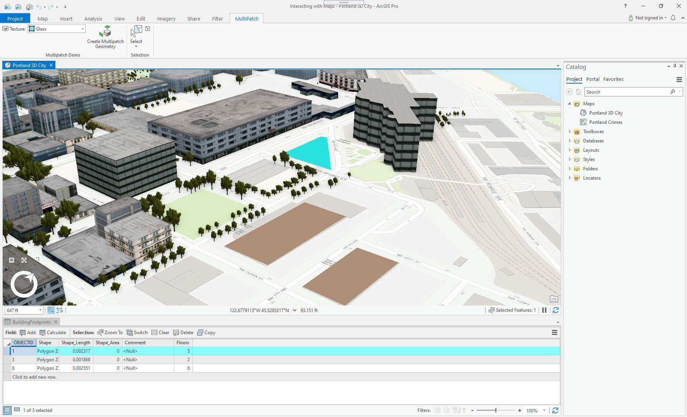
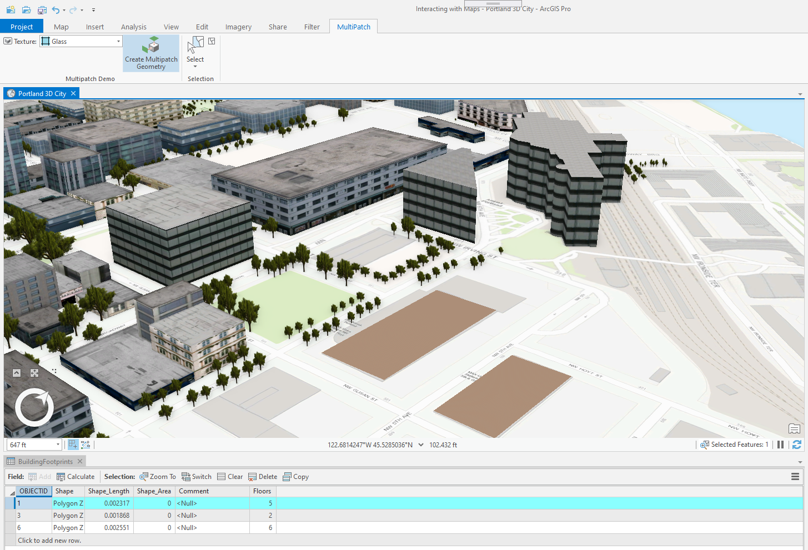
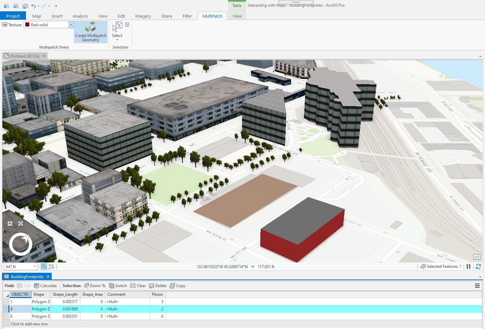
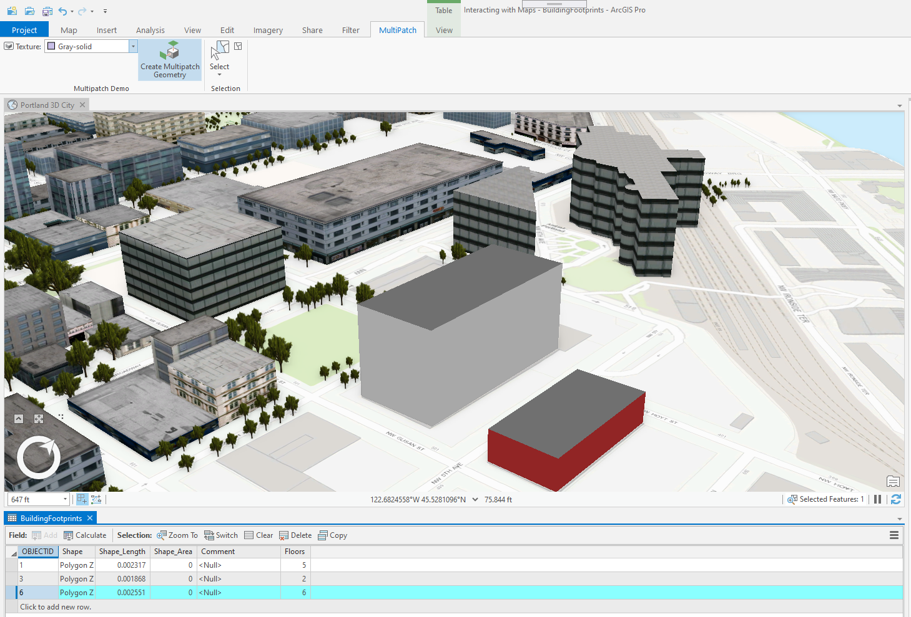

## MultipatchBuilder

<!-- TODO: Write a brief abstract explaining this sample -->
This sample demonstrates how to construct multipatch geometries using the MultipatchBuilderEx class found in the ArcGIS.Core.Geometry namespace.   
The MultipatchBuilderEx class also allows modifying the multipatch geometry including the materials and textures.  
  


<a href="https://pro.arcgis.com/en/pro-app/sdk/" target="_blank">View it live</a>

<!-- TODO: Fill this section below with metadata about this sample-->
```
Language:              C#
Subject:               Editing
Contributor:           ArcGIS Pro SDK Team <arcgisprosdk@esri.com>
Organization:          Esri, https://www.esri.com
Date:                  04/04/2024
ArcGIS Pro:            3.3
Visual Studio:         2022
.NET Target Framework: net8.0-windows
```

## Resources

[Community Sample Resources](https://github.com/Esri/arcgis-pro-sdk-community-samples#resources)

### Samples Data

* Sample data for ArcGIS Pro SDK Community Samples can be downloaded from the [Releases](https://github.com/Esri/arcgis-pro-sdk-community-samples/releases) page.  

## How to use the sample
<!-- TODO: Explain how this sample can be used. To use images in this section, create the image file in your sample project's screenshots folder. Use relative url to link to this image using this syntax:  -->
1. Download the Community Sample data (see under the 'Resources' section for downloading sample data).  The sample data contains required data for this sample add-in.  Make sure that the Sample data is unzipped in c:\data and "C:\Data\Interacting with Maps" is available.
2. In Visual Studio click the Build menu. Then select Build Solution.  
3. Launch the debugger to open ArcGIS Pro.  
4. ArcGIS Pro will open.   
5. Open the "C:\Data\Interacting with Maps\Interacting with Maps.aprx" project which contains the required data needed for this sample.  
6. Open the "Portland 3D City" mapview.  
  
7. One of the building footprint polygons has already been selected.  Select 'Glass' from the texture drop down and then click the 'Create Multipatch Geometry' button to generate the Multipatch geomtry for the selected footprint.   
  
8. Select the next building footprint and change the texture dropdown to 'Red-solid'. Then click the 'Create Multipatch Geometry' button to generate the Multipatch geomtry for this footprint.   
  
9. Select the next building footprint and change the texture dropdown to 'Gray-solid'. Then click the 'Create Multipatch Geometry' button to generate the Multipatch geomtry for this footprint.   
  
  

<!-- End -->

&nbsp;&nbsp;&nbsp;&nbsp;&nbsp;&nbsp;
&nbsp;&nbsp;&nbsp;&nbsp;&nbsp;&nbsp;&nbsp;&nbsp;&nbsp;&nbsp;&nbsp;&nbsp;
[Home](https://github.com/Esri/arcgis-pro-sdk/wiki) | <a href="https://pro.arcgis.com/en/pro-app/latest/sdk/api-reference" target="_blank">API Reference</a> | [Requirements](https://github.com/Esri/arcgis-pro-sdk/wiki#requirements) | [Download](https://github.com/Esri/arcgis-pro-sdk/wiki#installing-arcgis-pro-sdk-for-net) | <a href="https://github.com/esri/arcgis-pro-sdk-community-samples" target="_blank">Samples</a>
