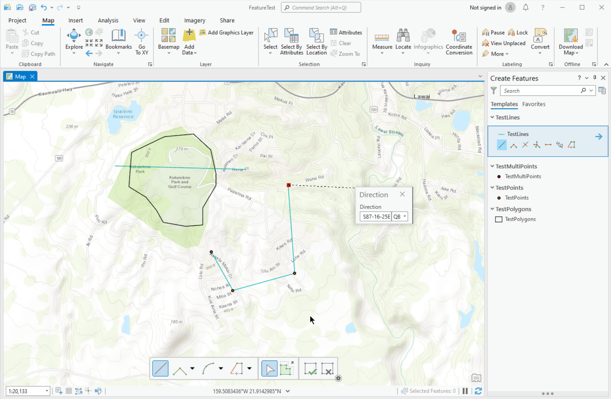
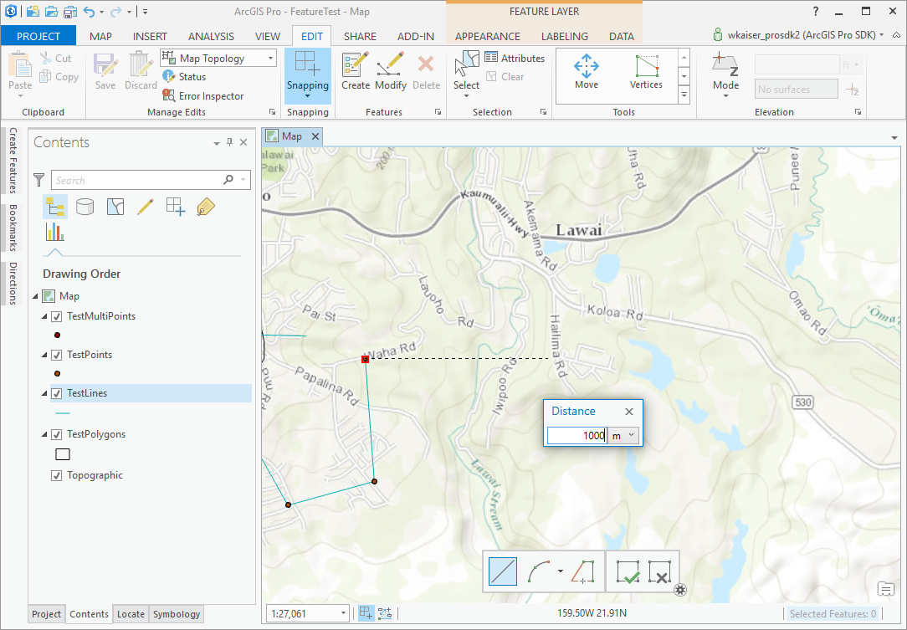
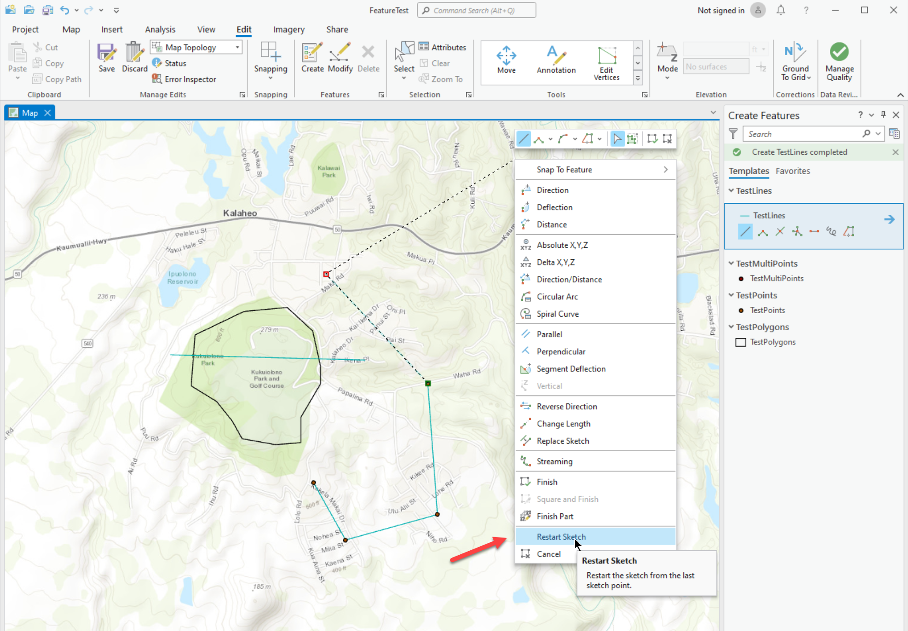
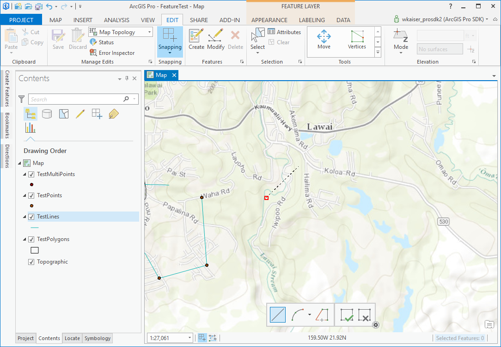

## RestartSketch

<!-- TODO: Write a brief abstract explaining this sample -->
This sample provides an edit sketch context menu to restart the sketch from the last vertex.  
  


<a href="https://pro.arcgis.com/en/pro-app/sdk/" target="_blank">View it live</a>

<!-- TODO: Fill this section below with metadata about this sample-->
```
Language:              C#
Subject:               Editing
Contributor:           ArcGIS Pro SDK Team <arcgisprosdk@esri.com>
Organization:          Esri, https://www.esri.com
Date:                  10/01/2023
ArcGIS Pro:            3.2
Visual Studio:         2022
.NET Target Framework: net6.0-windows
```

## Resources

[Community Sample Resources](https://github.com/Esri/arcgis-pro-sdk-community-samples#resources)

### Samples Data

* Sample data for ArcGIS Pro SDK Community Samples can be downloaded from the [Releases](https://github.com/Esri/arcgis-pro-sdk-community-samples/releases) page.  

## How to use the sample
<!-- TODO: Explain how this sample can be used. To use images in this section, create the image file in your sample project's screenshots folder. Use relative url to link to this image using this syntax:  -->
The main use case for this functionality is to start creating a new feature relative to somewhere else such as a distance and bearing from a road intersection or a distance along a stream.  
To use this add-in:  
  
1. Download the Community Sample data (see under the "Resources" section for downloading sample data).  The sample data contains a project called "FeatureTest.aprx" with data suitable for this sample.  Make sure that the Sample data is unzipped in c:\data and "C:\Data\FeatureTest\FeatureTest.aprx" is available.
2. Open this solution in Visual Studio.  
3. Click the build menu and select Build Solution.  
4. Launch the debugger to open ArCGIS Pro. ArcGIS Pro will open.    
5. Open the "C:\Data\FeatureTest\FeatureTest.aprx" project.  
6. Create an edit sketch representing the offset from an origin. E.g. start the sketch at an intersection and digitize a segment with direction and distance constraints.  
7. Start editing on the "TestLines" feature layer.  Place the first vertex by snapping to a given point and right click to chose a direction.  
  
8. Right click to set a given distance.  
  
9. A new vertex has now been placed in a given direction and distance from a starting location.  
10. Now I want to start my 'real' sketch at this vertex (with given direction and distance from a starting location).  
11. Right click to display the sketch context menu and click 'Restart Sketch'.  
  
12. The sketch is restarted from the last sketch point.  
  
  

<!-- End -->

&nbsp;&nbsp;&nbsp;&nbsp;&nbsp;&nbsp;
&nbsp;&nbsp;&nbsp;&nbsp;&nbsp;&nbsp;&nbsp;&nbsp;&nbsp;&nbsp;&nbsp;&nbsp;
[Home](https://github.com/Esri/arcgis-pro-sdk/wiki) | <a href="https://pro.arcgis.com/en/pro-app/latest/sdk/api-reference" target="_blank">API Reference</a> | [Requirements](https://github.com/Esri/arcgis-pro-sdk/wiki#requirements) | [Download](https://github.com/Esri/arcgis-pro-sdk/wiki#installing-arcgis-pro-sdk-for-net) | <a href="https://github.com/esri/arcgis-pro-sdk-community-samples" target="_blank">Samples</a>
