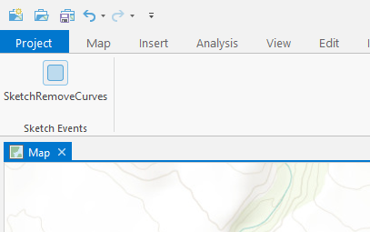
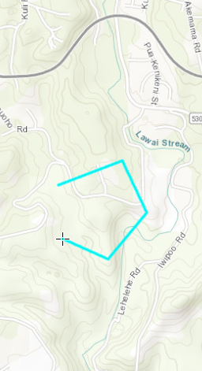

## SketchRemoveCurves

<!-- TODO: Write a brief abstract explaining this sample -->
This sample demonstrates the use of the BeforeSketchCompleted event to modify the sketch geometry before the sketch is completed.  
The example removes all curves from the sketch before the sketch is completed.  
  


<a href="https://pro.arcgis.com/en/pro-app/sdk/" target="_blank">View it live</a>

<!-- TODO: Fill this section below with metadata about this sample-->
```
Language:              C#
Subject:               Editing
Contributor:           ArcGIS Pro SDK Team <arcgisprosdk@esri.com>
Organization:          Esri, https://www.esri.com
Date:                  02/22/2023
ArcGIS Pro:            3.1
Visual Studio:         2022
.NET Target Framework: net6.0-windows
```

## Resources

[Community Sample Resources](https://github.com/Esri/arcgis-pro-sdk-community-samples#resources)

### Samples Data

* Sample data for ArcGIS Pro SDK Community Samples can be downloaded from the [Releases](https://github.com/Esri/arcgis-pro-sdk-community-samples/releases) page.  

## How to use the sample
<!-- TODO: Explain how this sample can be used. To use images in this section, create the image file in your sample project's screenshots folder. Use relative url to link to this image using this syntax:  -->
1. Download the Community Sample data (see under the "Resources" section for downloading sample data).  The sample data contains a project called "FeatureTest.aprx" with data suitable for this sample.  Make sure that the Sample data is unzipped in c:\data and "C:\Data\SDK\SDK.gdb" is available.  
1. In Visual Studio click the Build menu. Then select Build Solution.  
1. Launch the debugger to open ArcGIS Pro.  
1. ArcGIS Pro will open, select the FeatureTest.aprx project, alternatively create a new map and insert map notes.  
1. Open a map containing editable data.   
  
  
1. Open the add-in tab and click on the SketchRemoveCurves button in the Sketch Events group  
1. On the edit tab, click on the Create button in the Features group to display the create features pane.  
1. Start a sketch, and create some sketch segments as curves.  
  
  
1. Finish the sketch. The curves will be replaced with straight lines.  
  
  


<!-- End -->

&nbsp;&nbsp;&nbsp;&nbsp;&nbsp;&nbsp;
&nbsp;&nbsp;&nbsp;&nbsp;&nbsp;&nbsp;&nbsp;&nbsp;&nbsp;&nbsp;&nbsp;&nbsp;
[Home](https://github.com/Esri/arcgis-pro-sdk/wiki) | <a href="https://pro.arcgis.com/en/pro-app/latest/sdk/api-reference" target="_blank">API Reference</a> | [Requirements](https://github.com/Esri/arcgis-pro-sdk/wiki#requirements) | [Download](https://github.com/Esri/arcgis-pro-sdk/wiki#installing-arcgis-pro-sdk-for-net) | <a href="https://github.com/esri/arcgis-pro-sdk-community-samples" target="_blank">Samples</a>
