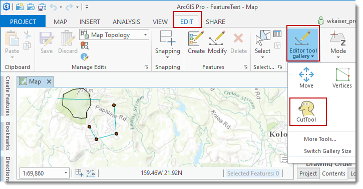
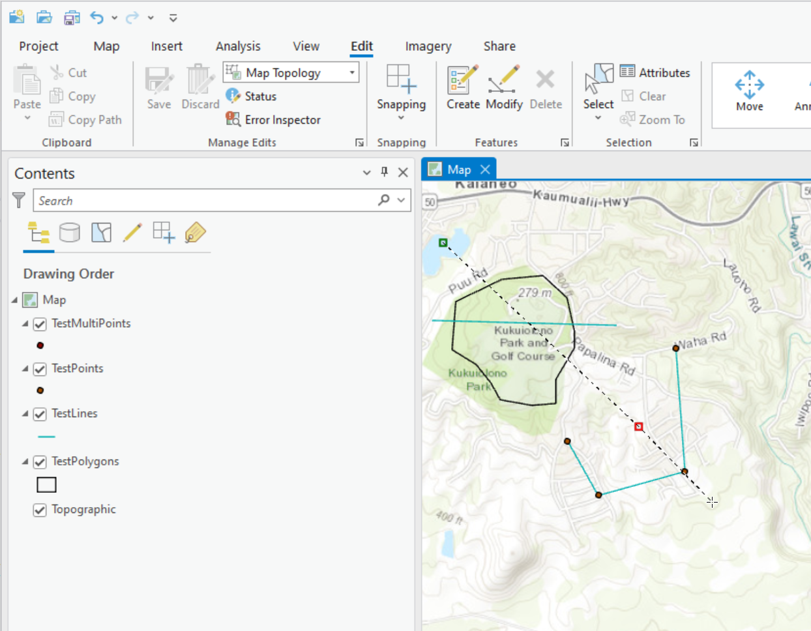
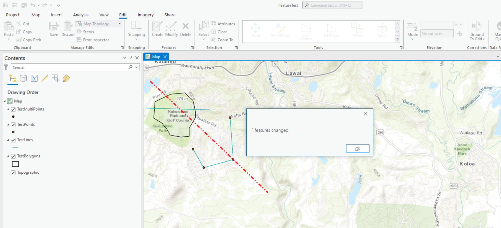

##SketchToolDemo

<!-- TODO: Write a brief abstract explaining this sample -->
This sample demonstrates a 'cut' tool that allows an editor to sketch a line over a set of existing features, if a polygon is intersected by the sketch line, the polygon will be cut by the sketched line.    
  


<a href="http://pro.arcgis.com/en/pro-app/sdk/" target="_blank">View it live</a>

<!-- TODO: Fill this section below with metadata about this sample-->
```
Language:              C# 6.0
Subject:               Editing
Contributor:           ArcGIS Pro SDK Team <arcgisprosdk@esri.com>
Organization:          Esri, http://www.esri.com
Date:                  7/15/2016
ArcGIS Pro:            1.3
Visual Studio:         2015
.NET Target Framework: 4.6.1
```

##Resources

* [API Reference online](http://pro.arcgis.com/en/pro-app/sdk/api-reference)  
* <a href="http://pro.arcgis.com/en/pro-app/sdk/" target="_blank">ArcGIS Pro SDK for .NET (pro.arcgis.com)</a>  
* [arcgis-pro-sdk-community-samples](http://github.com/Esri/arcgis-pro-sdk-community-samples)  
* [ArcGIS Pro DAML ID Reference](http://github.com/Esri/arcgis-pro-sdk/wiki/ArcGIS Pro DAML ID Reference)  
* [FAQ](http://github.com/Esri/arcgis-pro-sdk/wiki/FAQ)  
* [ArcGIS Pro SDK icons](https://github.com/Esri/arcgis-pro-sdk/releases/tag/1.2.0.5023)  

* [ProConcepts: ArcGIS Pro Add in Samples](https://github.com/Esri/arcgis-pro-sdk-community-samples/wiki/ProConcepts-ArcGIS-Pro-Add-in-Samples)  

### Samples Data

* Sample data for ArcGIS Pro SDK Community Samples can be downloaded from the [repo releases](https://github.com/Esri/arcgis-pro-sdk-community-samples/releases) page.  

##How to use the sample
<!-- TODO: Explain how this sample can be used. To use images in this section, create the image file in your sample project's screenshots folder. Use relative url to link to this image using this syntax:  -->
1. Download the Community Sample data (see under the 'Resources' section for downloading sample data)  
1. Make sure that the Sample data is unzipped in c:\data  
1. Before you run the sample verify that the project C:\data\SDK\SDK 1.1.aprx"C:\Data\FeatureTest\FeatureTest.aprx" is present since this is required to run the sample.  
1. In Visual Studio click the Build menu. Then select Build Solution.  
1. Click Start button to open ArcGIS Pro.  
1. ArcGIS Pro will open.   
1. Open the "C:\Data\FeatureTest\FeatureTest.aprx" project.  
1. Click on the Edit tab on the ribbon and select the 'CutTool' from the 2D edit tool gallery.   
  
  
1. Sketch a line across an existing polygon.  
  
  
1. Complete the sketch using a double click.  
  
  
1. Verify that the polygon was split properly.  
  
  


[](Esri Tags: ArcGIS-Pro-SDK)
[](Esri Language: C-Sharp)​

<p align = center>
<b> ArcGIS Pro 1.3 SDK for Microsoft .NET Framework</b>
</p>
&nbsp;&nbsp;&nbsp;&nbsp;&nbsp;&nbsp;&nbsp;&nbsp;&nbsp;&nbsp;&nbsp;&nbsp;&nbsp;&nbsp;&nbsp;&nbsp;&nbsp;&nbsp;&nbsp;&nbsp;[Home](https://github.com/Esri/arcgis-pro-sdk/wiki) | <a href="http://pro.arcgis.com/en/pro-app/sdk" target="_blank">ArcGIS Pro SDK</a> | <a href="http://pro.arcgis.com/en/pro-app/sdk/api-reference/index.html" target="_blank">API Reference</a> | [Requirements](#requirements) | [Download](#installing-arcgis-pro-sdk-for-net) |  <a href="http://github.com/esri/arcgis-pro-sdk-community-samples" target="_blank">Samples</a>
