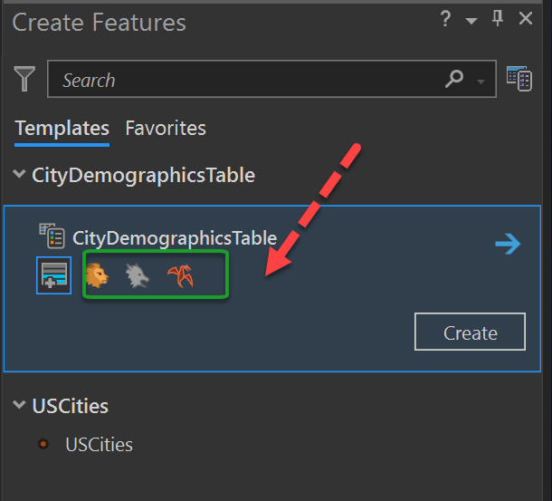
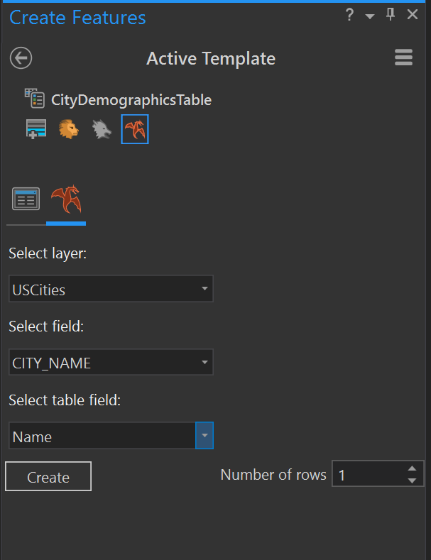

## TableConstructionTool

<!-- TODO: Write a brief abstract explaining this sample -->
This sample demonstrates 3 workflows that use the "Table Construction tool" - Basic, Intermediate and Advanced. To use this sample, you will need the TableConstructionTool.ppkx project package available in the ArcGIS Pro Community sample data.  
  


<a href="https://pro.arcgis.com/en/pro-app/sdk/" target="_blank">View it live</a>

<!-- TODO: Fill this section below with metadata about this sample-->
```
Language:              C#
Subject:               Framework
Contributor:           ArcGIS Pro SDK Team <arcgisprosdk@esri.com>
Organization:          Esri, https://www.esri.com
Date:                  05/06/2025
ArcGIS Pro:            3.5
Visual Studio:         2022
.NET Target Framework: net8.0-windows
```

## Resources

[Community Sample Resources](https://github.com/Esri/arcgis-pro-sdk-community-samples#resources)

### Samples Data

* Sample data for ArcGIS Pro SDK Community Samples can be downloaded from the [Releases](https://github.com/Esri/arcgis-pro-sdk-community-samples/releases) page.  

## How to use the sample
<!-- TODO: Explain how this sample can be used. To use images in this section, create the image file in your sample project's screenshots folder. Use relative url to link to this image using this syntax:  -->
1. Open this solution in Visual Studio.
2. Click the Build menu and select Build Solution.  
3. Click the Start button to open ArCGIS Pro.  ArcGIS Pro will open.  
4. In ArcGIS Pro, open the TableConstructionTool.ppkx project package.  
5. Open the "Map" project item, if it is not already open.  This map will have a "USCities" feature layer and a "CityDemographicsTable" standalone table.  
6. Activate the "Edit" tab on the ribbon and click the "Create" button to open the "Create Features" dockpane.  
7. Select the CityDemographicsTable template. This will display the various Table construction tools available for this template. The highlighted 3 tools are custom table constructions tools that have been added by this sample.  
  
### Basic table construction tool  
8. Click the "Basic Table Construction Tool" to activate it.  This is the button with the Lion icon.   
9. Click the "Create" button. This will invoke the code in the "OnSketchCompleteAsync" callback in the BasicTableConstTool.cs file in the Visual Studio solution.  
10. One record will be added to the "CityDemographicsTable" table. Dismiss the message box that displays this information. At this point, you can open the CityDemographicsTable standalone table and check the newly added record.  
### Intermediate table construction tool  
11. Click the "Intermediate Table Construction Tool" to activate it.  This is the button with the Wolf icon.   
12. Using the mouse cursor, sketch a rectangle geometry on the map to select a few of features in the USCities feature layer.  
13. When you complete the sketch, the code in the "OnSketchCompleteAsync" callback in the IntermediateTableConstTool.cs file is invoked.  
14. One record per selected feature will be added to the "CityDemographicsTable" table. The "Name" field of the table will be pre-populated with the "CITY_NAME" attribute of the selected USCities feature. At this point, you can open the CityDemographicsTable standalone table and check the newly added records.  
### Advanced table construction tool  
15. Click the "Advanced Table Construction Tool" to activate it.  This is the button with the Fire dragon icon.   
16. Activating this tool will display the "Options" pane for the Advanced Table Construction tool.  
  
17. Select the "USCities" layer in the "Select Layer" drop down. Select the "CITY_NAME" field in the "Select Field" dropdown.  Select "Name" in the "Select Table field" drop down.  
18. Using the mouse cursor, sketch a rectangle geometry on the map to select a few of features in the USCities feature layer.  
19. When you complete the sketch, the code in the "OnSketchCompleteAsync" callback in the AdvancedTableConstructionTool.cs file is invoked.  
20. One record per selected feature will be added to the "CityDemographicsTable" table. The "Name" field of the table will be pre-populated with the "CITY_NAME" attribute of the selected USCities feature. At this point, you can open the CityDemographicsTable standalone table and check the newly added records.  
  

<!-- End -->

&nbsp;&nbsp;&nbsp;&nbsp;&nbsp;&nbsp;
&nbsp;&nbsp;&nbsp;&nbsp;&nbsp;&nbsp;&nbsp;&nbsp;&nbsp;&nbsp;&nbsp;&nbsp;
[Home](https://github.com/Esri/arcgis-pro-sdk/wiki) | <a href="https://pro.arcgis.com/en/pro-app/latest/sdk/api-reference" target="_blank">API Reference</a> | [Requirements](https://github.com/Esri/arcgis-pro-sdk/wiki#requirements) | [Download](https://github.com/Esri/arcgis-pro-sdk/wiki#installing-arcgis-pro-sdk-for-net) | <a href="https://github.com/esri/arcgis-pro-sdk-community-samples" target="_blank">Samples</a>
