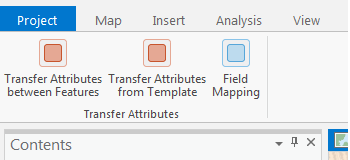
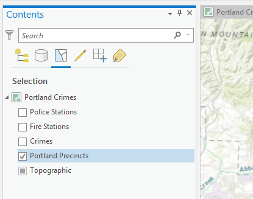
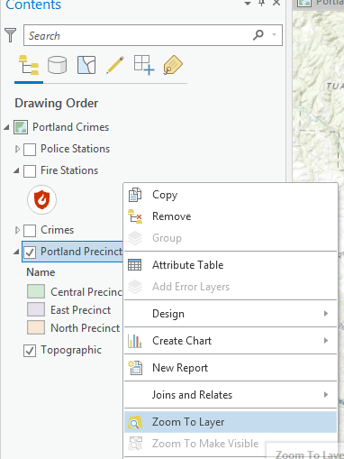
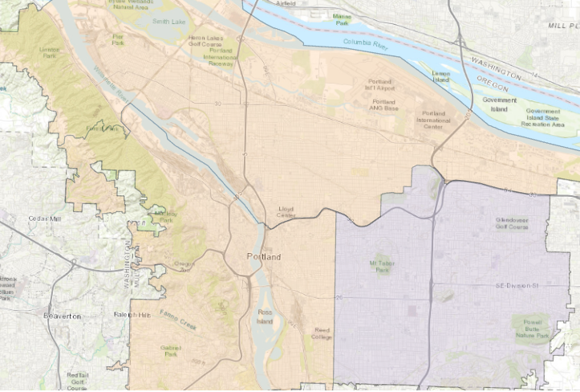
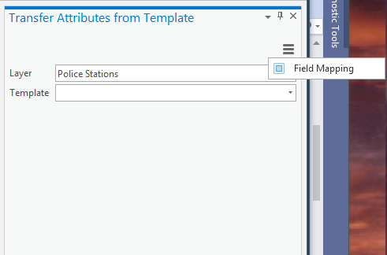

## TransferAttributes

<!-- TODO: Write a brief abstract explaining this sample -->
This sample demonstrates two ways to transfer attributes to a target feature using the application Field Mapping options set between two layers.   
The Field Mapping options are where a user can specify how attribute field values on a source layer are processed and copied to fields on a target layer.   
This sample also includes access to the Field Mapping page to allow editing of the options.   
  


<a href="http://pro.arcgis.com/en/pro-app/sdk/" target="_blank">View it live</a>

<!-- TODO: Fill this section below with metadata about this sample-->
```
Language:              C#
Subject:               Editing
Contributor:           ArcGIS Pro SDK Team <arcgisprosdk@esri.com>
Organization:          Esri, http://www.esri.com
Date:                  5/12/2021
ArcGIS Pro:            2.8
Visual Studio:         2019
.NET Target Framework: 4.8
```

## Resources

[Community Sample Resources](https://github.com/Esri/arcgis-pro-sdk-community-samples#resources)

### Samples Data

* Sample data for ArcGIS Pro SDK Community Samples can be downloaded from the [Releases](https://github.com/Esri/arcgis-pro-sdk-community-samples/releases) page.  

## How to use the sample
<!-- TODO: Explain how this sample can be used. To use images in this section, create the image file in your sample project's screenshots folder. Use relative url to link to this image using this syntax:  -->
1. Download the Community Sample data (see under the 'Resources' section for downloading sample data)  
1. Make sure that the Sample data is unzipped in c:\data  
1. Before you run the sample verify that the project "C:\Data\Interacting With Maps\Interacting with Maps.aprx" is present since this is required to run the sample.  
1. In Visual Studio click the Build menu. Then select Build Solution.  
1. Click Start button to open ArcGIS Pro.  
1. ArcGIS Pro will open.   
1. Open the "C:\Data\Interacting With Maps\Interacting with Maps.aprx" project.  
1. Click on the Add-in tab on the ribbon and verify the add-in has loaded.   
  
  
1. Move to the TOC List by Selection tab and ensure that the Portland Precincts layer is the only selectable layer.   
  
  
1. Move back to the TOC Drawing Order tab and turn off all layers except the Portland Precincts and the Topographic layers.   
1. Right click on the Portland Precincts layer and select Zoom to Layer  
  
  
1. Click on the Add-in tab on the ribbon and select the 'Transfer Attributes between Features' tool.   
1. Click on the map over a precinct. Then click on the map a second time over a different precinct.   
  
  
1. The second precinct should now have the attributes of the first precinct. The symbology of the feature should have also changed.   
  
  
1. Move back to the Add-in tab on the ribbon and select the 'Transfer Attributes from Templates' tool.   
1. The Transfer Attributes from Template UI displays in a dock pane.    
  
  
1. Use the Field Mapping button on the burger button (or from the Add-in ribbon) to investigate the current field mappings between layers. Add additional  field mappings if required.   
  
1. Choose the layer Portland Precincts and the Central Precinct template.  
1. Click in the precinct polygon that you changed with the previous tool.  The feature will now have the attributes of the Central Precinct template.  
  


<!-- End -->

&nbsp;&nbsp;&nbsp;&nbsp;&nbsp;&nbsp;
&nbsp;&nbsp;&nbsp;&nbsp;&nbsp;&nbsp;&nbsp;&nbsp;&nbsp;&nbsp;&nbsp;&nbsp;
[Home](https://github.com/Esri/arcgis-pro-sdk/wiki) | <a href="https://pro.arcgis.com/en/pro-app/latest/sdk/api-reference" target="_blank">API Reference</a> | [Requirements](https://github.com/Esri/arcgis-pro-sdk/wiki#requirements) | [Download](https://github.com/Esri/arcgis-pro-sdk/wiki#installing-arcgis-pro-sdk-for-net) | <a href="https://github.com/esri/arcgis-pro-sdk-community-samples" target="_blank">Samples</a>
