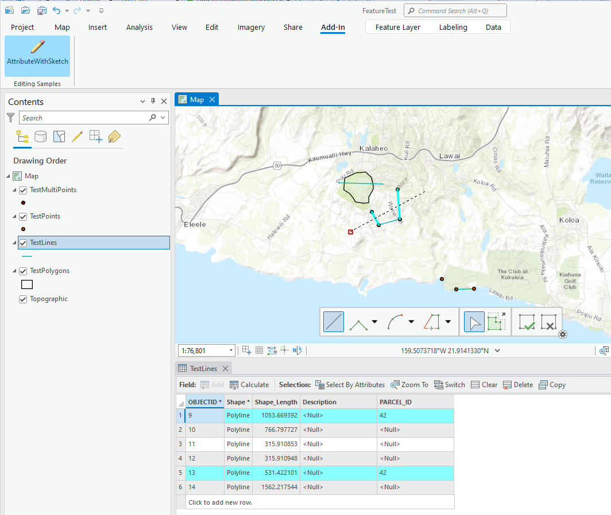

##UpdateAttributesWithSketch

<!-- TODO: Write a brief abstract explaining this sample -->
This sample creates a sketch tool that can be used to update the attributes of features that it intersects. It shows an example of creating a sketch tool, finding intersecting features, updating attributes and performing the edit through an edit operation.  
  


<a href="http://pro.arcgis.com/en/pro-app/sdk/" target="_blank">View it live</a>

<!-- TODO: Fill this section below with metadata about this sample-->
```
Language:      C#
Subject:       Editing
Contributor:   ArcGIS Pro SDK Team <arcgisprosdk@esri.com>
Organization:  Esri, http://www.esri.com
Date:          9/21/2015
ArcGIS Pro:    1.1
Visual Studio: 2013, 2015
```

##Resources

* [API Reference online](http://pro.arcgis.com/en/pro-app/sdk/api-reference)
* <a href="http://pro.arcgis.com/en/pro-app/sdk/" target="_blank">ArcGIS Pro SDK for .NET (pro.arcgis.com)</a>
* [arcgis-pro-sdk-community-samples](http://github.com/Esri/arcgis-pro-sdk-community-samples)
* [FAQ](http://github.com/Esri/arcgis-pro-sdk/wiki/FAQ)
* [ArcGIS Pro SDK icons](https://github.com/Esri/arcgis-pro-sdk/releases/tag/1.1.0.3308)
* [ProConcepts: ArcGIS Pro Add in Samples](https://github.com/Esri/arcgis-pro-sdk-community-samples/wiki/ProConcepts-ArcGIS-Pro-Add-in-Samples)
* [Sample data for ArcGIS Pro SDK Community Samples](https://github.com/Esri/arcgis-pro-sdk-community-samples/releases)

##How to use the sample
<!-- TODO: Explain how this sample can be used. To use images in this section, create the image file in your sample project's screenshots folder. Use relative url to link to this image using this syntax:  -->
1. Examine the code within AttributeWithSketch.cs.  
1. Replace the string "PARCEL_ID" with a field name from data you will add to the application.  
1. Build or debug start the sample through Visual Studio.  
1. Create a new map and add some data or open an existing map with known data.  
1. Examine the ADD-IN TAB on the ribbon, the sample should be present.  
1. Select the layer in the table of contents who's attributes you wish to update with this tool.  
1. Select the tool in the ADD-IN TAB.  
1. Sketch a line across features in the selected layer.  
1. Features that intersect the sketch will have their attributes updated.  
      
  


[](Esri Tags: ArcGIS-Pro-SDK)
[](Esri Language: C-Sharp)​


<p align = center>
<b> ArcGIS Pro 1.1 SDK for Microsoft .NET Framework</b>
</p>
&nbsp;&nbsp;&nbsp;&nbsp;&nbsp;&nbsp;&nbsp;&nbsp;&nbsp;&nbsp;&nbsp;&nbsp;&nbsp;&nbsp;&nbsp;&nbsp;&nbsp;&nbsp;&nbsp;&nbsp;[Home](https://github.com/Esri/arcgis-pro-sdk/wiki) | <a href="http://pro.arcgis.com/en/pro-app/sdk" target="_blank">ArcGIS Pro SDK</a> | <a href="http://pro.arcgis.com/en/pro-app/sdk/api-reference" target="_blank">API Reference</a> | [Requirements](#requirements) | [Download](#download) |  <a href="http://github.com/esri/arcgis-pro-sdk-community-samples" target="_blank">Samples</a>
