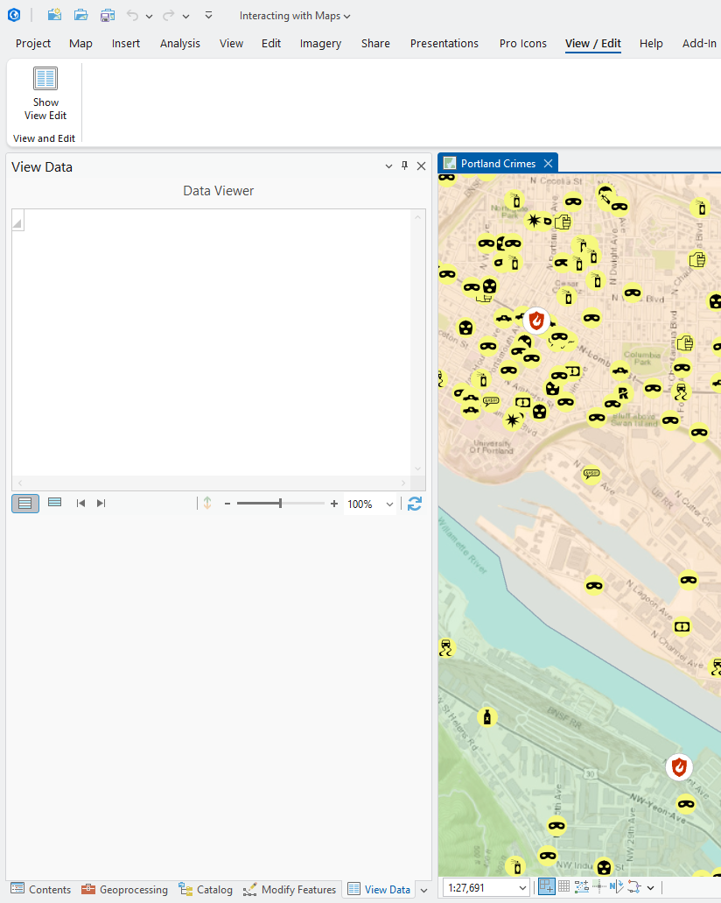
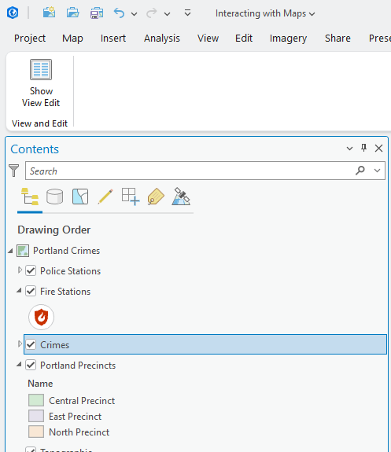
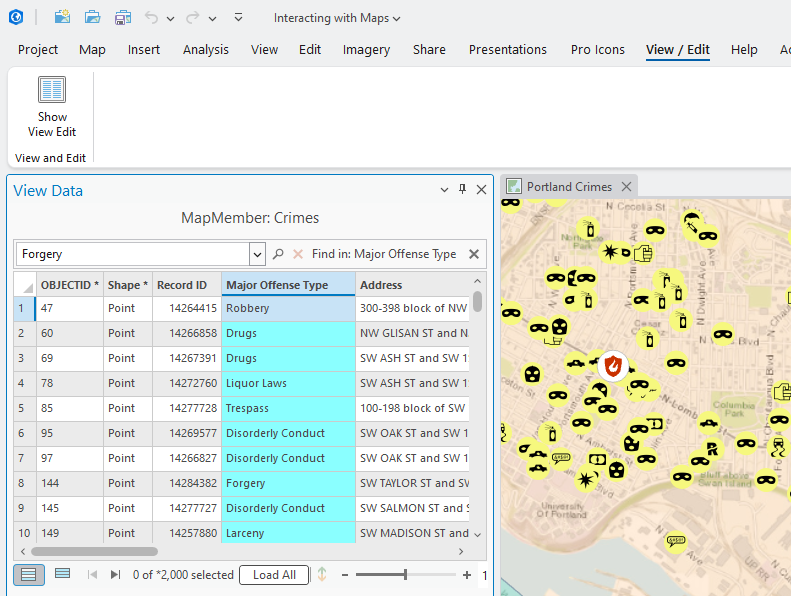
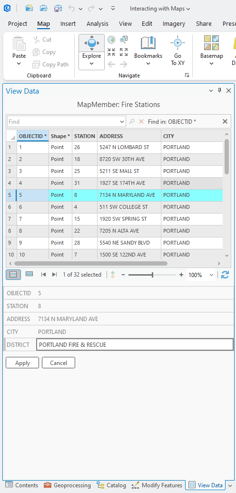
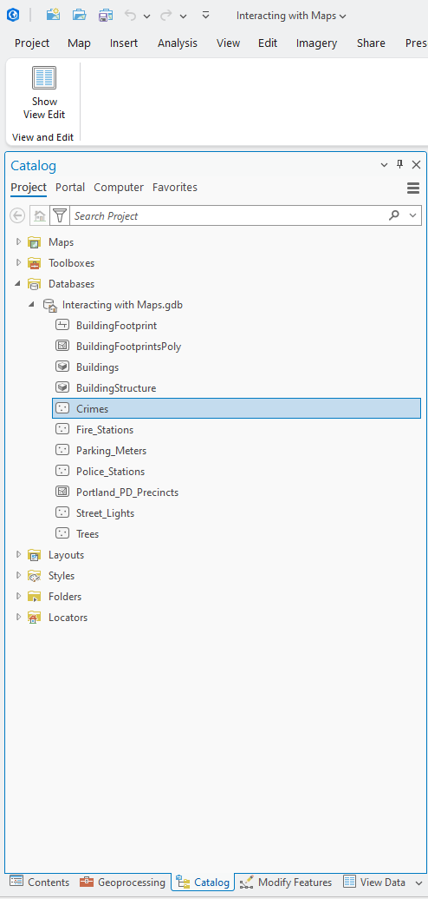
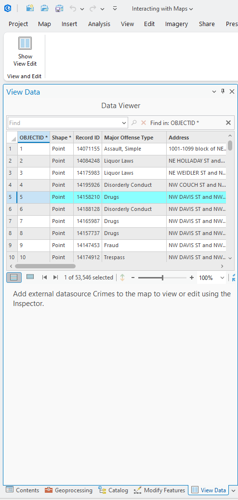

## ViewAndEditData

<!-- TODO: Write a brief abstract explaining this sample -->
This sample illustrates how to display tabular data using a Table Control. Additionally, this sample also illustrates how to use the Inspector to edit records in your tabular data  
  


<a href="https://pro.arcgis.com/en/pro-app/sdk/" target="_blank">View it live</a>

<!-- TODO: Fill this section below with metadata about this sample-->
```
Language:              C#
Subject:               Editing
Contributor:           ArcGIS Pro SDK Team <arcgisprosdk@esri.com>
Organization:          Esri, https://www.esri.com
Date:                  05/06/2025
ArcGIS Pro:            3.5
Visual Studio:         2022
.NET Target Framework: net8.0-windows
```

## Resources

[Community Sample Resources](https://github.com/Esri/arcgis-pro-sdk-community-samples#resources)

### Samples Data

* Sample data for ArcGIS Pro SDK Community Samples can be downloaded from the [Releases](https://github.com/Esri/arcgis-pro-sdk-community-samples/releases) page.  

## How to use the sample
<!-- TODO: Explain how this sample can be used. To use images in this section, create the image file in your sample project's screenshots folder. Use relative url to link to this image using this syntax:  -->
1. In Visual Studio click the Build menu. Then select Build Solution.
2. Launch the debugger to open ArcGIS Pro.  
3. Open any project that has a map with multiple layers and standalone tables.  
4. Click the Data Viewer button on the Add-In tab.  
  
5. Activate the map. Select a feature layer or a standalone table in the map's Table of Content.  
  
6. The Data Viewer dockpane opens up.  
7. The table control seen in the dockpane displays the data behind the selected map member in the TOC. Notice the "Find" control that allows you to search for a specific record in the table.  
    
8. Select a row in the table control in the dockpane. The attributes of the row or feature is displayed in the Inspector at the bottom.  
9. You can edit the editable fields and apply the changes using the Apply button at the bottom.  
   
10. Activate the Catalog window. Pick any dataset in the catalog window. These are classified as "external datasets".  
11. The table control in the dockpane will now display this data. Note: You will not be able to edit this data since it is an external dataset. You can add the dataset to the map in order to edit it.  
  
  
  

<!-- End -->

&nbsp;&nbsp;&nbsp;&nbsp;&nbsp;&nbsp;
&nbsp;&nbsp;&nbsp;&nbsp;&nbsp;&nbsp;&nbsp;&nbsp;&nbsp;&nbsp;&nbsp;&nbsp;
[Home](https://github.com/Esri/arcgis-pro-sdk/wiki) | <a href="https://pro.arcgis.com/en/pro-app/latest/sdk/api-reference" target="_blank">API Reference</a> | [Requirements](https://github.com/Esri/arcgis-pro-sdk/wiki#requirements) | [Download](https://github.com/Esri/arcgis-pro-sdk/wiki#installing-arcgis-pro-sdk-for-net) | <a href="https://github.com/esri/arcgis-pro-sdk-community-samples" target="_blank">Samples</a>
