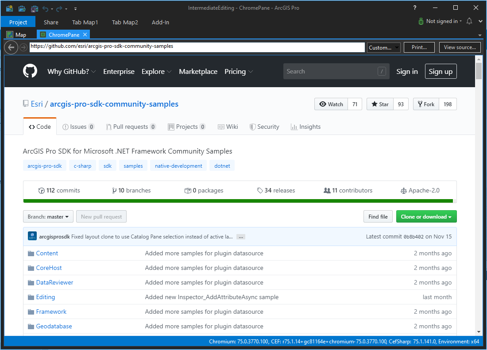

## ChromiumWebBrowserSample

<!-- TODO: Write a brief abstract explaining this sample -->
 This sample shows how to implement pane that contains a Chromium web browser control.  For details on how to utilize the Chromium web browser control in an add-in see here: https://github.com/Esri/arcgis-pro-sdk/wiki/ProConcepts-Framework#chromiumwebbrowser    
   


<a href="http://pro.arcgis.com/en/pro-app/sdk/" target="_blank">View it live</a>

<!-- TODO: Fill this section below with metadata about this sample-->
```
Language:              C#
Subject:               Framework
Contributor:           ArcGIS Pro SDK Team <arcgisprosdk@esri.com>
Organization:          Esri, http://www.esri.com
Date:                  5/12/2021
ArcGIS Pro:            2.8
Visual Studio:         2019
.NET Target Framework: 4.8
```

## Resources

[Community Sample Resources](https://github.com/Esri/arcgis-pro-sdk-community-samples#resources)

### Samples Data

* Sample data for ArcGIS Pro SDK Community Samples can be downloaded from the [Releases](https://github.com/Esri/arcgis-pro-sdk-community-samples/releases) page.  

## How to use the sample
<!-- TODO: Explain how this sample can be used. To use images in this section, create the image file in your sample project's screenshots folder. Use relative url to link to this image using this syntax:  -->
      
  
 1. In Visual Studio click the Build menu. Then select Build Solution.  
 1. Click Start button to open ArcGIS Pro.  
 1. ArcGIS Pro will open.   
 1. Open any project file.   
 1. Click on the Add-in tab on the ribbon and then on the "Open ChromePane" button.    
 1. The pane opens showing the https://github.com/esri/arcgis-pro-sdk-community-samples page.    
 \  
   
 Note: Custom scheme names must conform to RFC 3986.  
 <a href="https://tools.ietf.org/pdf/rfc3986.pdf"/>. Namely:  
 "Section 3.1 Scheme:<br/>  
 .....Scheme names consist of a sequence of characters beginning with a letter and followed by any combination of letters, digits, plus ("+"), period ("."), or hyphen("-"). Although schemes are case-insensitive, the canonical form is lowercase and documents that specify schemes must do so with lowercase letters."  
   
 Place your scheme name in the Config.daml within your custom scheme resource  handler registration DAML.In this sample, the corresponding resource  handler registration in the DAML looks like this:  
   


<!-- End -->

&nbsp;&nbsp;&nbsp;&nbsp;&nbsp;&nbsp;
&nbsp;&nbsp;&nbsp;&nbsp;&nbsp;&nbsp;&nbsp;&nbsp;&nbsp;&nbsp;&nbsp;&nbsp;
[Home](https://github.com/Esri/arcgis-pro-sdk/wiki) | <a href="https://pro.arcgis.com/en/pro-app/latest/sdk/api-reference" target="_blank">API Reference</a> | [Requirements](https://github.com/Esri/arcgis-pro-sdk/wiki#requirements) | [Download](https://github.com/Esri/arcgis-pro-sdk/wiki#installing-arcgis-pro-sdk-for-net) | <a href="https://github.com/esri/arcgis-pro-sdk-community-samples" target="_blank">Samples</a>
