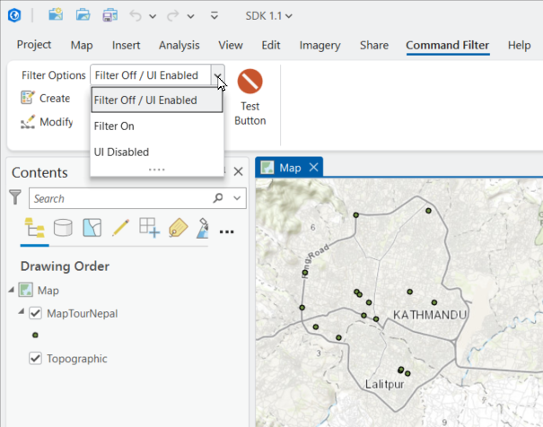
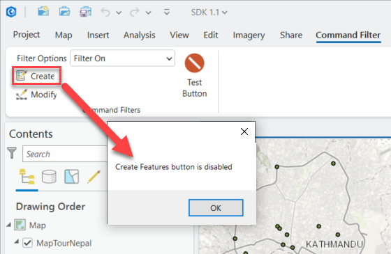
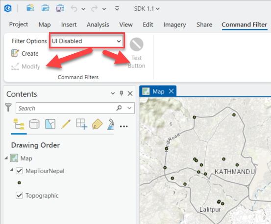

## CommandCustomizationFilter

<!-- TODO: Write a brief abstract explaining this sample -->
This sample implements "Command Filters", a.k.a. "Customization Filters", giving developers the opportunity to limit ArcGIS Pro DAML command functionality by stopping a command before its execution or by disabling a command in the UI.  This is useful when you want to prevent a command from executing based on certain conditions, such as the current state of the application or the user's permissions.  
** Note:** For your "Command Filter" class to work, the class must be registered with ArcGIS Pro using the `ArcGIS.Desktop.Framework.FrameworkApplication.RegisterCustomizationFilter` method.  
  


<a href="https://pro.arcgis.com/en/pro-app/sdk/" target="_blank">View it live</a>

<!-- TODO: Fill this section below with metadata about this sample-->
```
Language:              C#
Subject:               Framework
Contributor:           ArcGIS Pro SDK Team <arcgisprosdk@esri.com>
Organization:          Esri, https://www.esri.com
Date:                  05/06/2025
ArcGIS Pro:            3.5
Visual Studio:         2022
.NET Target Framework: net8.0-windows
```

## Resources

[Community Sample Resources](https://github.com/Esri/arcgis-pro-sdk-community-samples#resources)

### Samples Data

* Sample data for ArcGIS Pro SDK Community Samples can be downloaded from the [Releases](https://github.com/Esri/arcgis-pro-sdk-community-samples/releases) page.  

## How to use the sample
<!-- TODO: Explain how this sample can be used. To use images in this section, create the image file in your sample project's screenshots folder. Use relative url to link to this image using this syntax:  -->
      
  
1. In Visual Studio click the Build menu. Then select Build Solution.
2. Click Start button to open ArcGIS Pro.  
3. ArcGIS Pro will open.   
4. Open any project file with a map that contains at least one editable feature layer.  
5. Open a MapView and open the 'Command Filter' tab.  
6. Use the 'Filter Option' drop down to exercise three 'Command Filter' options:  
7. Select "Filter Off / UI Enabled" from the 'Filter Option' drop down. Notice that no filter functions are active.  
  
8. Select "Filter On" from the 'Filter Option' drop down. Notice that clicking the "Test" button and the "Create Features" buttons are not being executed.  
  
9. Select "UI Disabled" from the 'Filter Option' drop down. Notice that the "Test" button and the "Modify Features" button are disabled on the UI.  
  
  

<!-- End -->

&nbsp;&nbsp;&nbsp;&nbsp;&nbsp;&nbsp;
&nbsp;&nbsp;&nbsp;&nbsp;&nbsp;&nbsp;&nbsp;&nbsp;&nbsp;&nbsp;&nbsp;&nbsp;
[Home](https://github.com/Esri/arcgis-pro-sdk/wiki) | <a href="https://pro.arcgis.com/en/pro-app/latest/sdk/api-reference" target="_blank">API Reference</a> | [Requirements](https://github.com/Esri/arcgis-pro-sdk/wiki#requirements) | [Download](https://github.com/Esri/arcgis-pro-sdk/wiki#installing-arcgis-pro-sdk-for-net) | <a href="https://github.com/esri/arcgis-pro-sdk-community-samples" target="_blank">Samples</a>
