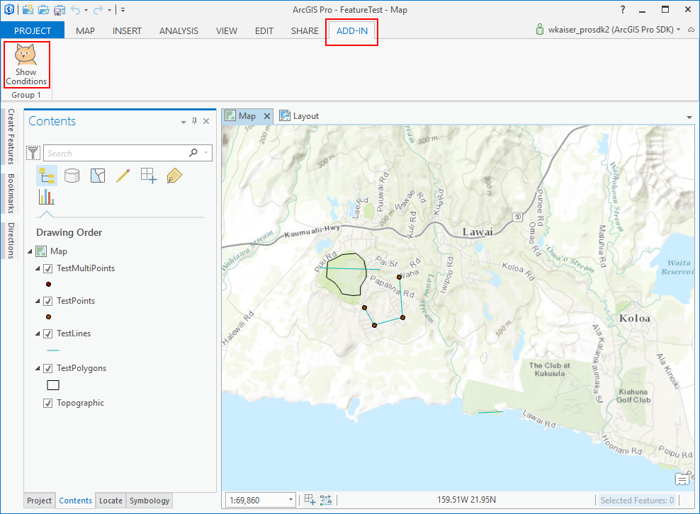
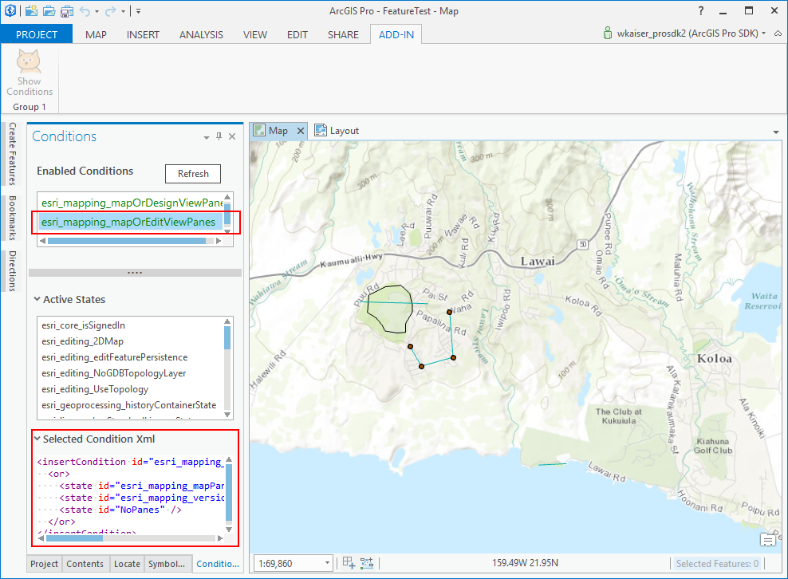
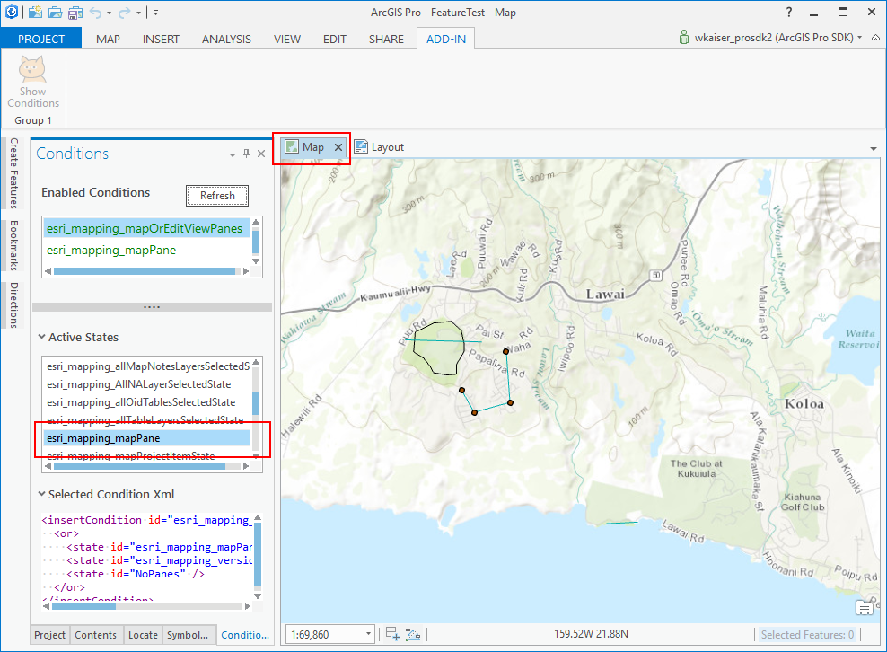
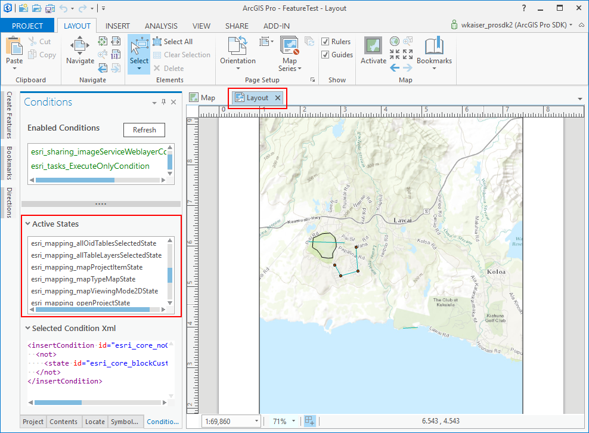

## ConditionQuery

<!-- TODO: Write a brief abstract explaining this sample -->
This Sample queries the application state to determine which conditions are currently enabled.  
  


<a href="https://pro.arcgis.com/en/pro-app/sdk/" target="_blank">View it live</a>

<!-- TODO: Fill this section below with metadata about this sample-->
```
Language:              C#
Subject:               Framework
Contributor:           ArcGIS Pro SDK Team <arcgisprosdk@esri.com>
Organization:          Esri, https://www.esri.com
Date:                  11/04/2024
ArcGIS Pro:            3.4
Visual Studio:         2022
.NET Target Framework: net8.0-windows
```

## Resources

[Community Sample Resources](https://github.com/Esri/arcgis-pro-sdk-community-samples#resources)

### Samples Data

* Sample data for ArcGIS Pro SDK Community Samples can be downloaded from the [Releases](https://github.com/Esri/arcgis-pro-sdk-community-samples/releases) page.  

## How to use the sample
<!-- TODO: Explain how this sample can be used. To use images in this section, create the image file in your sample project's screenshots folder. Use relative url to link to this image using this syntax:  -->
1. In Visual Studio click the Build menu. Then select Build Solution.
2. This solution is using the **AvalonEdit Nuget**.  If needed, you can install the Nuget from the "Nuget Package Manager Console" by using this script: "Install-Package AvalonEdit".  
3. Click Start button to open ArcGIS Pro.  
4. ArcGIS Pro will open.  
5. Open any ArcGIS Pro project file containing data.  
6. If the project doesn't have a map view add a new map view, and if the project doesn't have a layout view add a layout view.  
7. Click on the Add-in tab and see the 'Show Conditions' button.  
  
8. Click the 'Show Conditions' button to bring up the 'Conditions' dockpane into view.  
9. Open the 'Active States' and the 'Selected Condition XML' panes and select a condition under 'Enabled Conditions'.  This will show the 'Condition XML' for the selected condition, if a XML condition has been defined for the selected condition.  
  
10. Select the map view as the active view and click the refresh button on the Condition dock pane.  You should now find the 'esri_mapping_mapPane' condition under 'Active States'.  
  
11. Select the layout view as the active view and click the refresh button on the Condition dock pane.  You should now find that the 'esri_mapping_mapPane' condition is not listed under 'Active States' anymore.  
  
  

<!-- End -->

&nbsp;&nbsp;&nbsp;&nbsp;&nbsp;&nbsp;
&nbsp;&nbsp;&nbsp;&nbsp;&nbsp;&nbsp;&nbsp;&nbsp;&nbsp;&nbsp;&nbsp;&nbsp;
[Home](https://github.com/Esri/arcgis-pro-sdk/wiki) | <a href="https://pro.arcgis.com/en/pro-app/latest/sdk/api-reference" target="_blank">API Reference</a> | [Requirements](https://github.com/Esri/arcgis-pro-sdk/wiki#requirements) | [Download](https://github.com/Esri/arcgis-pro-sdk/wiki#installing-arcgis-pro-sdk-for-net) | <a href="https://github.com/esri/arcgis-pro-sdk-community-samples" target="_blank">Samples</a>
