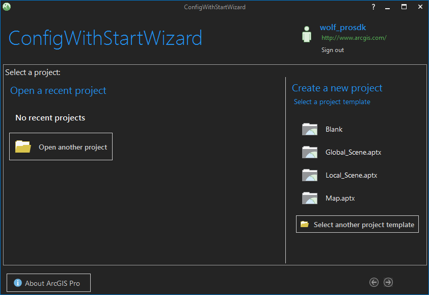
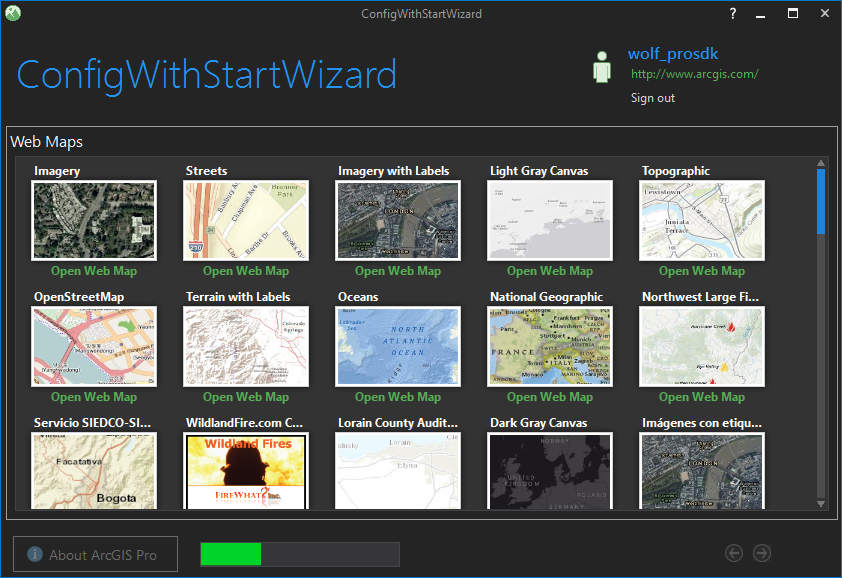
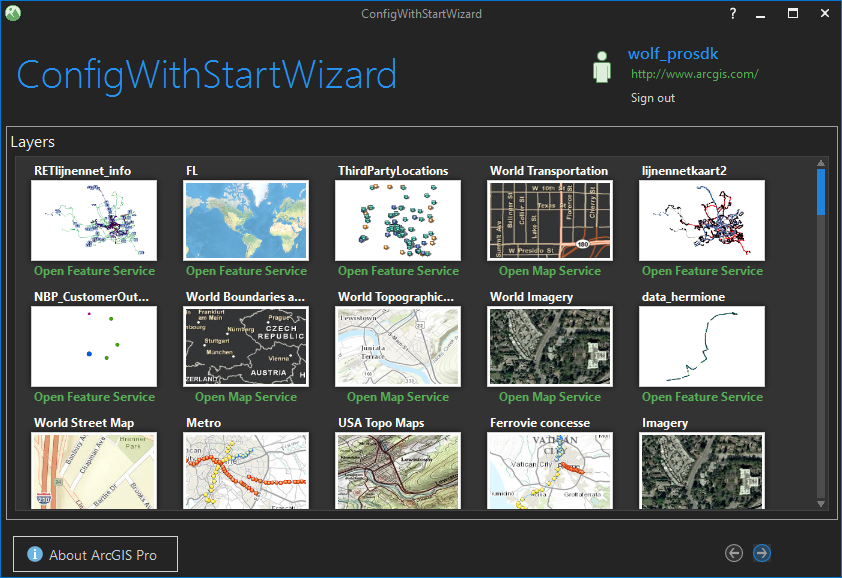

## ConfigWithStartWizard

<!-- TODO: Write a brief abstract explaining this sample -->
"Managed Configurations" allow branding of ArcGIS Pro meaning you can customize the splash and startup screens, application icon, and modify the runtime ArcGIS Pro User Interface to best fit your user’s business needs.  This sample illustrates a configuration solution that shows various startup screen options in form of a wizard interface.    
  


<a href="http://pro.arcgis.com/en/pro-app/sdk/" target="_blank">View it live</a>

<!-- TODO: Fill this section below with metadata about this sample-->
```
Language:              C#
Subject:               Framework
Contributor:           ArcGIS Pro SDK Team <arcgisprosdk@esri.com>
Organization:          Esri, http://www.esri.com
Date:                  11/01/2021
ArcGIS Pro:            2.9
Visual Studio:         2017, 2019
.NET Target Framework: 4.8
```

## Resources

[Community Sample Resources](https://github.com/Esri/arcgis-pro-sdk-community-samples#resources)

### Samples Data

* Sample data for ArcGIS Pro SDK Community Samples can be downloaded from the [Releases](https://github.com/Esri/arcgis-pro-sdk-community-samples/releases) page.  

## How to use the sample
<!-- TODO: Explain how this sample can be used. To use images in this section, create the image file in your sample project's screenshots folder. Use relative url to link to this image using this syntax:  -->
1. Download the Community Sample data (see under the 'Resources' section for downloading sample data).  The sample data contains a folder called 'C:\Data\Configurations\Projects' with sample data required for this solution.  Make sure that the Sample data is unzipped in c:\data and "C:\Data\Configurations\Projects" is available.  
1. In Visual Studio click the Build menu. Then select Build Solution.  
1. This solution is using the **Newtonsoft.Json NuGet**.  If needed, you can install the NuGet from the "NuGet Package Manager Console" by using this script: "Install-Package Newtonsoft.Json".  
1. Click Start button to debug ArcGIS Pro.  
1. ArcGIS Pro displays first the custom splash screen.  
1. Pro will then display the startup screen utilizing a wizard style user interface.  
  
  
1. The code for this startup user control can be found in OutofBoxStartPage.xaml and OutofBoxStartPageViewModel.cs.  
  
  
1. The code for this startup user control can be found in StockStartPage.xaml and StockStartPageViewModel.cs.  
  
  
1. The code for this startup user control can be found in OnlineItemStartPage.xaml and OnlineItemStartPageViewModel.cs.  
  
  
1. The code for this startup user control can be found in OnlineItemStartPage.xaml and OnlineItemStartPageViewModel.cs.  
  
  
1. The code for this startup user control can be found in OnlineItemStartPage.xaml and OnlineItemStartPageViewModel.cs.  
  
  
1. The code for this startup user control can be found in OnlineItemStartPage.xaml and OnlineItemStartPageViewModel.cs.  
  
  
1. The code for this startup user control can be found in CaliforniaStartPage.xaml and CaliforniaStartPageViewModel.cs.  
  


<!-- End -->

&nbsp;&nbsp;&nbsp;&nbsp;&nbsp;&nbsp;
&nbsp;&nbsp;&nbsp;&nbsp;&nbsp;&nbsp;&nbsp;&nbsp;&nbsp;&nbsp;&nbsp;&nbsp;
[Home](https://github.com/Esri/arcgis-pro-sdk/wiki) | <a href="https://pro.arcgis.com/en/pro-app/latest/sdk/api-reference" target="_blank">API Reference</a> | [Requirements](https://github.com/Esri/arcgis-pro-sdk/wiki#requirements) | [Download](https://github.com/Esri/arcgis-pro-sdk/wiki#installing-arcgis-pro-sdk-for-net) | <a href="https://github.com/esri/arcgis-pro-sdk-community-samples" target="_blank">Samples</a>
