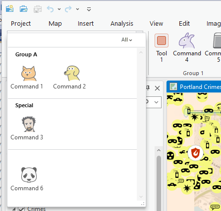

## ConfigureGallery

<!-- TODO: Write a brief abstract explaining this sample -->
This sample shows how to use custom categories to configure buttons and tools into a gallery on Pro's ribbon.  
  


<a href="https://pro.arcgis.com/en/pro-app/sdk/" target="_blank">View it live</a>

<!-- TODO: Fill this section below with metadata about this sample-->
```
Language:              C#
Subject:               Framework
Contributor:           ArcGIS Pro SDK Team <arcgisprosdk@esri.com>
Organization:          Esri, https://www.esri.com
Date:                  06/10/2022
ArcGIS Pro:            3.0
Visual Studio:         2022
.NET Target Framework: net6.0-windows
```

## Resources

[Community Sample Resources](https://github.com/Esri/arcgis-pro-sdk-community-samples#resources)

### Samples Data

* Sample data for ArcGIS Pro SDK Community Samples can be downloaded from the [Releases](https://github.com/Esri/arcgis-pro-sdk-community-samples/releases) page.  

## How to use the sample
<!-- TODO: Explain how this sample can be used. To use images in this section, create the image file in your sample project's screenshots folder. Use relative url to link to this image using this syntax:  -->
1. In Visual Studio click the Build menu. Then select Build Solution.  
1. Launch the debugger to open ArcGIS Pro.  
1. Open any project. Click on the Configure Gallery tab on the ribbon.  
1. Within this tab there is an inline gallery that hosts a collection of controls. Controls that are registered within A custom category are displayed in this gallery.  
 This tab also contains other controls that are placed directly on the ribbon, outside the gallery. These controls are not registered with the category.  
  
  
1. New custom categories are defined in DAML. Notice the following code snippet in the config.daml that defines a new category called AcmeCustom_AnalysisTools:  
```xml
<categories>
 <!--Step 1-->
 <!--Create a new category to hold new commands in a a Gallery-->
 <insertCategory id = "AcmeCustom_AnalysisTools" ></ insertCategory >
</ categories >
```
1. Controls are registered to a category using DAML. In Config.daml, here is a code snippet that registers a control with the AcmeCustom_AnalysisTools category:  
```xml
 <button id="ConfigureGallery_Buttons_AcmeCommand1" caption="Command 1" 
           categoryRefID="AcmeCustom_AnalysisTools" 
           className="ConfigureGallery.Buttons.AcmeCommand1" ...>
     <tooltip heading = "Tooltip Heading" >
      Command 1<disabledText />
     </tooltip>
     <content version = "1.0" group="Group A" />
 </button>
```
1. The gallery is built by finding all the controls registered in the custom category using the Categories.GetComponentElements method. You can also  define custom attributes in the content tag of the control entry in the config.daml. In this scenario we have defined a version and group attributes which are used to define how the gallery looks when dropped down.   
  
  


<!-- End -->

&nbsp;&nbsp;&nbsp;&nbsp;&nbsp;&nbsp;
&nbsp;&nbsp;&nbsp;&nbsp;&nbsp;&nbsp;&nbsp;&nbsp;&nbsp;&nbsp;&nbsp;&nbsp;
[Home](https://github.com/Esri/arcgis-pro-sdk/wiki) | <a href="https://pro.arcgis.com/en/pro-app/latest/sdk/api-reference" target="_blank">API Reference</a> | [Requirements](https://github.com/Esri/arcgis-pro-sdk/wiki#requirements) | [Download](https://github.com/Esri/arcgis-pro-sdk/wiki#installing-arcgis-pro-sdk-for-net) | <a href="https://github.com/esri/arcgis-pro-sdk-community-samples" target="_blank">Samples</a>
