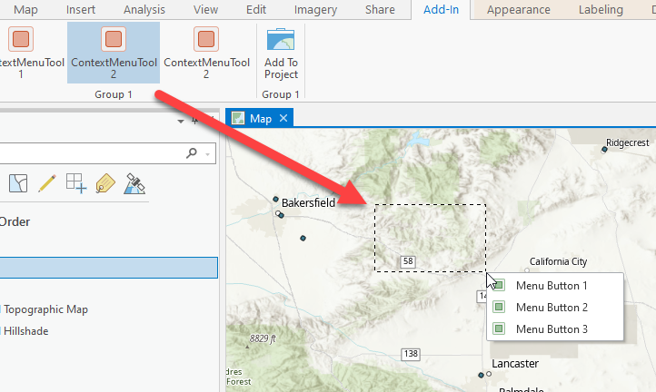
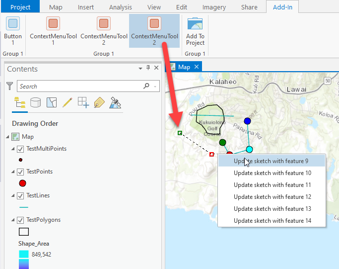

## ContextMenu

<!-- TODO: Write a brief abstract explaining this sample -->
This sample demonstrates three methods for associating, and showing, a context menu with a map tool. It is also the accompanying sample for the ArcGIS Pro SDK ProGuide Context Menus.  
  


<a href="https://pro.arcgis.com/en/pro-app/sdk/" target="_blank">View it live</a>

<!-- TODO: Fill this section below with metadata about this sample-->
```
Language:              C#
Subject:               Framework
Contributor:           ArcGIS Pro SDK Team <arcgisprosdk@esri.com>
Organization:          Esri, https://www.esri.com
Date:                  11/04/2024
ArcGIS Pro:            3.4
Visual Studio:         2022
.NET Target Framework: net8.0-windows
```

## Resources

[Community Sample Resources](https://github.com/Esri/arcgis-pro-sdk-community-samples#resources)

### Samples Data

* Sample data for ArcGIS Pro SDK Community Samples can be downloaded from the [Releases](https://github.com/Esri/arcgis-pro-sdk-community-samples/releases) page.  

## How to use the sample
<!-- TODO: Explain how this sample can be used. To use images in this section, create the image file in your sample project's screenshots folder. Use relative url to link to this image using this syntax:  -->
1. Example 1, ContextMenuTool1.cs illustrates the simplest and most straightforward approach - associating a predefined menu with the map tool ContextMenuID property. For example 1, right-click behavior is "built in".	///
  
2. Example 2, ContextMenuTool2.cs illustrates implementing custom right-click behavior to show the context menu "manually". The menu is the same menu used in Example 2.  
  
3. Example 3, ContextMenuTool3.cs illustrates the most flexible approach but also the most demanding to implement: A Dynamic context menu, built on-the-fly along with custom right-click behavior to show the menu.<br/>  
In Example 3, the tool sketches a line and, from the context menu, line features can be selected to add their feature shape into the sketch. The insertion point (for the shape) is the right-click location - the same location used to popup the context menu.<br/>  
  
Consult the <a href="https://github.com/Esri/arcgis-pro-sdk/wiki/ProGuide-Context-Menus">ArcGIS Pro SDK ProGuide Context Menus</a> for more details.  
  

<!-- End -->

&nbsp;&nbsp;&nbsp;&nbsp;&nbsp;&nbsp;
&nbsp;&nbsp;&nbsp;&nbsp;&nbsp;&nbsp;&nbsp;&nbsp;&nbsp;&nbsp;&nbsp;&nbsp;
[Home](https://github.com/Esri/arcgis-pro-sdk/wiki) | <a href="https://pro.arcgis.com/en/pro-app/latest/sdk/api-reference" target="_blank">API Reference</a> | [Requirements](https://github.com/Esri/arcgis-pro-sdk/wiki#requirements) | [Download](https://github.com/Esri/arcgis-pro-sdk/wiki#installing-arcgis-pro-sdk-for-net) | <a href="https://github.com/esri/arcgis-pro-sdk-community-samples" target="_blank">Samples</a>
