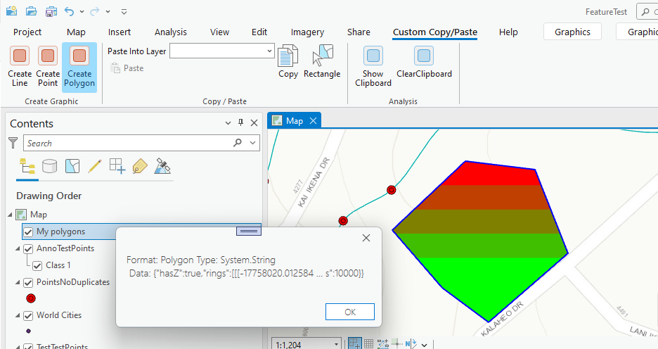
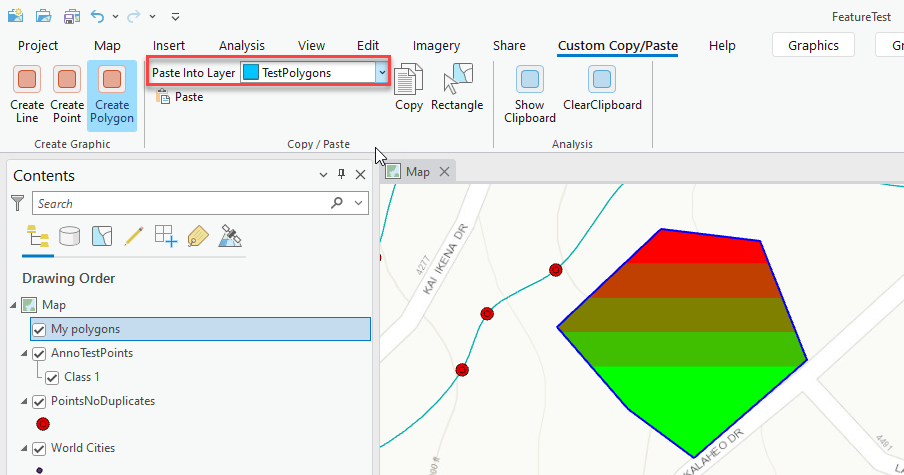
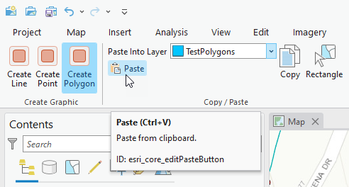
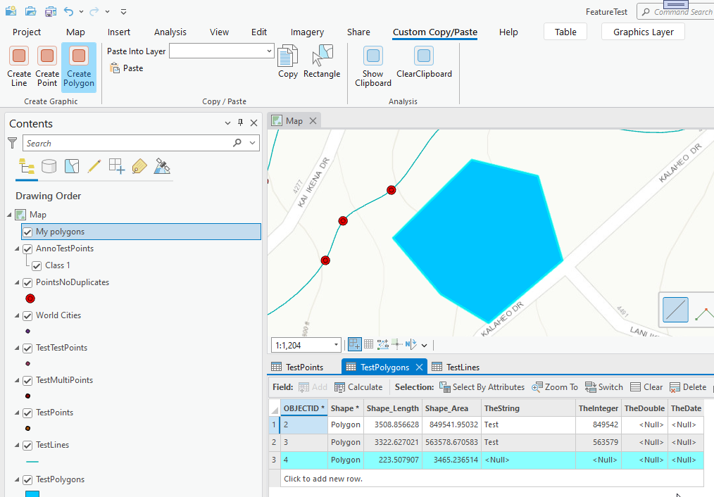

## CopyPaste

<!-- TODO: Write a brief abstract explaining this sample -->
This sample shows how to implement a custom copy/paste handler via the Module class.  The sample allows the operator to use the copy paste functionality of ArcGIS Pro to implement a custom implementation.  
  


<a href="https://pro.arcgis.com/en/pro-app/sdk/" target="_blank">View it live</a>

<!-- TODO: Fill this section below with metadata about this sample-->
```
Language:              C#
Subject:               Framework
Contributor:           ArcGIS Pro SDK Team <arcgisprosdk@esri.com>
Organization:          Esri, https://www.esri.com
Date:                  10/01/2023
ArcGIS Pro:            3.2
Visual Studio:         2022
.NET Target Framework: net6.0-windows
```

## Resources

[Community Sample Resources](https://github.com/Esri/arcgis-pro-sdk-community-samples#resources)

### Samples Data

* Sample data for ArcGIS Pro SDK Community Samples can be downloaded from the [Releases](https://github.com/Esri/arcgis-pro-sdk-community-samples/releases) page.  

## How to use the sample
<!-- TODO: Explain how this sample can be used. To use images in this section, create the image file in your sample project's screenshots folder. Use relative url to link to this image using this syntax:  -->
     
  
1. Open this solution in Visual Studio.
2. Click the build menu and select Build Solution.  
3. Launch the debugger to open ArCGIS Pro.   
4. Open any project with a map that contains Point, Line or Polygon feature layers.  
5. Click on the 'Custom Copy/Paste' tab and note the 'Create Graphic' group.  
6. Click the one of the button in the 'Create Graphic' group to create geometry for which you have a feature layer in your map's table of content.  
7. Create a geometry.  
  
8. Select a feature layer with a geometry type that matched the created graphic using the 'Paste Into Layer' combobox.  
  
9. You can click the 'Show Clipboard' button in the 'Analysis' group to view the Clipboard content.  
  
10. Click the paste button (this button is the out-of-box ArcGIS Pro Paste button).  
  
11. The graphic's geometry has been copied to the selected 'Paste to Layer'  
  
  

<!-- End -->

&nbsp;&nbsp;&nbsp;&nbsp;&nbsp;&nbsp;
&nbsp;&nbsp;&nbsp;&nbsp;&nbsp;&nbsp;&nbsp;&nbsp;&nbsp;&nbsp;&nbsp;&nbsp;
[Home](https://github.com/Esri/arcgis-pro-sdk/wiki) | <a href="https://pro.arcgis.com/en/pro-app/latest/sdk/api-reference" target="_blank">API Reference</a> | [Requirements](https://github.com/Esri/arcgis-pro-sdk/wiki#requirements) | [Download](https://github.com/Esri/arcgis-pro-sdk/wiki#installing-arcgis-pro-sdk-for-net) | <a href="https://github.com/esri/arcgis-pro-sdk-community-samples" target="_blank">Samples</a>
