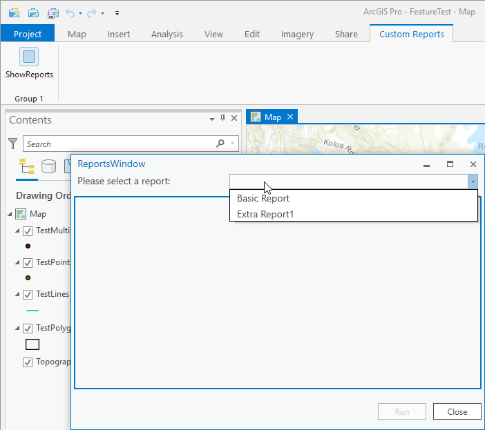

## CustomCategoriesExample

<!-- TODO: Write a brief abstract explaining this sample -->
An example of implementing a custom category. In this case we declare a custom category <b>AcmeCustom_Reports</b> and a contract:  
<b>IAcmeCustomReport</b>  


<a href="http://pro.arcgis.com/en/pro-app/sdk/" target="_blank">View it live</a>

<!-- TODO: Fill this section below with metadata about this sample-->
```
Language:              C#
Subject:               Framework
Contributor:           ArcGIS Pro SDK Team <arcgisprosdk@esri.com>
Organization:          Esri, http://www.esri.com
Date:                  1/10/2019
ArcGIS Pro:            2.3
Visual Studio:         2017
.NET Target Framework: 4.6.1
```

## Resources

* [API Reference online](https://pro.arcgis.com/en/pro-app/sdk/api-reference)
* <a href="https://pro.arcgis.com/en/pro-app/sdk/" target="_blank">ArcGIS Pro SDK for .NET (pro.arcgis.com)</a>
* [arcgis-pro-sdk-community-samples](https://github.com/Esri/arcgis-pro-sdk-community-samples)
* [ArcGIS Pro DAML ID Reference](https://github.com/Esri/arcgis-pro-sdk/wiki/ArcGIS-Pro-DAML-ID-Reference)
* [FAQ](https://github.com/Esri/arcgis-pro-sdk/wiki/FAQ)
* [ArcGIS Pro SDK icons](https://github.com/Esri/arcgis-pro-sdk/releases/tag/2.3.0.15769)


### Samples Data

* Sample data for ArcGIS Pro SDK Community Samples can be downloaded from the [repo releases](https://github.com/Esri/arcgis-pro-sdk-community-samples/releases) page.  

## How to use the sample
<!-- TODO: Explain how this sample can be used. To use images in this section, create the image file in your sample project's screenshots folder. Use relative url to link to this image using this syntax:  -->
CustomCategoriesExample add-in declares the category AcmeCustom_Reports.  
It also provides a default component, <b>CustomCategoriesExample.Report.DefaultReport</b> that implements it via the <b>IAcmeCustomReport</b> contract. DefaultReport registers in the AcmeCustom_Reports category in the Config.daml.<br />  
ExtraReport1 add-in also creates a component for the AcmeCustom_Reports category and likewise registers it in the category within its config.daml.   
ExtraReport1.ExtraReport1 class implements the IAcmeCustomReport contract (as required by the category creator - CustomCategoriesExample add-in in this case).<br />  
When the CustomCategoriesExample Module is initialized, it reads its   
AcmeCustom_Reports category via <b>Categories.GetComponentElements</b> and tests each one for the presence of the IAcmeCustomReport contract. Any component that registers in the category but does not implement the contract is skipped.  
The rest are instantiated and loaded into the ReportsWindow dialog for selection.  
  
<br />  
Try making additional add-ins that implement the IAcmeCustomReport contract and register their component in the AcmeCustom_Reports category. Depending on the number of components loaded that implement the AcmeCustom_Reports category, the list of available reports in the ReportsWindow will increase or decrease respectively.  
  


<!-- End -->

&nbsp;&nbsp;&nbsp;&nbsp;&nbsp;&nbsp;
&nbsp;&nbsp;&nbsp;&nbsp;&nbsp;&nbsp;&nbsp;&nbsp;&nbsp;&nbsp;&nbsp;&nbsp;
[Home](https://github.com/Esri/arcgis-pro-sdk/wiki) | <a href="https://pro.arcgis.com/en/pro-app/sdk/api-reference" target="_blank">API Reference</a> | [Requirements](https://github.com/Esri/arcgis-pro-sdk/wiki#requirements) | [Download](https://github.com/Esri/arcgis-pro-sdk/wiki#installing-arcgis-pro-sdk-for-net) | <a href="https://github.com/esri/arcgis-pro-sdk-community-samples" target="_blank">Samples</a>
