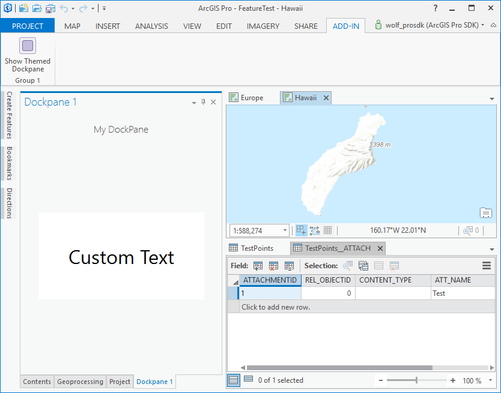

## CustomStyling

<!-- TODO: Write a brief abstract explaining this sample -->
 Show how to apply custom styles to a UserControl that work in both Light and Dark modes.  
   


<a href="http://pro.arcgis.com/en/pro-app/sdk/" target="_blank">View it live</a>

<!-- TODO: Fill this section below with metadata about this sample-->
```
Language:              C# 6.0
Subject:               Framework
Contributor:           ArcGIS Pro SDK Team <arcgisprosdk@esri.com>
Organization:          Esri, http://www.esri.com
Date:                  6/28/2017
ArcGIS Pro:            2.0
Visual Studio:         2015, 2017
.NET Target Framework: 4.6.1
```

## Resources

* [API Reference online](http://pro.arcgis.com/en/pro-app/sdk/api-reference)
* <a href="http://pro.arcgis.com/en/pro-app/sdk/" target="_blank">ArcGIS Pro SDK for .NET (pro.arcgis.com)</a>
* [arcgis-pro-sdk-community-samples](http://github.com/Esri/arcgis-pro-sdk-community-samples)
* [ArcGISPro Registry Keys](http://github.com/Esri/arcgis-pro-sdk/wiki/ArcGIS-Pro-Registry-Keys)
* [FAQ](http://github.com/Esri/arcgis-pro-sdk/wiki/FAQ)
* [ArcGIS Pro SDK icons](https://github.com/Esri/arcgis-pro-sdk/releases/tag/1.4.0.7198)
* [ProConcepts: ArcGIS Pro Add in Samples](https://github.com/Esri/arcgis-pro-sdk-community-samples/wiki/ProConcepts-ArcGIS-Pro-Add-in-Samples)


* [ProSnippets: 2.0 Migration](http://github.com/Esri/arcgis-pro-sdk/wiki/ProSnippets-Migrating-to-2.0)  
* [ProSnippets: 2.0 Migration Samples](http://github.com/Esri/arcgis-pro-sdk/wiki/ProSnippets-2.0-Migration-Samples)  
* [ProConcepts: 2.0 Migration](http://github.com/Esri/arcgis-pro-sdk/wiki/ProConcepts-2.0-Migration-Guide)  

### Samples Data

* Sample data for ArcGIS Pro SDK Community Samples can be downloaded from the [repo releases](https://github.com/Esri/arcgis-pro-sdk-community-samples/releases) page.  

## How to use the sample
<!-- TODO: Explain how this sample can be used. To use images in this section, create the image file in your sample project's screenshots folder. Use relative url to link to this image using this syntax:  -->
 New at 1.4, ArcGIS Pro supports a Light theme, Dark theme, and a variant of the Dark theme for use with High Contrast. Developers who want their Add-ins to blend in with Pro must likewise style their Add-in UIs to provide a Light and Dark themeing. In most cases, developers need only apply 'ESRI' styles to their UserControl content (refer to the ProGuide at [ProGuide: Style Guide](https://github.com/esri/arcgis-pro-sdk/wiki/proguide-style-guide). However, there may be situations where you need to derive your own styles and have them switch between a custom Light and Dark mode to mirror the current theme being applied to Pro. This sample shows you how.    
 The sample contains a custom UserControl as well as a custom Light and Dark theme that is applied at runtime in conjunction with the Light or Dark theme applied to Pro.    
 Steps:    
  
 1. In Visual Studio click the Build menu. Then select Build Solution.  
 1. Click Start button to open ArcGIS Pro.  
 1. The style applied to the Dockpane custom UserControl should match the Light or Dark mode of Pro.  
  
  
 1. Toggle the Pro theme (via backstage->Options->Application->General settings). Restart Pro.  
 1. Re-start the Debugger and Re-open the Dockpane in ArcGIS Pro.  
 1. The custom style should have changed (Light to Dark or vice versa) to match the corresponding change made to Pro.  
  
  
 1. Please also refer to the companion ProGuide at [ProGuide: Applying Custom Styles](https://github.com/Esri/arcgis-pro-sdk/wiki/ProGuide-Applying-Custom-Styles) for more information.    
   


<!-- End -->

&nbsp;&nbsp;&nbsp;&nbsp;&nbsp;&nbsp;
&nbsp;&nbsp;&nbsp;&nbsp;&nbsp;&nbsp;&nbsp;&nbsp;&nbsp;&nbsp;&nbsp;&nbsp;
[Home](https://github.com/Esri/arcgis-pro-sdk/wiki) | <a href="http://pro.arcgis.com/en/pro-app/sdk/api-reference" target="_blank">API Reference</a> | [Requirements](https://github.com/Esri/arcgis-pro-sdk/wiki#requirements) | [Download](https://github.com/Esri/arcgis-pro-sdk/wiki#installing-arcgis-pro-sdk-for-net) | <a href="http://github.com/esri/arcgis-pro-sdk-community-samples" target="_blank">Samples</a>
