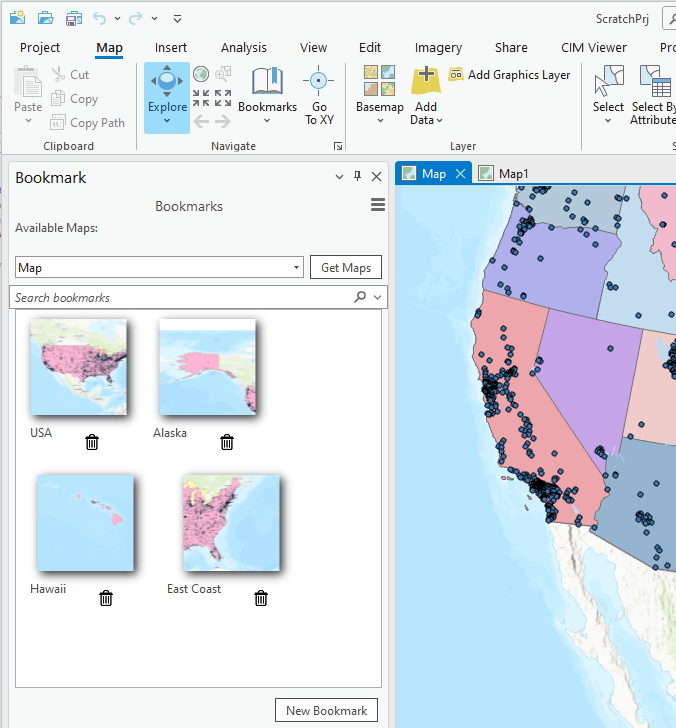
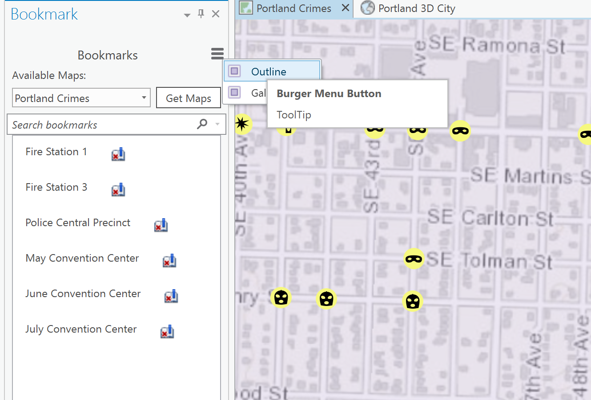
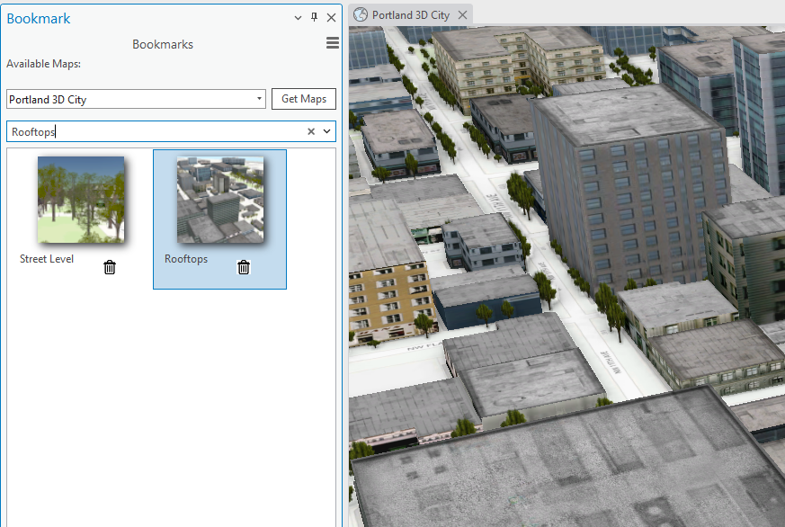
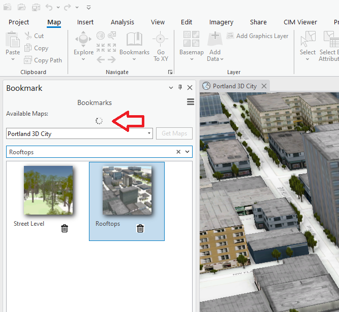
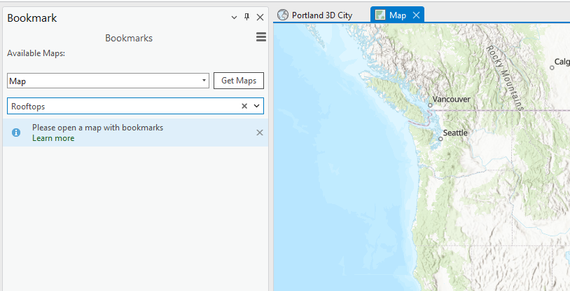

## Advanced UI Demo

<!-- TODO: Write a brief abstract explaining this sample -->
This sample shows how to:    
* Handle project item collection changes  
* Add and delete a bookmark  
* Leverage existing ArcGIS Pro commands  
* Add styling to buttons to follow ArcGIS Pro styling guidelines  
  


<a href="http://pro.arcgis.com/en/pro-app/sdk/" target="_blank">View it live</a>

<!-- TODO: Fill this section below with metadata about this sample-->
```
Language:              C#
Subject:               Framework
Contributor:           ArcGIS Pro SDK Team <arcgisprosdk@esri.com>
Organization:          Esri, http://www.esri.com
Date:                  4/20/2017
ArcGIS Pro:            2.0
Visual Studio:         2016
.NET Target Framework: 4.6.1
```

## Resources

* [API Reference online](http://pro.arcgis.com/en/pro-app/sdk/api-reference)
* <a href="http://pro.arcgis.com/en/pro-app/sdk/" target="_blank">ArcGIS Pro SDK for .NET (pro.arcgis.com)</a>
* [arcgis-pro-sdk-community-samples](http://github.com/Esri/arcgis-pro-sdk-community-samples)
* [ArcGISPro Registry Keys](http://github.com/Esri/arcgis-pro-sdk/wiki/ArcGIS-Pro-Registry-Keys)
* [FAQ](http://github.com/Esri/arcgis-pro-sdk/wiki/FAQ)
* [ArcGIS Pro SDK icons](https://github.com/Esri/arcgis-pro-sdk/releases/tag/1.4.0.7198)
* [ProConcepts: ArcGIS Pro Add in Samples](https://github.com/Esri/arcgis-pro-sdk-community-samples/wiki/ProConcepts-ArcGIS-Pro-Add-in-Samples)


### Samples Data

* Sample data for ArcGIS Pro SDK Community Samples can be downloaded from the [repo releases](https://github.com/Esri/arcgis-pro-sdk-community-samples/releases) page.  

## How to use the sample
<!-- TODO: Explain how this sample can be used. To use images in this section, create the image file in your sample project's screenshots folder. Use relative url to link to this image using this syntax:  -->
1. In Visual Studio click the Build menu. Then select Build Solution.  
1. Click Start button to open ArcGIS Pro.  
1. ArcGIS Pro will open.   
1. Open a project with a map that has bookmarks and click on the 'Add-in' tab.  
1. Click the 'Show bookmarks' button to show the bookmark dockpane  
1. On the 'bookmark dockpane' click the 'Get Maps' button to fill the 'Available Maps' dropdown.  
1. Select a map on the 'Available Maps' dropdown.  
1. Click on any of the 'Bookmark' thumbnails to zoom to a given bookmark.  
1. Clock the 'New Bookmark' button.  
  
###UI Controls  
**Burger button:**  
  
1. Click on the burger button conrol on the top right corner of the dockpane to display the menu options.  
1. Select the "Outline" menu option.  The bookmarks are displayed in a list view mode.  
  
**Search text box:**  
  
1. Notice the Search box control located above the list of bookmarks in the dockpane.  
1. Type the name of one of your bookmarks. Click the arrow next to it and notice the bookmark gets selected in the gallery of bookmarks and the map view zooms to that bookmark.  
     
 **Circular Animation:**  
  
 1. In the Project pane, right click the "Maps" folder and select "'New Map" from the context menu.  
 2. Notice the circular animation control dispayed on the bookmark dockpane while the new map is being opened.  
   
 ** Message label: **  
  
 1. In the drop down control that lists the colelction of maps in the project, select the new map you created in the step above.  
 2. Since this new map has no bookmarks associated with it yet, notice how the bookmark list view is now replaced with a Message label control.  
   
  


<!-- End -->

&nbsp;&nbsp;&nbsp;&nbsp;&nbsp;&nbsp;
&nbsp;&nbsp;&nbsp;&nbsp;&nbsp;&nbsp;&nbsp;&nbsp;&nbsp;&nbsp;&nbsp;&nbsp;
[Home](https://github.com/Esri/arcgis-pro-sdk/wiki) | <a href="http://pro.arcgis.com/en/pro-app/sdk/api-reference" target="_blank">API Reference</a> | [Requirements](https://github.com/Esri/arcgis-pro-sdk/wiki#requirements) | [Download](https://github.com/Esri/arcgis-pro-sdk/wiki#installing-arcgis-pro-sdk-for-net) | <a href="http://github.com/esri/arcgis-pro-sdk-community-samples" target="_blank">Samples</a>
