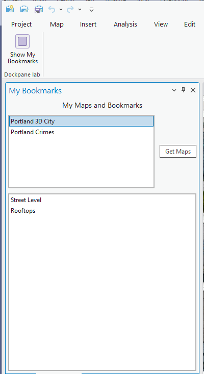

## DockpaneSimple

<!-- TODO: Write a brief abstract explaining this sample -->
This sample shows how to:   
* Create a Dockpane using DAML  
* Use the MVVM Pattern with ArcGIS Pro  
* Change the Dockpane title  
* Add a ListBox to the Dockpane showing the list of maps  
* Add a ListBox to the Dockpane showing bookmarks of a selected map  
* Use the Map selection changed event to populate a list of bookmarks with bookmarks for the selected map.  
* Use Bookmark list selection change event to zoom map view to bookmark  
  


<a href="http://pro.arcgis.com/en/pro-app/sdk/" target="_blank">View it live</a>

<!-- TODO: Fill this section below with metadata about this sample-->
```
Language:              C#
Subject:               Framework
Contributor:           ArcGIS Pro SDK Team <arcgisprosdk@esri.com>
Organization:          Esri, http://www.esri.com
Date:                  11/01/2021
ArcGIS Pro:            2.9
Visual Studio:         2017, 2019
.NET Target Framework: 4.8
```

## Resources

[Community Sample Resources](https://github.com/Esri/arcgis-pro-sdk-community-samples#resources)

### Samples Data

* Sample data for ArcGIS Pro SDK Community Samples can be downloaded from the [Releases](https://github.com/Esri/arcgis-pro-sdk-community-samples/releases) page.  

## How to use the sample
<!-- TODO: Explain how this sample can be used. To use images in this section, create the image file in your sample project's screenshots folder. Use relative url to link to this image using this syntax:  -->
1. In Visual Studio click the Build menu. Then select Build Solution.  
1. Click Start button to open ArcGIS Pro.  
1. ArcGIS Pro will open.   
1. Open a project with a map view that has bookmarks and click on the 'Dockpane Lab' tab.  
1. Select a Map view from the list of Map views.  
1. The bookmarks for the selected map should appear in the list of bookmarks.    
1. Select a bookmark to zoom to a given bookmark.  
  
  


<!-- End -->

&nbsp;&nbsp;&nbsp;&nbsp;&nbsp;&nbsp;
&nbsp;&nbsp;&nbsp;&nbsp;&nbsp;&nbsp;&nbsp;&nbsp;&nbsp;&nbsp;&nbsp;&nbsp;
[Home](https://github.com/Esri/arcgis-pro-sdk/wiki) | <a href="https://pro.arcgis.com/en/pro-app/latest/sdk/api-reference" target="_blank">API Reference</a> | [Requirements](https://github.com/Esri/arcgis-pro-sdk/wiki#requirements) | [Download](https://github.com/Esri/arcgis-pro-sdk/wiki#installing-arcgis-pro-sdk-for-net) | <a href="https://github.com/esri/arcgis-pro-sdk-community-samples" target="_blank">Samples</a>
