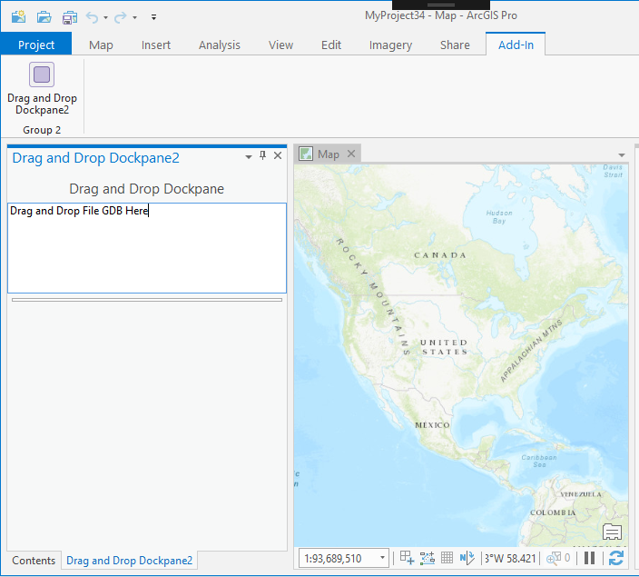
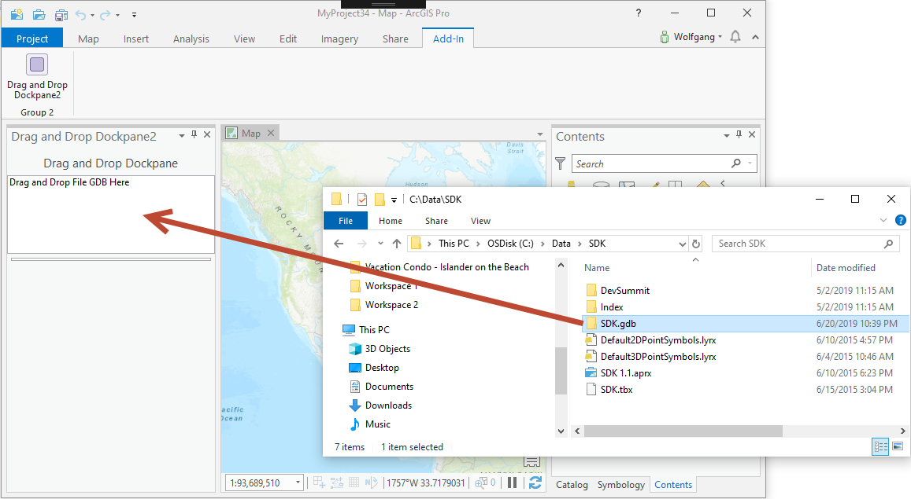
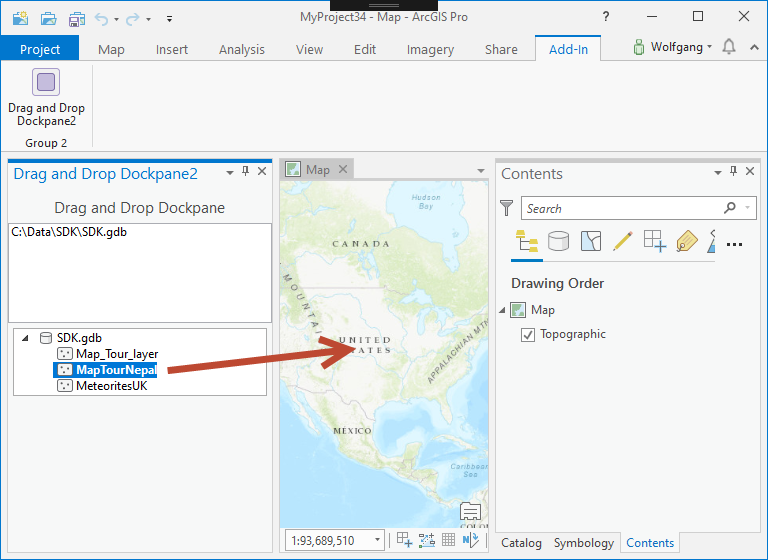
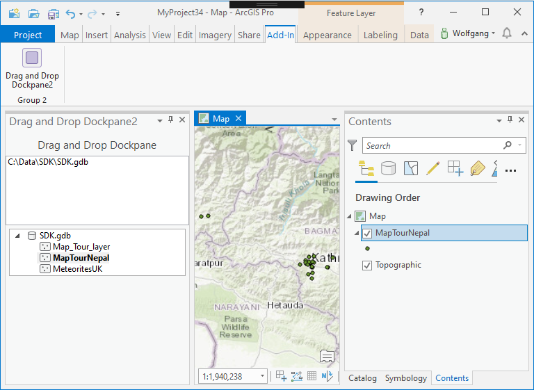
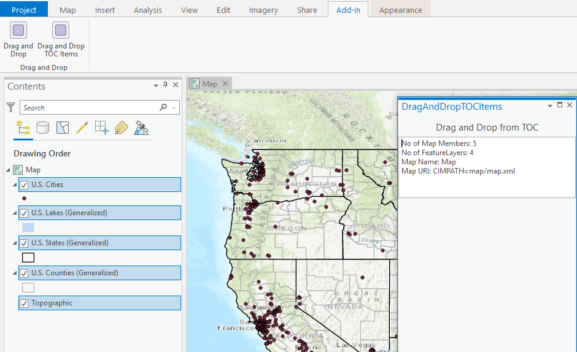

## DragAndDrop

<!-- TODO: Write a brief abstract explaining this sample -->
This sample shows how to implement drag & drop using a custom dockpane tree control.  
  


<a href="https://pro.arcgis.com/en/pro-app/sdk/" target="_blank">View it live</a>

<!-- TODO: Fill this section below with metadata about this sample-->
```
Language:              C#
Subject:               Framework
Contributor:           ArcGIS Pro SDK Team <arcgisprosdk@esri.com>
Organization:          Esri, https://www.esri.com
Date:                  02/22/2023
ArcGIS Pro:            3.1
Visual Studio:         2022
.NET Target Framework: net6.0-windows
```

## Resources

[Community Sample Resources](https://github.com/Esri/arcgis-pro-sdk-community-samples#resources)

### Samples Data

* Sample data for ArcGIS Pro SDK Community Samples can be downloaded from the [Releases](https://github.com/Esri/arcgis-pro-sdk-community-samples/releases) page.  

## How to use the sample
<!-- TODO: Explain how this sample can be used. To use images in this section, create the image file in your sample project's screenshots folder. Use relative url to link to this image using this syntax:  -->
   
  
1. Download the Community Sample data (see under the 'Resources' section for downloading sample data)  
1. Make sure that the Sample data is unzipped in c:\data   
1. The project used for this sample is -C:\Data\SDK\SDK.gdb-.   
1. In Visual Studio click the Build menu. Then select Build Solution.  
1. Click Start button to open ArcGIS Pro.  
1. In ArcGIS Pro create a new project using the Map template.  
1. ArcGIS Pro displays a map view.    
### Drag and drog from Catalog or the file system  
  
1. From the Add-in tab click the Drag and Drop button  
  
  
1. Use the Windows file explorer to navigate to a Geodatabase folder, for example -C:\Data\SDK\SDK.gdb-, then drag & drop the folder into the dropzone in the Drag & Drop dockpane.  
  
  
1. Notice that after the drop the Tree Control is being populated with the feature classes contained in the dropped Geodatabase.  
1. Drag one of the feature classes listed in the Tree Control onto the Map pane.   
  
  
1. The feature class is added to the map.    
  
### Drag and drop from the Map's TOC  
  
1. From the Add-In tab, click the Drag and Drop TOC Items button. The "Drag and drop TOC items" dockpane will open.  
1. Drag any layer(s) from the active map's TOC to the text box in the dockpane.  
1. The text box in the dockpane will list information about the map members being dragged and dropped.  
  
  


<!-- End -->

&nbsp;&nbsp;&nbsp;&nbsp;&nbsp;&nbsp;
&nbsp;&nbsp;&nbsp;&nbsp;&nbsp;&nbsp;&nbsp;&nbsp;&nbsp;&nbsp;&nbsp;&nbsp;
[Home](https://github.com/Esri/arcgis-pro-sdk/wiki) | <a href="https://pro.arcgis.com/en/pro-app/latest/sdk/api-reference" target="_blank">API Reference</a> | [Requirements](https://github.com/Esri/arcgis-pro-sdk/wiki#requirements) | [Download](https://github.com/Esri/arcgis-pro-sdk/wiki#installing-arcgis-pro-sdk-for-net) | <a href="https://github.com/esri/arcgis-pro-sdk-community-samples" target="_blank">Samples</a>
