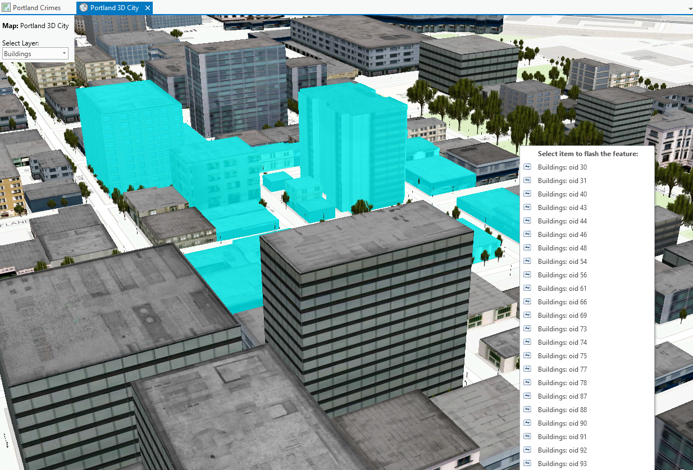

## DynamicMenu

<!-- TODO: Write a brief abstract explaining this sample -->
 This sample shows how to display a dynamic context menu. The sample also have an embeddabel control on the map that allows you pick the layer you want to select.     
 When you select features with this tool, the oids of the feaures will be displayed in a dynamic context menu.   
 When you click one of the OIDs in this context menu, that feature will flash on the Map View and display a pop-up.   
   


<a href="http://pro.arcgis.com/en/pro-app/sdk/" target="_blank">View it live</a>

<!-- TODO: Fill this section below with metadata about this sample-->
```
Language:              C# 6.0
Subject:               Framework
Contributor:           ArcGIS Pro SDK Team <arcgisprosdk@esri.com>
Organization:          Esri, http://www.esri.com
Date:                  6/28/2017
ArcGIS Pro:            2.0
Visual Studio:         2015, 2017
.NET Target Framework: 4.6.1
```

## Resources

* [API Reference online](http://pro.arcgis.com/en/pro-app/sdk/api-reference)
* <a href="http://pro.arcgis.com/en/pro-app/sdk/" target="_blank">ArcGIS Pro SDK for .NET (pro.arcgis.com)</a>
* [arcgis-pro-sdk-community-samples](http://github.com/Esri/arcgis-pro-sdk-community-samples)
* [ArcGISPro Registry Keys](http://github.com/Esri/arcgis-pro-sdk/wiki/ArcGIS-Pro-Registry-Keys)
* [FAQ](http://github.com/Esri/arcgis-pro-sdk/wiki/FAQ)
* [ArcGIS Pro SDK icons](https://github.com/Esri/arcgis-pro-sdk/releases/tag/1.4.0.7198)
* [ProConcepts: ArcGIS Pro Add in Samples](https://github.com/Esri/arcgis-pro-sdk-community-samples/wiki/ProConcepts-ArcGIS-Pro-Add-in-Samples)


* [ProSnippets: 2.0 Migration](http://github.com/Esri/arcgis-pro-sdk/wiki/ProSnippets-Migrating-to-2.0)  
* [ProSnippets: 2.0 Migration Samples](http://github.com/Esri/arcgis-pro-sdk/wiki/ProSnippets-2.0-Migration-Samples)  
* [ProConcepts: 2.0 Migration](http://github.com/Esri/arcgis-pro-sdk/wiki/ProConcepts-2.0-Migration-Guide)  

### Samples Data

* Sample data for ArcGIS Pro SDK Community Samples can be downloaded from the [repo releases](https://github.com/Esri/arcgis-pro-sdk-community-samples/releases) page.  

## How to use the sample
<!-- TODO: Explain how this sample can be used. To use images in this section, create the image file in your sample project's screenshots folder. Use relative url to link to this image using this syntax:  -->
 1. In Visual Studio click the Build menu. Then select Build Solution.  
 1. This solution is using the **Extended.Wpf.Toolkit NuGet**.  If needed, you can install the NuGet from the "NuGet Package Manager Console" by using this script: "Install-Package Extended.Wpf.Toolkit".  
 1. Click Start button to open ArcGIS Pro.  
 1. ArcGIS Pro will open.   
 1. Open a map view. The map should contain a few feature layers.  
 1. Click on the Add-In tab on the ribbon.  
 1. Within this tab there is a Display Dynamic Menu tool. Click it to activate the tool.  
 1. In the map click a point around which you want to identify features and display them in a dynamic menu.  
 1. A dynamic menu with the OIds of the features selected will display.  
 1. Click one of the items in the menu. You will see the feature flash on the map and their attributes will be displayed in a pop-up.  
  
   


<!-- End -->

&nbsp;&nbsp;&nbsp;&nbsp;&nbsp;&nbsp;
&nbsp;&nbsp;&nbsp;&nbsp;&nbsp;&nbsp;&nbsp;&nbsp;&nbsp;&nbsp;&nbsp;&nbsp;
[Home](https://github.com/Esri/arcgis-pro-sdk/wiki) | <a href="http://pro.arcgis.com/en/pro-app/sdk/api-reference" target="_blank">API Reference</a> | [Requirements](https://github.com/Esri/arcgis-pro-sdk/wiki#requirements) | [Download](https://github.com/Esri/arcgis-pro-sdk/wiki#installing-arcgis-pro-sdk-for-net) | <a href="http://github.com/esri/arcgis-pro-sdk-community-samples" target="_blank">Samples</a>
